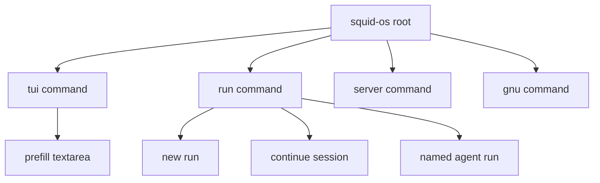
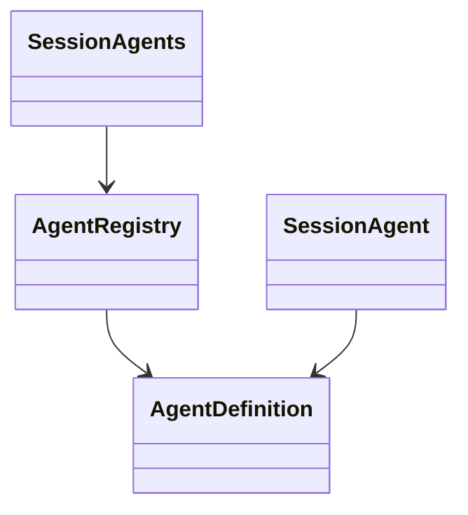
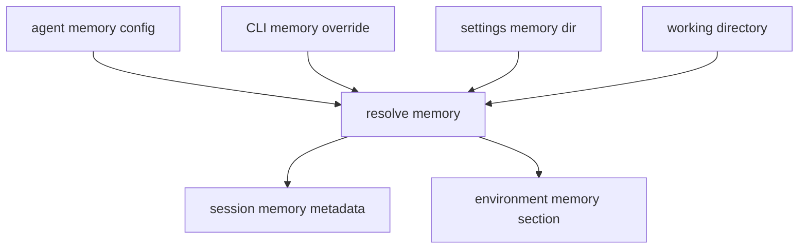
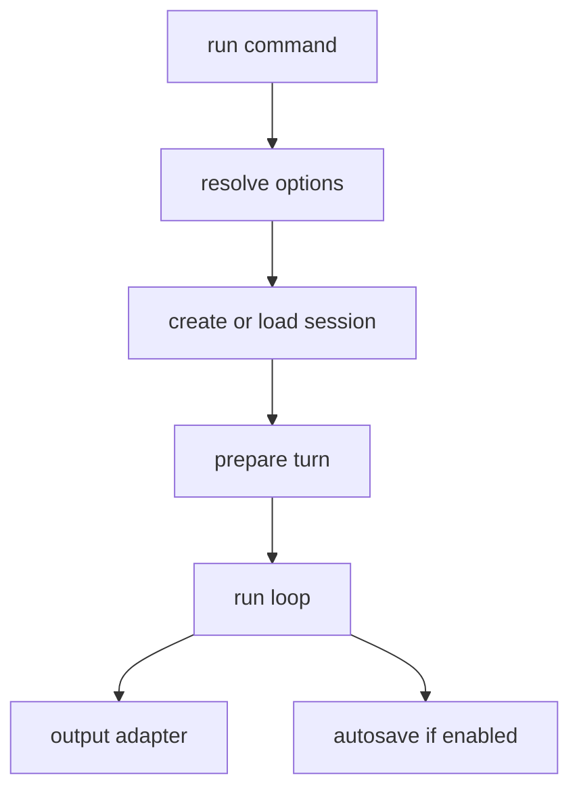
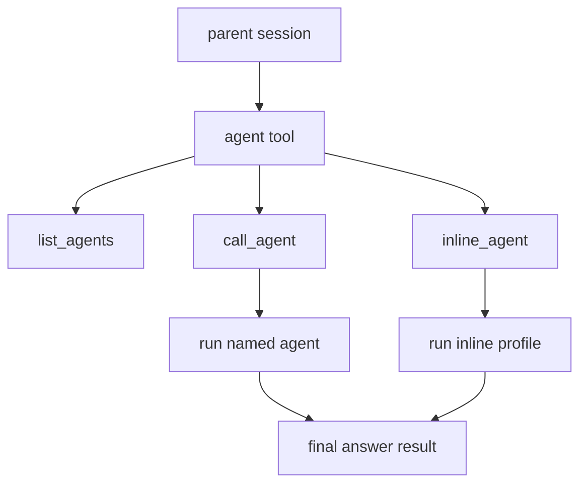
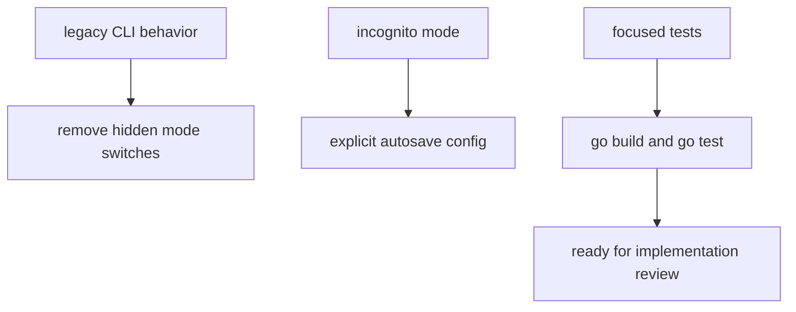

# Agent Runtime and CLI Architecture

## Core Problem

Squid-OS needs a clean explicit CLI, first-class agent presets, session continuation, autosave-aware run execution, memory scaffolding, and bounded agent tool delegation without scattering behavior across main.go and TUI-only paths.

## Goal

A mode-driven CLI, global agent registry, expanded session metadata, shared turn preparation, memory namespace foundation, run output modes, autosave behavior, and phase-1 agent tools.

---

## 1. CLI Command Model

- **Pattern:** Command Tree, Explicit Mode Selection

**Objective:** Refactor the existing Cobra CLI into explicit root, tui, run, server, and gnu command paths with stable flag semantics.

**Success Criteria:** Root and tui open the TUI, run executes non-TUI, server and gnu are visible not-implemented commands, prompt no longer implies headless, and CLI parsing is centralized outside main.go.



### 1.1. Extract CLI command construction

**Type:** refactor

**What:** Create an internal CLI package that builds the Cobra command tree and keeps main.go as a thin bootstrap.

**Why:** Centralized command construction prevents CLI behavior from spreading through main.go as the command surface grows.

**Files:**

- + internal/cli
- ~ main.go

**Snippet:**

```
package cli

type Dependencies struct {
    // paths, settings, endpoints, history loaders, and program launch hooks
}

func NewRootCommand(deps Dependencies) *cobra.Command {
    // Build root, tui, run, server, and gnu commands.
}

func Execute(deps Dependencies) error {
    // Entrypoint called by main.go.
}
```

**Acceptance Criteria:**

- [ ] main.go delegates command creation/execution to internal/cli.
- [ ] Root, tui, run, server, and gnu commands are constructed in one package.
- [ ] go build passes with no behavior changes beyond command routing.

**Verify:**

```bash
go build ./...
```

### 1.2. Implement root and TUI option parsing

**Type:** feature

**What:** Add root and tui options for session selection, prompt prefill, model, thinking, working directory, agent system, tool, skill, and callable agent scopes.

**Why:** TUI boot needs the same explicit session setup surface as run without treating prompt as headless execution.

**Files:**

- ~ internal/cli
- ~ internal/app/app.go
- ~ internal/app/ui_session.go

**Snippet:**

```
type TUIOptions struct {
    Prompt string
    SessionName string
    Model string
    Thinking string
    WorkingDir string
    AgentName string
    AgentSystem string
    ToolNames []string
    SkillNames []string
    ActiveSkill string
    CallableAgentNames []string
}

func RunTUI(opts TUIOptions, deps Dependencies) error {
    // Load or create session, prefill textarea, then launch Bubble Tea.
}
```

**Acceptance Criteria:**

- [ ] squid-os opens TUI.
- [ ] squid-os tui opens TUI.
- [ ] --prompt on root or tui pre-fills textarea and does not execute a run.
- [ ] --session on root or tui opens the named saved session.
- [ ] TUI bootstrap options are passed through a typed options object.

**Verify:**

```bash
go build ./...
```

### 1.3. Implement complete run option parsing

**Type:** feature

**What:** Add run options for inline runs, named agents, session continuation, stdin composition, output mode, autosave, auth, memory, scopes, active skill, and limits.

**Why:** run is the explicit non-TUI execution surface and must carry the full runtime override contract.

**Files:**

- ~ internal/cli
- ~ internal/headless/headless.go

**Snippet:**

```
type RunOptions struct {
    AgentName string
    PositionalAgent string
    SessionName string
    Prompt string
    Stdin string
    Mode string
    Model string
    Thinking string
    WorkingDir string
    AgentSystem string
    ToolNames []string
    SkillNames []string
    ActiveSkill string
    CallableAgentNames []string
    Autosave bool
    AutosaveName string
    AuthMode string
    MemoryNamespace string
    MemoryInstructions string
    Limits LimitOptions
}

type LimitOptions struct {
    MaxSteps int
    MaxTools int
    MaxTime string
    MaxToolResultTokens int
}
```

**Acceptance Criteria:**

- [ ] squid-os run executes only through the explicit run command.
- [ ] squid-os run name and squid-os run --agent name resolve equivalently.
- [ ] Differing positional agent and --agent values fail clearly.
- [ ] --prompt and stdin compose predictably.
- [ ] --session adds a new turn to an existing session rather than rebuilding bootstrap.
- [ ] Bootstrap replacement flags are rejected with --session where required by the prep docs.

**Verify:**

```bash
go build ./...
```

### 1.4. Preserve version and stub commands

**Type:** feature

**What:** Wire --version to the canonical version source and expose server and gnu as help-visible not-implemented commands.

**Why:** The expanded CLI must preserve existing version behavior while reserving future product surfaces cleanly.

**Files:**

- ~ internal/cli
- ~ internal/version.go
- ~ main.go

**Snippet:**

```
type CommandInfo struct {
    Name string
    Short string
    NotImplemented bool
}

func NewVersionCommandSource() string {
    // Return canonical app version used by CLI, TUI header, and user agents.
}
```

**Acceptance Criteria:**

- [ ] --version prints the canonical Squid-OS version and exits.
- [ ] server appears in help and returns a clear not implemented response.
- [ ] gnu appears in help as shell GNU tool generation migration surface and returns not implemented.

**Verify:**

```bash
go build ./...
```

### 1.5. Add bash and zsh completion

**Type:** feature

**What:** Add shell completion for command names, static enum values, and dynamic sessions, skills, agents, and tool names where practical.

**Why:** Completion is part of the CLI product contract and makes the larger command surface usable.

**Files:**

- ~ internal/cli
- ~ internal/config/session.go
- ~ internal/skills
- ~ internal/agent
- ~ internal/tools

**Snippet:**

```
type CompletionProvider interface {
    Sessions(prefix string) []string
    Skills(prefix string) []string
    Agents(prefix string) []string
    Tools(prefix string) []string
}

func AttachCompletions(cmd *cobra.Command, provider CompletionProvider) {
    // Register dynamic and static completions.
}
```

**Acceptance Criteria:**

- [ ] --session completion suggests saved session names.
- [ ] --skill and --skills completion suggest installed skills.
- [ ] --agent and --agents completion suggest installed agents.
- [ ] --tools completion suggests registered tools or a generated registry-backed list.
- [ ] Static flags complete values for thinking, save, mode, memory namespace, and auth mode.

**Verify:**

```bash
go build ./...
```

---

## 2. Agent Registry and Session Metadata

- **Pattern:** Registry, Configuration Object, Provenance Metadata

**Objective:** Introduce global agents as first-class runtime presets with registry discovery, YAML loading, environment visibility, and session metadata.

**Success Criteria:** Agents live under config agents, can be listed and loaded, appear in environment, and sessions persist root Agent plus available Agents separately from Skill and Skills.



### 2.1. Add agent config path and registry

**Type:** feature

**What:** Create internal/agent with definition structs, YAML loading, registry scanning, and config path support for the agents directory.

**Why:** Agents become a first-class global preset system like skills instead of a run-command special case.

**Files:**

- + internal/agent
- ~ internal/config/paths.go
- ~ go.mod

**Snippet:**

```
package agent

type Definition struct {
    Name string
    Description string
    Mode string
    AuthMode string
    Model string
    Thinking bool
    WorkingDirectory string
    System string
    Tools []string
    Skills []string
    Agents []string
    Memory MemoryConfig
    Limits LimitsConfig
}

type Entry struct {
    Name string
    Description string
    Path string
}

type Registry struct {
    // Scanned agent entries indexed by name.
}

func InitRegistry(baseDir string) (*Registry, error) {
    // Create agents directory and scan definitions.
}
```

**Acceptance Criteria:**

- [ ] Paths includes an Agents directory under the Squid-OS config root.
- [ ] EnsureDirs creates the agents directory.
- [ ] Registry lists agent names and descriptions.
- [ ] Registry loads a full definition by name.

**Verify:**

```bash
go build ./...
```

### 2.2. Add Agent and Agents session metadata

**Type:** feature

**What:** Extend SessionMeta with singular Agent provenance and plural Agents availability scope.

**Why:** The root agent that started a session is provenance, while Agents is the callable subagent access list.

**Files:**

- ~ internal/config/session.go
- ~ internal/chat/session.go

**Snippet:**

```
type SessionAgent struct {
    Name string
}

type SessionAgents struct {
    Initial []string
    Current []string
}

type SessionMeta struct {
    Agent SessionAgent
    Agents SessionAgents
    // Existing session metadata remains distinct.
}
```

**Acceptance Criteria:**

- [ ] Session Agent stores the root owning agent name without initial/current.
- [ ] Session Agents stores initial/current callable agent names.
- [ ] Agent remains distinct from Skill.
- [ ] Agents remains distinct from Skills and Tools.

**Verify:**

```bash
go build ./...
```

### 2.3. Expose agents in environment

**Type:** feature

**What:** Initialize the agent registry before session bootstrap and add an Agents section to the generated environment.

**Why:** The model should discover available agents the same way it discovers skills.

**Files:**

- ~ internal/environment/environment.go
- ~ internal/environment/loader.go
- ~ internal/app/app.go
- ~ internal/headless/headless.go

**Snippet:**

```
type AgentInfo struct {
    Name string
    Description string
}

type Environment struct {
    Agents []AgentInfo
    // Existing environment sections remain.
}

func FormatEnvironment(env Environment) string {
    // Render Agents section like Skills.
}
```

**Acceptance Criteria:**

- [ ] Environment includes an Agents section with name and description.
- [ ] Agent registry initialization happens before NewSession environment injection.
- [ ] Existing Skills environment behavior remains unchanged.

**Verify:**

```bash
go build ./...
```

---

## 3. Runtime Options and Turn Preparation

- **Pattern:** Application Service, Explicit State Transition

**Objective:** Resolve settings, agent definitions, CLI options, and session continuation into concrete session/run options, then prepare each turn consistently before streaming.

**Success Criteria:** TUI, run, session continuation, and agent tools use the same resolved options and transition injection happens after the user message and before stream start.

```mermaid
sequenceDiagram
    participant Entry as CLI or TUI
    participant Resolve as ResolveOptions
    participant Session as ChatSession
    participant Turn as PrepareTurn
    participant Loop as RunLoop
    Entry->>Resolve: settings agent flags session
    Resolve->>Session: create or load session
    Entry->>Session: append user message
    Entry->>Turn: desired next turn options
    Turn->>Session: inject transitions
    Entry->>Loop: stream prepared session
```

### 3.1. Add runtime option resolver

**Type:** feature

**What:** Add a small resolver that maps settings, optional agent definition, CLI options, and session continuation context into concrete runtime options.

**Why:** One resolver prevents precedence, model parsing, autosave, auth, and scope rules from diverging across TUI, run, and agent tools.

**Files:**

- + internal/runtime
- ~ internal/cli
- ~ internal/agent
- ~ internal/config/settings.go

**Snippet:**

```
package runtime

type Inputs struct {
    Settings config.Settings
    Agent *agent.Definition
    CLI CLIOptions
    ExistingSession *config.SessionDoc
}

type Options struct {
    AgentName string
    Provider string
    Model string
    Thinking config.ThinkingConfig
    AgentSystem string
    ToolNames []string
    SkillNames []string
    ActiveSkill string
    CallableAgentNames []string
    Autosave AutosaveOptions
    AuthMode string
    Memory memory.Config
    Limits Limits
    OutputMode string
}

func Resolve(inputs Inputs) (Options, error) {
    // Apply CLI, then agent, then settings precedence.
}
```

**Acceptance Criteria:**

- [ ] CLI values override agent definition values.
- [ ] Agent definition values override settings defaults.
- [ ] Combined provider/model strings are parsed consistently.
- [ ] --session rejects bootstrap replacement options such as root agent and agent system replacement.
- [ ] Resolved options include tools, skills, active skill, callable agents, autosave, auth, memory, and limits.

**Verify:**

```bash
go build ./...
```

### 3.2. Expand session bootstrap config

**Type:** feature

**What:** Extend SessionConfig and NewSession so resolved runtime options create complete session metadata and bootstrap messages.

**Why:** Session creation should receive explicit inputs for agent, scopes, memory, autosave, auth, and limits instead of reading scattered global state.

**Files:**

- ~ internal/chat/session.go
- ~ internal/config/session.go
- ~ internal/environment/loader.go

**Snippet:**

```
type SessionConfig struct {
    Provider string
    Model string
    Thinking config.ThinkingConfig
    SystemPromptFile string
    AgentName string
    AgentSystem string
    ToolNames []string
    SkillNames []string
    ActiveSkill string
    CallableAgentNames []string
    WorkingDir string
    Memory memory.Config
    Autosave AutosaveOptions
    AuthMode string
    Limits Limits
}

func NewSession(cfg SessionConfig, paths config.Paths) *Session {
    // Append Base System, Environment System, optional Agent System, config, and tools metadata.
}
```

**Acceptance Criteria:**

- [ ] New sessions persist root Agent and callable Agents metadata.
- [ ] New sessions can set active Skill separately from available Skills.
- [ ] NewSession injects agent0 when Agent System text exists.
- [ ] Base System, Environment System, and Agent System remain separate concepts.

**Verify:**

```bash
go build ./...
```

### 3.3. Add shared PrepareTurn

**Type:** feature

**What:** Move next-turn transition injection into a shared PrepareTurn function called after user append and before StartStream.

**Why:** Model, thinking, active skill, and availability changes must behave the same in TUI, run, session continuation, and future automation.

**Files:**

- + internal/chat/turn.go
- ~ internal/chat/session.go
- ~ internal/app/stream.go
- ~ internal/run

**Snippet:**

```
type PrepareTurnOptions struct {
    Inference config.InferenceConfig
    ActiveSkill string
    ToolNames []string
    SkillNames []string
    CallableAgentNames []string
}

func PrepareTurn(s *Session, opts PrepareTurnOptions) error {
    // Insert transition messages after the latest user message.
    // Update current inference and availability scopes.
}

```

**Acceptance Criteria:**

- [ ] PrepareTurn inserts transitions immediately after the user message they affect.
- [ ] TUI sendMessage no longer owns model/thinking/skill transition logic.
- [ ] run --session uses PrepareTurn before streaming.
- [ ] StartStream remains focused on starting provider streaming and does not hide history mutation.

**Verify:**

```bash
go build ./...
```

### 3.4. Model autosave as session runtime config

**Type:** feature

**What:** Represent autosave settings in resolved options and session metadata so TUI and run can persist automatically through one concept.

**Why:** Autosave is the existing persistence behavior and should replace incognito-style special cases and run-only save wording.

**Files:**

- ~ internal/config/session.go
- ~ internal/config/settings.go
- ~ internal/runtime
- ~ internal/app/session_persistence.go

**Snippet:**

```
type AutosaveOptions struct {
    Enabled bool
    Name string
}

type SessionMeta struct {
    Autosave AutosaveOptions
    // Existing metadata omitted.
}

```

**Acceptance Criteria:**

- [ ] Resolved runtime options include autosave enabled and optional autosave name.
- [ ] Session metadata can persist autosave configuration.
- [ ] Manual save remains separate from autosave.
- [ ] Existing TUI autosave behavior can be mapped to the new config.

**Verify:**

```bash
go build ./...
```

---

## 4. Memory Foundation

- **Pattern:** Configuration Scaffold, Namespace Resolution

**Objective:** Add memory namespace config, path resolution, session metadata, and environment exposure without implementing a full memory engine.

**Success Criteria:** workspace, global, and agent memory resolve to clear paths, memory instructions appear in environment, and memory metadata persists on sessions.



### 4.1. Add memory config and namespace paths

**Type:** feature

**What:** Create internal/memory with config types and helpers that resolve workspace, global, and agent namespaces to concrete paths.

**Why:** Memory needs a stable structural foundation before any retrieval or writeback engine exists.

**Files:**

- + internal/memory
- ~ internal/config/paths.go
- ~ internal/runtime

**Snippet:**

```
package memory

type Namespace string

const (
    NamespaceWorkspace Namespace = "workspace"
    NamespaceGlobal Namespace = "global"
    NamespaceAgent Namespace = "agent"
)

type Config struct {
    Namespace Namespace
    Path string
    Instructions string
}

func ResolvePath(namespace Namespace, workingDir string, paths config.Paths, agentName string) (string, error) {
    // workspace -> workingDir/memory
    // global -> configured memory directory
    // agent -> config agents agent-name memory
}
```

**Acceptance Criteria:**

- [ ] workspace namespace resolves to working-directory/memory.
- [ ] global namespace resolves to configured memory dir.
- [ ] agent namespace resolves under config agents agent-name memory.
- [ ] No memory retrieval or writeback engine is added in this task.

**Verify:**

```bash
go build ./...
```

### 4.2. Persist and expose memory config

**Type:** feature

**What:** Add memory metadata to sessions and update environment generation to show namespace, resolved path, instructions, and current memory index content.

**Why:** The model needs explicit memory intent and location even while the memory engine remains deferred.

**Files:**

- ~ internal/config/session.go
- ~ internal/environment/environment.go
- ~ internal/environment/loader.go
- ~ internal/chat/session.go

**Snippet:**

```
type SessionMemory struct {
    Namespace string
    Path string
    Instructions string
}

type Environment struct {
    MemoryNamespace string
    MemoryPath string
    MemoryInstructions string
    Memory string
}

```

**Acceptance Criteria:**

- [ ] Session metadata stores resolved memory namespace, path, and instructions.
- [ ] Environment includes memory namespace and resolved path.
- [ ] Environment includes memory instructions when configured.
- [ ] Existing memory index display still works.

**Verify:**

```bash
go build ./...
```

---

## 5. Run Execution and Output Modes

- **Pattern:** Headless Runner, Output Adapter, Autosave

**Objective:** Make run execute prepared sessions through the shared loop with autosave, session continuation, auth mapping, limits, and output modes.

**Success Criteria:** run supports final_message, silent, stream JSONL, structured not implemented, autosaves saved runs, and keeps stdout/stderr contracts clean.



### 5.1. Build run execution service

**Type:** feature

**What:** Create a run package that creates or loads a session, appends prompt input, prepares the turn, runs RunLoop, and applies autosave.

**Why:** run should become the canonical non-TUI execution path instead of a special headless shortcut.

**Files:**

- + internal/run
- ~ internal/headless/headless.go
- ~ internal/chat/loop.go
- ~ internal/cli

**Snippet:**

```
package run

type Request struct {
    Options runtime.Options
    SessionName string
    Prompt string
}

type Result struct {
    FinalText string
    SavedSessionName string
}

func Execute(ctx context.Context, req Request) (Result, error) {
    // Load or create session, append prompt, prepare turn, run loop, autosave.
}
```

**Acceptance Criteria:**

- [ ] run executes a fresh inline prompt without launching TUI.
- [ ] run with a named agent creates a session from that agent.
- [ ] run --session appends a new turn to an existing saved session.
- [ ] autosave writes a session when enabled and reports only the saved session name.

**Verify:**

```bash
go build ./...
```

### 5.2. Implement run output modes

**Type:** feature

**What:** Add output adapters for final_message, silent, stream, and structured mode handling.

**Why:** Automation needs predictable stdout and stderr behavior for each run mode.

**Files:**

- ~ internal/run
- ~ internal/cli

**Snippet:**

```
type OutputMode string

const (
    OutputFinalMessage OutputMode = "final_message"
    OutputStream OutputMode = "stream"
    OutputSilent OutputMode = "silent"
    OutputStructured OutputMode = "structured"
)

type OutputWriter interface {
    WriteResult(result Result) error
}

```

**Acceptance Criteria:**

- [ ] final_message prints the final assistant answer to stdout.
- [ ] silent prints no final assistant answer to stdout.
- [ ] saved session name goes to stderr for final_message and silent when autosaved.
- [ ] structured returns a clear not implemented error for phase 1.

**Verify:**

```bash
go build ./...
```

### 5.3. Add CLI stream JSONL protocol

**Type:** feature

**What:** Map loop events and selected session lifecycle events into JSONL stream output with timestamps, roles, message IDs, and tool call IDs.

**Why:** stream mode needs a stable machine-readable CLI boundary without redesigning provider streaming.

**Files:**

- ~ internal/run
- ~ internal/chat/loop.go

**Snippet:**

```
type StreamEnvelope struct {
    Event string
    Timestamp string
    Role string
    MessageID string
    ToolCallID string
    Tool string
    Text string
    Saved bool
    SessionName string
    StopReason string
}

func WriteStreamEvent(env StreamEnvelope) error {
    // Write one JSON object per line.
}
```

**Acceptance Criteria:**

- [ ] stream emits session_start as the first JSONL event.
- [ ] session_start includes saved session name only when saved.
- [ ] stream events include timestamps.
- [ ] message, thinking, tool call, tool execution, permission request, error, session_event, and finished events are valid JSONL.
- [ ] stream mode does not duplicate saved session metadata to stderr on success.

**Verify:**

```bash
go build ./...
```

### 5.4. Apply run auth and limits

**Type:** feature

**What:** Map agent/run auth modes onto existing authorization behavior and enforce practical phase-1 run limits.

**Why:** Non-TUI runs and agent tools must be deterministic and bounded without inventing separate auth or limit systems.

**Files:**

- ~ internal/run
- ~ internal/chat/loop.go
- ~ internal/chat/tool_exec.go
- ~ internal/runtime

**Snippet:**

```
type Limits struct {
    MaxSteps int
    MaxTools int
    MaxTime time.Duration
    MaxToolResultTokens int
}

type AuthMode string

func ApplyRunPolicies(opts runtime.Options) chat.RunLoopOptions {
    // Map auth and limits into loop/tool execution options.
}
```

**Acceptance Criteria:**

- [ ] max tool result tokens continues to be enforced.
- [ ] max steps, max tools, and max time are modeled and enforced where practical.
- [ ] auth-required behavior maps to configured non-TUI policy.
- [ ] No separate agent-tool auth subsystem is introduced.

**Verify:**

```bash
go build ./...
```

---

## 6. Agent Tools

- **Pattern:** Tool Adapter, Registry Guard, Blocking Delegation

**Objective:** Add list_agents, call_agent, and inline_agent tools using the agent registry and run execution model.

**Success Criteria:** The model can list agents, call an allowed named agent as a blocking final-answer subtask, and run inline agent definitions from tool arguments.



### 6.1. Register list_agents tool

**Type:** feature

**What:** Add a list_agents tool that returns agent names and descriptions using the agent registry and documented callable-agent behavior.

**Why:** The model needs explicit agent discovery just like it has skill_list for skills.

**Files:**

- + internal/tools/agents.go
- ~ internal/tools/tools.go
- ~ internal/agent

**Snippet:**

```
var ListAgentsTool = Tool{
    Name: "list_agents"
    Description: "List available agents with names and descriptions."
    // Schema has no required arguments.
}

func executeListAgents(args map[string]interface{}) ToolResult {
    // Read agent registry and return compact name plus description list.
}
```

**Acceptance Criteria:**

- [ ] list_agents is registered in the tool registry.
- [ ] list_agents returns agent names and descriptions.
- [ ] The implementation clearly chooses or labels installed versus callable agent listing behavior.

**Verify:**

```bash
go build ./...
```

### 6.2. Register call_agent tool

**Type:** feature

**What:** Add call_agent as a blocking named-agent tool with arguments for agent name, prompt, and limits.

**Why:** Provides simple phase-1 sub-agent delegation while keeping full child-session orchestration out of scope.

**Files:**

- ~ internal/tools/agents.go
- ~ internal/run
- ~ internal/agent
- ~ internal/chat/tool_exec.go

**Snippet:**

```
type CallAgentArgs struct {
    Agent string
    Prompt string
    Limits Limits
}

func executeCallAgent(args CallAgentArgs, ctx ToolContext) ToolResult {
    // Verify Agent is allowed by current session Agents scope.
    // Execute named agent through run service with final-answer output.
}

```

**Acceptance Criteria:**

- [ ] call_agent requires agent and prompt.
- [ ] call_agent accepts limits for the delegated subtask.
- [ ] call_agent rejects agents not allowed by the current session Agents scope.
- [ ] called agent uses its own configured tools, skills, agents, memory, system, and model.
- [ ] call_agent returns only the final answer as the tool result.

**Verify:**

```bash
go build ./...
```

### 6.3. Register inline_agent tool

**Type:** feature

**What:** Add inline_agent as a blocking tool whose agent-like profile is defined directly in tool arguments instead of an installed preset.

**Why:** Supports ad hoc delegation without requiring users to create a registry agent file first.

**Files:**

- ~ internal/tools/agents.go
- ~ internal/run
- ~ internal/runtime

**Snippet:**

```
type InlineAgentArgs struct {
    Prompt string
    System string
    Model string
    ToolNames []string
    SkillNames []string
    CallableAgentNames []string
    AuthMode string
    Limits Limits
}

func executeInlineAgent(args InlineAgentArgs, ctx ToolContext) ToolResult {
    // Build runtime options from inline arguments and run blocking.
}

```

**Acceptance Criteria:**

- [ ] inline_agent does not require registry lookup.
- [ ] inline_agent profile source is the tool arguments.
- [ ] inline_agent runs blocking and returns the final answer.
- [ ] inline_agent uses the normal run execution path.

**Verify:**

```bash
go build ./...
```

---

## 7. Cleanup and Validation

- **Pattern:** Strangler Cleanup, Regression Tests

**Objective:** Remove obsolete incognito and legacy CLI behavior, then validate the new architecture with focused regression tests.

**Success Criteria:** Incognito and implicit headless prompt behavior are gone, version remains preserved, and tests cover CLI parsing, agents, runtime resolution, PrepareTurn, run output, and agent tools.



### 7.1. Drop incognito CLI flag

**Type:** refactor

**What:** Remove the incognito CLI flag from main.go. Incognito toggle (alt+i) remains in the app — it keeps the session alive and just stops saving/history.

**Why:** The incognito feature is useful for privacy (no history, no save). Keep it as an in-app toggle, just remove the CLI startup flag.

**Files:**

- ~ main.go
- ~ internal/cli
- ~ internal/keymap.go

**Snippet:**

```
func main() {
    // incognito flag removed from CLI parsing
    // incognito remains as in-app toggle (alt+i)
}
```

**Acceptance Criteria:**

- [ ] No incognito flag in CLI argument parsing.
- [ ] App still toggles incognito via alt+i.
- [ ] Incognito still blocks history and session saves.
- [ ] Toggle off reloads session from disk (discarding incognito changes).

**Verify:**

```bash
go build ./...
```

### 7.2. Remove legacy root CLI behavior

**Type:** refactor

**What:** Remove implicit headless-on-prompt behavior and legacy root image handling that no longer fit the explicit command model.

**Why:** Root command should consistently mean TUI while non-TUI execution belongs only under run.

**Files:**

- ~ internal/cli
- ~ internal/headless/headless.go
- ~ main.go

**Snippet:**

```
func RunRoot(opts TUIOptions) error {
    // Root always launches TUI.
}

func RunExplicit(opts RunOptions) error {
    // Non-TUI execution lives under squid-os run.
}

```

**Acceptance Criteria:**

- [ ] Root --prompt does not start non-TUI execution.
- [ ] Non-TUI execution requires the run command.
- [ ] Unsupported legacy flags are removed or rejected clearly.

**Verify:**

```bash
go build ./...
```

### 7.3. Add focused regression tests

**Type:** test

**What:** Add tests for CLI parsing, agent registry loading, runtime precedence, PrepareTurn injection, run outputs, memory paths, and agent tools.

**Why:** The new architecture crosses many entrypoints and needs tests to prevent behavior drift.

**Files:**

- + internal/cli/*_test.go
- + internal/agent/*_test.go
- + internal/runtime/*_test.go
- + internal/chat/*_test.go
- + internal/run/*_test.go
- + internal/memory/*_test.go

**Snippet:**

```
func TestRunAgentFlagConflict(t *testing.T) {
    // Positional agent and --agent mismatch should fail.
}

func TestPrepareTurnTransitionPlacement(t *testing.T) {
    // Transitions should appear after the user message.
}

func TestWorkspaceMemoryPath(t *testing.T) {
    // workspace memory resolves to working-directory/memory.
}

```

**Acceptance Criteria:**

- [ ] Tests cover positional agent and --agent equivalence and conflict.
- [ ] Tests cover --prompt plus stdin composition.
- [ ] Tests cover --session continuation rejecting bootstrap replacement flags.
- [ ] Tests cover PrepareTurn transition placement.
- [ ] Tests cover stream session_start output and saved session name behavior.
- [ ] Tests cover agent registry scan/load and agent tool contracts.

**Verify:**

```bash
go test ./...
```
