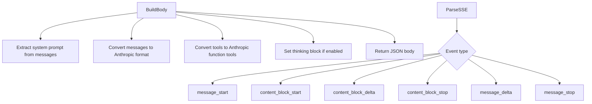
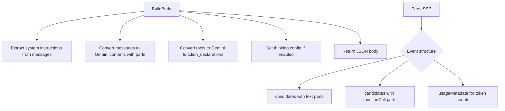
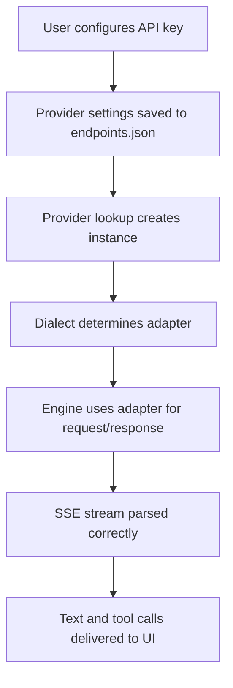

# Anthropic and Gemini Dialect Support

## Core Problem

Add native API support for Anthropic Claude and Google Gemini providers. Currently only OpenAI-compatible dialects are implemented. Both providers use fundamentally different request/response formats requiring dedicated adapters and providers.

## Goal

Users can authenticate with Claude and Gemini API keys, select models from both providers, stream responses with tool calling support, and think/reasoning mode works where applicable.

---

## 1. Anthropic Provider

- **Pattern:** Provider Factory, Port & Adapter

**Objective:** Implement the Anthropic provider registration, authentication, and URL resolution.

**Success Criteria:** Anthropic provider is registered, authenticates via API key, and resolves correct chat and models URLs.

```mermaid
graph TD
    A[init() registers anthropic provider] --> B[Provider factory creates AnthropicProvider]
    B --> C[PrepareRequest sets x-api-key header]
    B --> D[Dialect returns DialectAnthropic]
    B --> E[GetChatURL returns messages endpoint]
    B --> F[StaticModels returns Claude model list]
```

### 1.1. Add Anthropic provider constants and config

**Type:** feature

**What:** Add ProviderAnthropic constant and anthropic provider struct to config and provider packages.

**Why:** Establishes the provider name in the registry and enables users to configure Anthropic as a provider.

**Files:**

- + internal/config/endpoints.go
- + internal/chat/provider/anthropic.go

**Snippet:**

```
const ProviderAnthropic = "anthropic"

type AnthropicProvider struct {
    settings *config.ProviderSettings
}

func (a *AnthropicProvider) Dialect() config.Dialect {
    return config.DialectAnthropic
}

func (a *AnthropicProvider) SupportedAuth() []config.AuthMethod {
    return []config.AuthMethod{config.AuthAPIKey}
}

func (a *AnthropicProvider) DefaultBaseURL() string {
    return "https://api.anthropic.com"
}

func (a *AnthropicProvider) GetChatURL() string {
    base := a.settings.BaseURL
    if base == "" { base = a.DefaultBaseURL() }
    return base + "/v1/messages"
}
```

**Acceptance Criteria:**

- [ ] ProviderAnthropic constant is defined in config package
- [ ] AnthropicProvider struct implements all Provider interface methods
- [ ] Default base URL is https://api.anthropic.com
- [ ] Chat URL resolves to /v1/messages
- [ ] Dialect returns DialectAnthropic
- [ ] SupportedAuth returns API key method
- [ ] RequiresBaseURL returns false for the known cloud provider

**Verify:**

```bash
go build ./...
```

```bash
go test ./internal/chat/provider/...
```

### 1.2. Implement Anthropic provider auth and models

**Type:** feature

**What:** Add API key authentication via x-api-key header and anthropic-version header, plus Claude model list and PrepareRequest logic.

**Why:** Anthropic requires its own header-based authentication and versioning for request signing.

**Files:**

- ~ internal/chat/provider/anthropic.go

**Snippet:**

```
// PrepareRequest sets Anthropic-specific headers
func (a *AnthropicProvider) PrepareRequest(req *http.Request) error {
    if a.settings.Credentials != nil && a.settings.Credentials.APIKey != "" {
        req.Header.Set("x-api-key", a.settings.Credentials.APIKey)
    }
    req.Header.Set("anthropic-version", "2023-06-01")
    req.Header.Set("anthropic-dangerous-direct-browser-access", "true")
    return nil
}

func (a *AnthropicProvider) StaticModels() []string {
    return []string{
        "claude-opus-4-20250514",
        "claude-sonnet-4-20250514",
        "claude-sonnet-4-5-20250929",
        "claude-haiku-3-5-20241022",
        "claude-opus-4-20250514",
    }
}
```

**Acceptance Criteria:**

- [ ] PrepareRequest sets x-api-key header from credentials
- [ ] PrepareRequest sets anthropic-version header
- [ ] StaticModels returns known Claude model IDs
- [ ] IsExpired returns false since API key auth does not expire
- [ ] Refresh returns nil for API key providers

**Verify:**

```bash
go build ./...
```

```bash
go test ./internal/chat/provider/...
```

---

## 2. Anthropic Adapter

- **Pattern:** Adapter Pattern, Vertical Slice

**Objective:** Implement the Anthropic API adapter that translates internal messages/tools into Claude request format and parses Claude SSE events.

**Success Criteria:** Claude requests serialize correctly with system prompt, messages, tools, and thinking. SSE events parse text deltas, thinking deltas, tool call deltas, and completion.



### 2.1. Implement Anthropic adapter BuildBody

**Type:** feature

**What:** Create AnthropicAdapter with BuildBody that converts internal messages to Anthropic messages API format with system prompt, messages, tools, and thinking.

**Why:** Anthropic uses a distinct request format: system is a top-level string, messages use role/content with text blocks, and tools are separate from messages.

**Files:**

- + internal/chat/adapter/anthropic.go

**Snippet:**

```
type AnthropicAdapter struct {}

// Anthropic request structure
type anthropicRequest struct {
    Model    string                   
    System   interface{}              
    Messages []anthropicMessage       
    Tools    []anthropicTool          
    MaxTokens int                     
    Thinking *anthropicThinking       
    Stream   bool                     
}

type anthropicMessage struct {
    Role    string           
    Content interface{}      
}

type anthropicTextBlock struct {
    Type string 
    Text string 
}

type anthropicToolUseBlock struct {
    Type     string 
    ID       string 
    Name     string 
    Input    map[string]interface{} 
}

type anthropicToolResultBlock struct {
    Type       string 
    ToolUseID  string 
    Content    string 
}

// Convert internal roles: system -> top-level, user/assistant stay, tool -> user with tool_result
```

**Acceptance Criteria:**

- [ ] BuildBody extracts system prompt from system role messages and places it in the top-level system field
- [ ] BuildBody converts user messages to role=user with text blocks
- [ ] BuildBody converts assistant messages with tool calls to tool_use blocks
- [ ] BuildBody converts tool result messages to user role with tool_result blocks
- [ ] BuildBody converts tools to Anthropic function tool format with name, description, input_schema
- [ ] BuildBody sets thinking block with budget when thinking is enabled
- [ ] BuildBody sets max_tokens (e.g. 8192 for claude)
- [ ] BuildBody sets stream to true

**Verify:**

```bash
go build ./...
```

```bash
go test ./internal/chat/adapter/...
```

### 2.2. Implement Anthropic adapter ParseSSE

**Type:** feature

**What:** Create ParseSSE for Anthropic that handles message_start, content_block_start, content_block_delta, content_block_stop, message_delta, and message_stop SSE events.

**Why:** Anthropic streams events with distinct types for text, thinking, and tool_use blocks that need mapping to AdapterEvent.

**Files:**

- ~ internal/chat/adapter/anthropic.go

**Snippet:**

```
func (a *AnthropicAdapter) ParseSSE(payload string) *AdapterEvent {
    // Parse event type from top-level type field
    // message_start: extract stop_reason for done signal
    // content_block_start: detect text vs tool_use vs thinking blocks
    // content_block_delta: extract text delta, thinking delta, or tool_use arg delta
    // content_block_stop: end of current block
    // message_delta: extract stop_reason
    // message_stop: done signal
}
```

**Acceptance Criteria:**

- [ ] ParseSSE handles message_stop event and returns Done=true
- [ ] ParseSSE handles content_block_delta for text content and returns Text delta
- [ ] ParseSSE handles content_block_delta for thinking blocks and returns Thinking delta
- [ ] ParseSSE handles content_block_start for tool_use and initializes ToolCallName/ToolCallID
- [ ] ParseSSE handles content_block_delta for tool_use input and returns ToolCallDelta
- [ ] ParseSSE handles message_delta stop_reason and returns appropriate stop reason
- [ ] ParseSSE returns nil for intermediate/skip events (ping, message_start without data, etc.)

**Verify:**

```bash
go build ./...
```

```bash
go test ./internal/chat/adapter/...
```

### 2.3. Wire Anthropic dialect into engine

**Type:** feature

**What:** Add DialectAnthropic case in engine.go NewEngine to instantiate AnthropicAdapter.

**Why:** The engine needs to route Anthropic dialect requests to the correct adapter.

**Files:**

- ~ internal/chat/engine.go

**Snippet:**

```
var a adapter.APIAdapter
switch p.Dialect() {
case config.DialectOpenAICodex:
    a = &adapter.CodexAdapter{}
case config.DialectAnthropic:
    a = &adapter.AnthropicAdapter{}
default:
    a = &adapter.ChatCompletionsAdapter{}
}
```

**Acceptance Criteria:**

- [ ] Engine selects AnthropicAdapter when provider Dialect returns DialectAnthropic
- [ ] Existing OpenAI-compatible and Codex adapters remain unaffected
- [ ] go build succeeds with the new case

**Verify:**

```bash
go build ./...
```

---

## 3. Gemini Provider

- **Pattern:** Provider Factory, Port & Adapter

**Objective:** Implement the Gemini provider registration, API key authentication, and URL resolution for Google's Generative Language API.

**Success Criteria:** Gemini provider is registered, authenticates via API key, and resolves correct generateContent and models URLs.

```mermaid
graph TD
    A[init() registers gemini provider] --> B[Provider factory creates GeminiProvider]
    B --> C[PrepareRequest appends key query param]
    B --> D[Dialect returns DialectGemini]
    B --> E[GetChatURL returns generateContent endpoint]
    B --> F[StaticModels returns Gemini model list]
```

### 3.1. Add Gemini provider constants and config

**Type:** feature

**What:** Add ProviderGemini constant and gemini provider struct with API key auth and URL resolution.

**Why:** Establishes the Gemini provider in the registry and enables users to configure Gemini as a provider with native API support.

**Files:**

- + internal/config/endpoints.go
- + internal/chat/provider/gemini.go

**Snippet:**

```
const ProviderGemini = "gemini"

type GeminiProvider struct {
    settings *config.ProviderSettings
}

func (g *GeminiProvider) Dialect() config.Dialect {
    return config.DialectGemini
}

func (g *GeminiProvider) SupportedAuth() []config.AuthMethod {
    return []config.AuthMethod{config.AuthAPIKey}
}

func (g *GeminiProvider) DefaultBaseURL() string {
    return "https://generativelanguage.googleapis.com"
}

func (g *GeminiProvider) GetChatURL() string {
    // Returns v1beta/models/MODEL:generateContent?key=API_KEY with streaming
}
```

**Acceptance Criteria:**

- [ ] ProviderGemini constant is defined in config package
- [ ] GeminiProvider struct implements all Provider interface methods
- [ ] Default base URL is https://generativelanguage.googleapis.com
- [ ] Chat URL resolves to the generateContent endpoint with api version and streaming=true
- [ ] Dialect returns DialectGemini
- [ ] SupportedAuth returns API key method
- [ ] RequiresBaseURL returns false for the known cloud provider
- [ ] StaticModels returns known Gemini model IDs

**Verify:**

```bash
go build ./...
```

```bash
go test ./internal/chat/provider/...
```

### 3.2. Implement Gemini provider auth and models

**Type:** feature

**What:** Add API key authentication via query parameter and Gemini model list with PrepareRequest logic.

**Why:** Gemini authenticates via ?key=API_KEY query parameter appended to the URL, not via headers.

**Files:**

- ~ internal/chat/provider/gemini.go

**Snippet:**

```
func (g *GeminiProvider) PrepareRequest(req *http.Request) error {
    // Gemini uses query param auth - append key to URL
    if g.settings.Credentials != nil && g.settings.Credentials.APIKey != "" {
        u, _ := url.Parse(req.URL.String())
        q := u.Query()
        q.Set("key", g.settings.Credentials.APIKey)
        u.RawQuery = q.Encode()
        req.URL = u
    }
    return nil
}

func (g *GeminiProvider) StaticModels() []string {
    return []string{
        "gemini-2.5-pro",
        "gemini-2.5-flash",
        "gemini-2.5-flash-lite",
        "gemini-2.0-flash",
    }
}
```

**Acceptance Criteria:**

- [ ] PrepareRequest appends ?key=API_KEY query parameter to the request URL
- [ ] StaticModels returns known Gemini model IDs
- [ ] IsExpired returns false for API key auth
- [ ] Refresh returns nil for API key providers
- [ ] Models URL returns the list models endpoint

**Verify:**

```bash
go build ./...
```

```bash
go test ./internal/chat/provider/...
```

---

## 4. Gemini Adapter

- **Pattern:** Adapter Pattern, Vertical Slice

**Objective:** Implement the Gemini API adapter that translates internal messages/tools into Gemini generateContent format and parses streaming response events.

**Success Criteria:** Gemini requests serialize correctly with contents, tools, and system instructions. Streaming events parse text deltas, function calls, and completion.



### 4.1. Implement Gemini adapter BuildBody

**Type:** feature

**What:** Create GeminiAdapter with BuildBody that converts internal messages to Gemini generateContent format with system instructions, contents, tools, and thinking config.

**Why:** Gemini uses a distinct request format: system_instruction is separate from contents, messages map to parts with role alternation, and tools use function_declarations.

**Files:**

- + internal/chat/adapter/gemini.go

**Snippet:**

```
type GeminiAdapter struct {}

// Gemini request structure for generateContent
type geminiRequest struct {
    Contents         []geminiContent     
    Tools            []geminiTool        
    SystemInstruction *geminiContent     
    GenerationConfig *geminiGenConfig    
}

type geminiContent struct {
    Role  string           
    Parts []geminiPart     
}

type geminiPart struct {
    Text         string                 
    FunctionCall *geminiFunctionCall    
    FunctionResponse *geminiFuncResp   
}

// Convert internal roles: system -> system_instruction, user/assistant -> role user/model, tool -> functionResponse
```

**Acceptance Criteria:**

- [ ] BuildBody extracts system prompt into system_instruction content
- [ ] BuildBody converts user messages to role=user with text parts
- [ ] BuildBody converts assistant messages with tool calls to functionCall parts
- [ ] BuildBody converts tool result messages to functionResponse parts with role=model
- [ ] BuildBody converts tools to Gemini function_declarations with name, description, parameters
- [ ] BuildBody sets thinking_config when thinking is enabled
- [ ] BuildBody handles Gemini role convention (user vs model, not assistant)

**Verify:**

```bash
go build ./...
```

```bash
go test ./internal/chat/adapter/...
```

### 4.2. Implement Gemini adapter ParseSSE

**Type:** feature

**What:** Create ParseSSE for Gemini that handles the generateContent streaming response with candidates containing text parts and functionCall parts.

**Why:** Gemini streaming returns a single JSON object per SSE chunk with candidates containing incremental text or function calls.

**Files:**

- ~ internal/chat/adapter/gemini.go

**Snippet:**

```
func (g *GeminiAdapter) ParseSSE(payload string) *AdapterEvent {
    // Each SSE chunk is a complete JSON object
    // with candidates array containing content with parts
    // Parse text parts -> Text delta
    // Parse functionCall parts -> ToolCallName, ToolCallDelta
    // Parse usageMetadata with finishReason -> Done event
}
```

**Acceptance Criteria:**

- [ ] ParseSSE handles text parts in candidates and returns Text delta
- [ ] ParseSSE handles functionCall parts and returns ToolCallName, ToolCallDelta with arguments
- [ ] ParseSSE detects finishReason and returns Done with stop reason
- [ ] ParseSSE handles multiple parts in a single chunk
- [ ] ParseSSE returns nil for chunks with no meaningful content (usage-only)

**Verify:**

```bash
go build ./...
```

```bash
go test ./internal/chat/adapter/...
```

### 4.3. Wire Gemini dialect into engine

**Type:** feature

**What:** Add DialectGemini case in engine.go NewEngine to instantiate GeminiAdapter.

**Why:** The engine needs to route Gemini dialect requests to the correct adapter.

**Files:**

- ~ internal/chat/engine.go

**Snippet:**

```
var a adapter.APIAdapter
switch p.Dialect() {
case config.DialectOpenAICodex:
    a = &adapter.CodexAdapter{}
case config.DialectAnthropic:
    a = &adapter.AnthropicAdapter{}
case config.DialectGemini:
    a = &adapter.GeminiAdapter{}
default:
    a = &adapter.ChatCompletionsAdapter{}
}
```

**Acceptance Criteria:**

- [ ] Engine selects GeminiAdapter when provider Dialect returns DialectGemini
- [ ] Existing OpenAI-compatible, Codex, and Anthropic adapters remain unaffected
- [ ] go build succeeds with the new case

**Verify:**

```bash
go build ./...
```

---

## 5. Integration and Testing

- **Pattern:** End-to-End Verification

**Objective:** Verify both providers integrate correctly with the engine, UI model picker, and endpoint configuration.

**Success Criteria:** Both providers appear in the model picker, accept API key configuration, and can be selected for chat sessions.



### 5.1. Add unit tests for Anthropic and Gemini adapters

**Type:** test

**What:** Add unit tests for both AnthropicAdapter and GeminiAdapter covering BuildBody and ParseSSE with representative payloads.

**Why:** Ensures correctness of request serialization and response parsing for both new dialects before live testing.

**Files:**

- + internal/chat/adapter/anthropic_test.go
- + internal/chat/adapter/gemini_test.go

**Snippet:**

```
// TestAnthropicAdapterBuildBody tests system extraction, user/assistant/tool messages, tools, and thinking
// TestAnthropicAdapterParseSSE tests text delta, thinking delta, tool_use start/delta, and message_stop
// TestGeminiAdapterBuildBody tests system_instruction, user/model contents, functionCall/functionResponse parts
// TestGeminiAdapterParseSSE tests text parts, functionCall parts, and finishReason detection
```

**Acceptance Criteria:**

- [ ] BuildBody test covers system prompt extraction for both adapters
- [ ] BuildBody test covers user message conversion
- [ ] BuildBody test covers assistant message with tool calls conversion
- [ ] BuildBody test covers tool result message conversion
- [ ] BuildBody test covers tool definition conversion
- [ ] BuildBody test covers thinking mode toggle
- [ ] ParseSSE test covers text streaming
- [ ] ParseSSE test covers tool call streaming
- [ ] ParseSSE test covers done/stop detection

**Verify:**

```bash
go test ./internal/chat/adapter/... -v
```

### 5.2. Add unit tests for Anthropic and Gemini providers

**Type:** test

**What:** Add unit tests for both provider structs covering auth, URL resolution, and metadata methods.

**Why:** Validates provider contract compliance and correct URL/header behavior.

**Files:**

- + internal/chat/provider/anthropic_test.go
- + internal/chat/provider/gemini_test.go

**Snippet:**

```
// TestAnthropicProviderAuth verifies x-api-key header and anthropic-version header
// TestAnthropicProviderURLs verifies GetChatURL and GetModelsURL resolution
// TestGeminiProviderAuth verifies query parameter auth
// TestGeminiProviderURLs verifies generateContent URL with streaming
// TestIsConfigured verifies credential validation for both providers
```

**Acceptance Criteria:**

- [ ] Anthropic provider test verifies API key header is set correctly
- [ ] Anthropic provider test verifies anthropic-version header
- [ ] Anthropic provider test verifies chat URL resolution
- [ ] Gemini provider test verifies API key query param is appended
- [ ] Gemini provider test verifies generateContent URL resolution
- [ ] Both providers return correct dialect, supported auth, and static models

**Verify:**

```bash
go test ./internal/chat/provider/... -v
```
