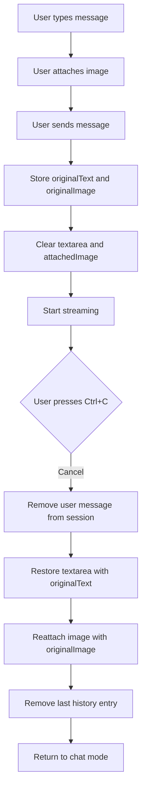

# Cancel Restore Feature Plan

## Objective

When a user cancels a streaming message that had an attached file, the system should:
1. Restore the original textarea text
2. Reattach the original image file
3. Remove the last entry from history (if not in incognito mode)

## Current Behavior

### sendMessage() Flow (internal/app/stream.go)
- Reads textarea value into `text` variable
- Adds user message to session
- Clears textarea (`m.textarea.SetValue("")`)
- Clears attached image (`m.attachedImage = ""`)
- Starts streaming

### handleStreamingKey() Flow (internal/app/input.go)
- On Ctrl+C during streaming:
  - Cancels the stream context
  - Removes the user message from session
  - Resets stream state
  - Returns to chat mode
- **Missing**: Does NOT restore textarea text or reattach image

## Implementation Plan

### 1. Update streamState Struct

**File**: `internal/app/stream.go`

Add two new fields to track original values:

```go
type streamState struct {
    text           string
    thinking       string
    inThinking     bool
    active         bool
    markdown       string
    markdownEnd    int
    tokenCount     int
    start          time.Time
    firstTokenTime time.Time
    cancelFn       context.CancelFunc
    ch             <-chan chat.StreamEvent
    userCancelled  bool
    originalText   string  // NEW: Store original textarea value
    originalImage  string  // NEW: Store original attached image path
}
```

### 2. Update reset() Method

**File**: `internal/app/stream.go`

Clear the new fields when resetting:

```go
func (ss *streamState) reset() {
    ss.text = ""
    ss.thinking = ""
    ss.inThinking = false
    ss.active = false
    ss.markdown = ""
    ss.markdownEnd = -1
    ss.tokenCount = 0
    ss.start = time.Time{}
    ss.firstTokenTime = time.Time{}
    ss.cancelFn = nil
    ss.ch = nil
    ss.userCancelled = false
    ss.originalText = ""    // NEW: Clear original text
    ss.originalImage = ""   // NEW: Clear original image
}
```

### 3. Update sendMessage() Method

**File**: `internal/app/stream.go`

Store original values before clearing:

```go
func (m Model) sendMessage() (tea.Model, tea.Cmd) {
    text := strings.TrimSpace(m.textarea.Value())
    if text == "" {
        return m, nil
    }

    // Store original values BEFORE clearing
    m.stream.originalText = text
    m.stream.originalImage = m.attachedImage

    if !m.incognito {
        config.AddHistoryEntry(&m.history, text, m.settings.MaxHistory)
        _ = config.SaveHistory(m.paths, m.history)
    }
    m.historyIdx = -1
    m.draft = ""

    userMsg := config.DisplayMessage{
        Message: config.Message{
            ID:          fmt.Sprintf("msg_%d", len(m.session.messages)+1),
            Role:        "user",
            CreatedAt:   time.Now(),
            Text:        text,
            ImagePath:   m.attachedImage,
            InputTokens: countTokensApprox(text),
        },
    }
    m.session.appendMsg(userMsg)

    m.textarea.SetValue("")
    m.textarea.Blur()

    apiMsgs := chat.BuildAPIMessages(m.paths, m.settings, m.session.messages)
    m.attachedImage = ""
    // ... rest of the function
}
```

### 4. Update handleStreamingKey() Method

**File**: `internal/app/input.go`

Restore text, reattach image, and remove history entry on cancel:

```go
func (m Model) handleStreamingKey(msg tea.KeyMsg) (tea.Model, tea.Cmd) {
    switch {
    case key.Matches(msg, keys.Cancel):
        if m.stream.cancelFn != nil {
            m.stream.userCancelled = true
            m.stream.cancelFn()
        }

        // Remove the user message that was added before streaming started
        n := len(m.session.messages)
        if n > 0 && m.session.messages[n-1].Role == "user" {
            m.session.truncateTo(n - 1)
        }

        // Restore original text to textarea
        if m.stream.originalText != "" {
            m.textarea.SetValue(m.stream.originalText)
        }

        // Reattach the original image
        if m.stream.originalImage != "" {
            m.attachedImage = m.stream.originalImage
        }

        // Remove last history entry (if not in incognito mode)
        if !m.incognito && len(m.history.Entries) > 0 {
            m.history.Entries = m.history.Entries[:len(m.history.Entries)-1]
            _ = config.SaveHistory(m.paths, m.history)
        }

        m.stream.active = false
        m.stream.tokenCount = 0
        m.stream.text = ""
        m.stream.thinking = ""
        m.stream.markdown = ""
        m.stream.markdownEnd = -1

        m.mode = ModeChat
        m.textarea.Focus()

        m.updateViewportContent()
        return m, nil
    // ... rest of the function
}
```

## Summary of Changes

| File | Function | Change |
|------|----------|--------|
| `internal/app/stream.go` | `streamState` struct | Add `originalText` and `originalImage` fields |
| `internal/app/stream.go` | `reset()` | Clear new fields |
| `internal/app/stream.go` | `sendMessage()` | Store original values before clearing |
| `internal/app/input.go` | `handleStreamingKey()` | Restore text, reattach image, remove history entry |

## Testing Checklist

- [ ] Send a message with attached image, then cancel - verify image is reattached
- [ ] Send a message without image, then cancel - verify text is restored
- [ ] Verify history entry is removed on cancel (non-incognito mode)
- [ ] Verify incognito mode doesn't add/remove history entries
- [ ] Verify multiple cancel operations work correctly
- [ ] Verify error handling still works (user message removal on error)

## Mermaid Flow Diagram


