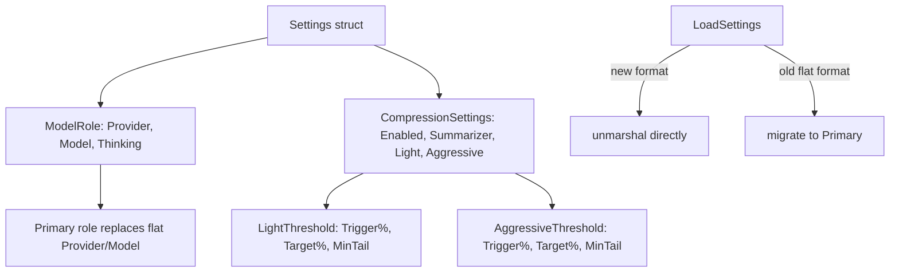
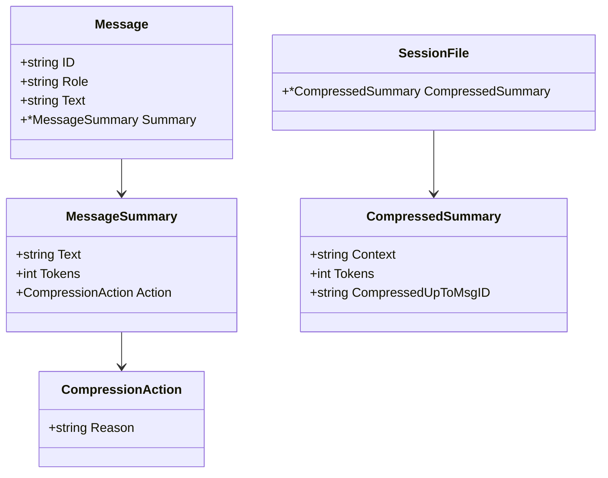
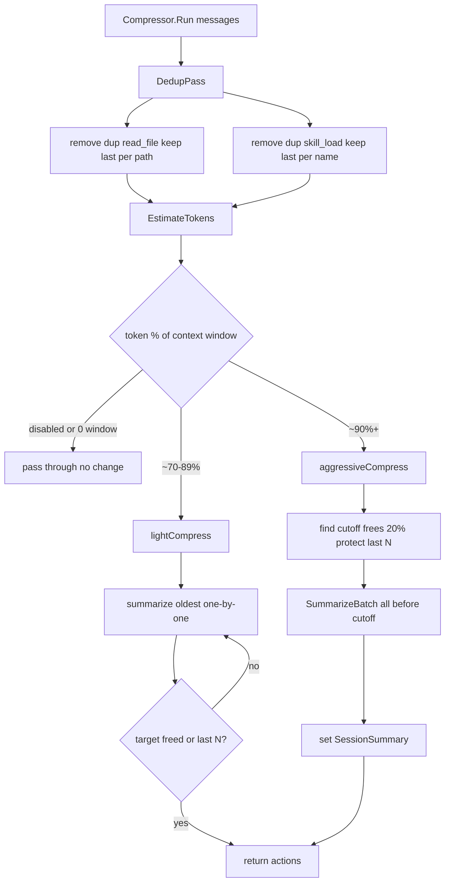
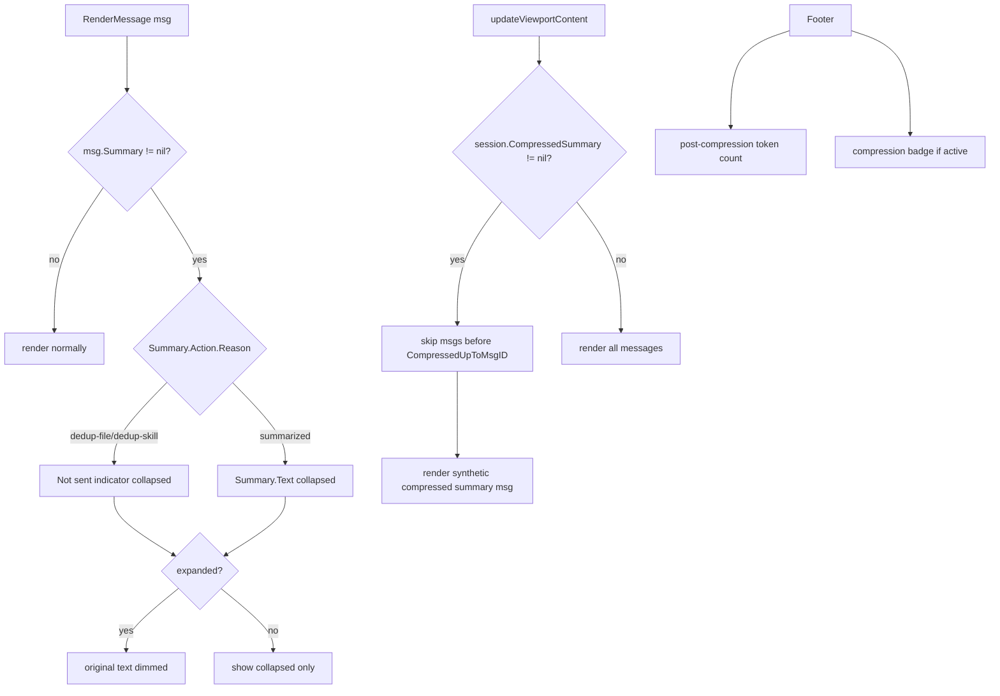

# Dynamic Context Compression

## Core Problem

Long conversations exceed context windows. Current BuildAPIMessages is a dumb pass-through with no compression, wasting tokens on repeated file reads, skill loads, and stale assistant messages.

## Goal

Compressed context that fits within window. Stable KV cache by compressing in meaningful chunks. User-visible compression state (summarized content, dedup indicators).

---

## 1. Settings & Config

- **Pattern:** Data Model, Config Migration

**Objective:** Add summarizer provider/model config and compression thresholds to Settings. Migrate from flat Provider/Model to structured Primary/Summarizer roles.

**Success Criteria:** Settings struct supports primary + summarizer model roles. Compression thresholds configurable. Existing sessions backward compatible.



### 1.1. Add compression settings to Settings struct

**Type:** feature

**What:** Add CompressionSettings struct to config/settings.go with Enabled, Summarizer role, and threshold configs. Migrate existing flat Provider/Model into Primary role.

**Why:** Settings needs to drive compression behavior. Existing flat fields need to become Primary role for backward compatibility.

**Files:**

- ~ internal/config/settings.go

**Snippet:**

```
type ModelRole struct {
	Provider string `json:"provider"`
	Model    string `json:"model"`
	Thinking bool   `json:"thinking,omitempty"`
}
type CompressionThreshold struct {
	Trigger         int `json:"trigger"`
	TargetReduction int `json:"target_reduction"`
	MinTailMessages int `json:"min_tail_messages"`
}
type CompressionSettings struct {
	Enabled    bool                 `json:"enabled"`
	Summarizer ModelRole            `json:"summarizer"`
	Light      CompressionThreshold `json:"light"`
	Aggressive CompressionThreshold `json:"aggressive"`
}
```

```
type Settings struct {
	Primary     ModelRole           `json:"primary"`
	Compression CompressionSettings `json:"compression"`
	// ... existing fields (MaxHistory, AutoSave, etc.) ...
}
```

```
func DefaultSettings() Settings {
	return Settings{
		Primary: ModelRole{Provider: "vllm"},
		Compression: CompressionSettings{
			Enabled: false,
			Light: CompressionThreshold{Trigger: 70, TargetReduction: 20, MinTailMessages: 5},
			Aggressive: CompressionThreshold{Trigger: 90, TargetReduction: 20, MinTailMessages: 10},
		},
		// ... existing defaults ...
	}
}
```

```
func LoadSettings(p Paths) Settings {
	s := DefaultSettings()
	data, err := os.ReadFile(p.SettingsFile())
	if err != nil { return s }
	if err := json.Unmarshal(data, &s); err == nil { return s }
	// Migrate old flat format
	var legacy struct {
		Provider string `json:"provider"`
		Model    string `json:"model"`
		Thinking bool   `json:"thinking"`
	}
	_ = json.Unmarshal(data, &legacy)
	s.Primary = ModelRole{Provider: legacy.Provider, Model: legacy.Model, Thinking: legacy.Thinking}
	return s
}
```

**Acceptance Criteria:**

- [ ] DefaultSettings returns Primary with existing defaults and Compression.Enabled = false
- [ ] LoadSettings migrates old flat Provider/Model/Thinking into Primary
- [ ] SaveSettings round-trips the new struct without data loss
- [ ] Existing sessions without compression fields load with defaults

**Verify:**

```bash
go build ./...
```

### 1.2. Update all references to flat Provider and Model fields

**Type:** refactor

**What:** Update all code that reads settings.Provider and settings.Model to use settings.Primary.Provider and settings.Primary.Model across app, chat, and config packages.

**Why:** Settings struct changed from flat fields to nested ModelRole. All callers need updating to avoid compile errors.

**Files:**

- ~ internal/app/app.go
- ~ internal/app/stream.go
- ~ internal/chat/engine.go
- ~ internal/ui/footer.go

**Snippet:**

```
// settings.Provider -> settings.Primary.Provider
// settings.Model -> settings.Primary.Model  
// settings.Thinking -> settings.Primary.Thinking
// chat.NewEngine(chatURL, m.settings.Primary.Model, m.settings.Primary.Thinking)
// modelBasename(m.settings.Primary.Model) in footer
// ResolveChatURL(m.endpoints, m.settings.Primary.Provider) in stream
```

**Acceptance Criteria:**

- [ ] All references to flat Provider/Model/Thinking updated
- [ ] ResolveChatURL uses Primary.Provider
- [ ] NewEngine uses Primary.Model and Primary.Thinking
- [ ] Footer display shows correct model name from Primary

**Verify:**

```bash
go build ./...
```

---

## 2. Compression Data Model

- **Pattern:** Value Object, Session Metadata

**Objective:** Define the data structures for individual message summaries and session-level compressed summaries. Add fields to Message and SessionFile.

**Success Criteria:** Message has optional Summary with reason. SessionFile has optional CompressedSummary. Both persist through save/load.



### 2.1. Add compression fields to Message and SessionFile

**Type:** feature

**What:** Add Summary field to Message and CompressedSummary field to SessionFile in config/session.go

**Why:** Messages need to store individual summaries for UI. SessionFile needs session-level summary for cross-message compression.

**Files:**

- ~ internal/config/session.go

**Snippet:**

```
type CompressionAction struct {
	Reason string `json:"reason"` // dedup-file, dedup-skill, summarized
}
```

```
type MessageSummary struct {
	Text   string            `json:"text"`
	Tokens int               `json:"tokens"`
	Action CompressionAction `json:"action,omitempty"`
}
```

```
type CompressedSummary struct {
	Context             string `json:"context"`
	Tokens              int    `json:"tokens"`
	CompressedUpToMsgID string `json:"compressed_up_to_msg_id"`
}
```

```
// Added to Message struct:
	Summary *MessageSummary `json:"summary,omitempty"`
```

```
// Added to SessionFile struct:
	CompressedSummary *CompressedSummary `json:"compressed_summary,omitempty"`
```

```
// Added to ToolCallEntry.Execution:
	SkipExecutionSummary string `json:"skip_execution_summary,omitempty"`
```

**Acceptance Criteria:**

- [ ] Message with nil Summary is backward compatible
- [ ] SessionFile with nil CompressedSummary serializes without the field
- [ ] Non-nil Summary persists through SaveSession/LoadSession round-trip
- [ ] Non-nil CompressedSummary persists through SaveSession/LoadSession round-trip
- [ ] CompressionAction.Reason supports dedup-file, dedup-skill, summarized, session-compressed
- [ ] ToolCallEntry.Execution has SkipExecutionSummary for deduped tool calls
- [ ] SkipExecutionSummary persists through SaveSession/LoadSession round-trip

**Verify:**

```bash
go build ./...
```

---

## 3. Compressor Engine

- **Pattern:** Strategy Pattern, Pipeline

**Objective:** Build the compression engine that runs dedup rules, checks thresholds, and triggers summarization. Plugs into BuildAPIMessages as a pre-processing step.

**Success Criteria:** Compressor.Run() returns filtered results. Dedup for read_file/skill_load works. Token estimation works. Light 70% and aggressive 90% thresholds trigger correctly with proper tail protection.



### 3.1. Build summarizer API client

**Type:** feature

**What:** Create summarizer.go in compress package that calls the summarizer model endpoint for individual message and batch session summaries.

**Why:** The compressor needs to call a separate model endpoint to generate summaries using the configured summarizer provider and model.

**Files:**

- + internal/compress/summarizer.go

**Snippet:**

```
type Summarizer struct {
	Client  *http.Client
	ChatURL string
	Model   string
}
func NewSummarizer(endpoints config.EndpointsConfig, role config.ModelRole) *Summarizer
```

```
func (s *Summarizer) SummarizeMessage(ctx context.Context, role, text string) (string, int, error)
func (s *Summarizer) SummarizeBatch(ctx context.Context, msgs []struct{ Role, Text string }) (string, int, error)
```

```
// Uses non-streaming chat completion with a system prompt asking for concise summary.
// 30 second timeout. Returns (summary text, token count, error).
```

**Acceptance Criteria:**

- [ ] SummarizeMessage makes non-streaming chat completion call to summarizer endpoint
- [ ] SummarizeMessage returns summary text and approximate token count
- [ ] SummarizeBatch returns single combined summary
- [ ] Handles endpoint errors gracefully - returns error for compressor to handle
- [ ] Uses 30 second timeout

**Verify:**

```bash
go build ./...
```

### 3.2. Build compressor engine with dedup, token estimation, and threshold logic

**Type:** feature

**What:** Create Compressor struct and Run() method with dedup rules, token estimation, and light/aggressive summarization passes.

**Why:** Core compression logic that transforms message history before sending to API.

**Files:**

- + internal/compress/compressor.go
- + internal/compress/dedup.go
- + internal/compress/tokenizer.go

**Snippet:**

```
type Compressor struct {
	Paths     config.Paths
	Endpoints config.EndpointsConfig
	Settings  config.Settings
}
```

```
type CompressionResult struct {
	Actions        []config.CompressionAction
	SessionSummary *config.CompressedSummary
}
```

```
func (c *Compressor) Run(messages []config.Message) *CompressionResult {
	if !c.Settings.Compression.Enabled || c.Settings.ContextWindow == 0 {
		return &CompressionResult{}
	}
	actions := c.dedupToolEntries(messages)
	tokens := estimateTokens(messages, actions)  // shared function
	pct := tokens * 100 / c.Settings.ContextWindow
	if pct >= c.Settings.Compression.Aggressive.Trigger {
		actions = append(actions, c.aggressiveCompress(messages, actions)...)
	} else if pct >= c.Settings.Compression.Light.Trigger {
		actions = append(actions, c.lightCompress(messages, actions)...)
	}
	return &CompressionResult{Actions: actions}
}
```

```
// dedupToolEntries: scan assistant msgs with tool calls.
// For read_file keep last execution per path, earlier get SkipExecutionSummary
// For skill_load keep last execution per name, earlier get SkipExecutionSummary
// Does NOT remove messages — just marks tool entries with skip summary.
```

```
// lightCompress: summarize oldest msgs one by one until target freed or last N reached. Updates msg.Summary in-place.
// aggressiveCompress: find cutoff that frees 20% tokens respecting MinTailMessages. SummarizeBatch all before cutoff. Sets SessionSummary.
```

**Acceptance Criteria:**

- [ ] Dedup keeps last read_file per path, marks earlier tool entries with SkipExecutionSummary
- [ ] Dedup keeps last skill_load per skill name, marks earlier tool entries with SkipExecutionSummary
- [ ] Does NOT remove messages from sequence — only marks tool entries as skipped
- [ ] Token estimation uses shared estimateTokens() function
- [ ] Light compression summarizes oldest until target met or last N reached
- [ ] Aggressive compression creates CompressedSummary with cutoff respecting MinTailMessages
- [ ] Uses configured Summarizer Provider/Model
- [ ] Disabled compression returns empty result (pass-through)
- [ ] ContextWindow=0 means no compression
- [ ] Summarizer API failure falls back to uncompressed

**Verify:**

```bash
go build ./...
```

### 3.2b. Add estimateTokens to chat_session

**Type:** feature

**What:** Add estimateTokens() method to chat_session that walks all messages respecting CompressedSummary cutoff, skipped tool entries, and Summary text. Used by both compressor threshold checking and footer display.

**Why:** Single source of truth for token counting across the compression pipeline and footer display. Footer and compressor use the same logic.

**Files:**

- ~ internal/app/chat_session.go
- ~ internal/app/render.go

**Snippet:**

```
// estimateTokens walks all messages and returns total token count
// accounting for compression state:
//  - If CompressedSummary exists, skip all msgs before CompressedUpToMsgID,
//    count the CompressedSummary.Context tokens instead
//  - For each message: if msg.Summary exists, count Summary.Text tokens
//  - For each tool call entry: if SkipExecutionSummary set, count placeholder tokens
//    instead of full execution result
//  - For other tool calls: count execution tokens normally
func (cs *chatSession) estimateTokens() int {
	var total int
	startIdx := 0
	if cs.file.CompressedSummary != nil {
		total += countTokensApprox(cs.file.CompressedSummary.Context)
		// find index of CompressedUpToMsgID
		startIdx = findMsgIdx(cs.file.Messages, cs.file.CompressedSummary.CompressedUpToMsgID)
	}
	for i := startIdx; i < len(cs.file.Messages); i++ {
		total += estimateMessageTokens(cs.file.Messages[i])
	}
	return total
}
```

```
func estimateMessageTokens(msg config.Message) int {
	if msg.Summary != nil {
		return countTokensApprox(msg.Summary.Text)
	}
	var total int
	if msg.Role == config.RoleUser {
		total += countTokensApprox(msg.Text)
	}
	for _, tc := range msg.ToolCalls {
		if tc.SkipExecutionSummary != "" {
			total += countTokensApprox(tc.SkipExecutionSummary)
		} else {
			total += countTokensApprox(tc.Execution.Result)
		}
	}
	return total
}
```

**Acceptance Criteria:**

- [ ] Respects CompressedSummary cutoff — skips msgs before CompressedUpToMsgID
- [ ] Counts CompressedSummary.Context tokens as replacement for skipped msgs
- [ ] For msgs with Summary, counts Summary.Text tokens instead of original
- [ ] For tool entries with SkipExecutionSummary, counts placeholder tokens
- [ ] For normal tool entries, counts execution result tokens
- [ ] Used by compressor Run() for threshold percentage calculation
- [ ] Used by footer buildFooterData() for display token count

**Verify:**

```bash
go build ./...
```

### 3.3. Integrate compressor into BuildAPIMessages and session save

**Type:** refactor

**What:** Wire Compressor.Run() into BuildAPIMessages. Apply actions to messages. Handle existing CompressedSummary on session load. Persist results on auto-save.

**Why:** BuildAPIMessages is the single entry point. Compression must happen here. Results must persist across session reloads.

**Files:**

- ~ internal/chat/engine.go
- ~ internal/app/stream.go
- ~ internal/app/chat_session.go

**Snippet:**

```
func BuildAPIMessages(paths config.Paths, endpoints config.EndpointsConfig, settings config.Settings, session *config.SessionFile, messages []config.Message) []ChatMessage {
	var result *compress.CompressionResult
	if settings.Compression.Enabled && settings.ContextWindow > 0 {
		result = compress.NewCompressor(paths, endpoints, settings).Run(messages)
		applyActions(messages, result.Actions)
	}
	if session != nil && session.CompressedSummary != nil {
		return buildFromSummary(session.CompressedSummary, messages)
	}
	return buildMessages(messages)
}
```

```
// applyActions: set msg.Summary for each action. Dedup -> Summary with reason. Summarized -> Summary text.
// buildFromSummary: prepend synthetic msg with CompressedSummary.Context, skip msgs before CompressedUpToMsgID.
// In stream.go: after compression runs, set m.session.file.CompressedSummary = result.SessionSummary, trigger auto-save.
```

**Acceptance Criteria:**

- [ ] Disabled compression = unchanged BuildAPIMessages behavior
- [ ] Enabled dedup removes repeated read_file/skill_load from API output
- [ ] Summarized messages send Summary.Text to API instead of original
- [ ] Saved session with CompressedSummary starts from cutoff point
- [ ] Summaries applied to messages for UI rendering
- [ ] Compression results persist on auto-save

**Verify:**

```bash
go build ./...
```

---

## 4. UI Rendering

- **Pattern:** Conditional Render, Expand/Collapse

**Objective:** Render compressed, summarized, and deduped messages with expand/collapse. Update footer token count.

**Success Criteria:** Deduped messages show Not sent indicator + original dimmed on expand. Summarized show summary default + original dimmed on expand. CompressedSummary renders as synthetic message. Footer shows post-compression tokens.



### 4.1. Render compressed and summarized messages in UI

**Type:** feature

**What:** Update message rendering in ui/message_format.go and ui/message_draw.go to handle Summary fields. Update render.go to skip messages before CompressedSummary cutoff.

**Why:** User needs to see what was compressed and be able to expand to original. Messages before cutoff must not appear.

**Files:**

- ~ internal/ui/message_format.go
- ~ internal/ui/message_draw.go
- ~ internal/app/render.go

**Snippet:**

```
// In RenderMessage or renderAssistantMessage:
if msg.Summary != nil {
	switch msg.Summary.Action.Reason {
	case "dedup-file", "dedup-skill":
		collapsed = "Not sent: file superseded / skill already loaded"
		expanded = original text dimmed
	case "summarized":
		collapsed = msg.Summary.Text with Summary label
		expanded = Summary.Text + original dimmed
	}
}
```

```
// In render.go updateViewportContent:
// If session.CompressedSummary != nil, skip messages before CompressedUpToMsgID
// Render synthetic Compressed: N messages summarized message
```

```
// Dimmed style: lipgloss.NewStyle().Foreground(lipgloss.Color("243")).Render(original)
```

**Acceptance Criteria:**

- [ ] Message with Summary renders summary text in collapsed view
- [ ] Expanded view shows original text dimmed
- [ ] Deduped messages show not sent indicator collapsed
- [ ] Deduped messages show original dimmed on expand
- [ ] CompressedSummary renders as styled synthetic message
- [ ] Messages before CompressedUpToMsgID are not rendered

**Verify:**

```bash
go build ./...
```

### 4.2. Update footer to reflect post-compression token count

**Type:** feature

**What:** Update footer token counting to use post-compression estimate. Show compression indicator when active.

**Why:** Footer needs to show real token count going to API. Per-message headers stay frozen at generation time.

**Files:**

- ~ internal/ui/footer.go
- ~ internal/app/render.go

**Snippet:**

```
// buildFooterData: use session.estimateTokens() for live post-compression token count
// Per-message header tokens remain frozen at generation time (unchanged)
```

```
// Optional: show compression indicator in footer when active
// e.g. 'compress: 2 skipped, 1 summarized' badge
```

**Acceptance Criteria:**

- [ ] Footer total tokens comes from session.estimateTokens() — same function used by compressor
- [ ] Per-message header tokens unchanged (frozen at generation time)
- [ ] Compression indicator visible in footer when active

**Verify:**

```bash
go build ./...
```
