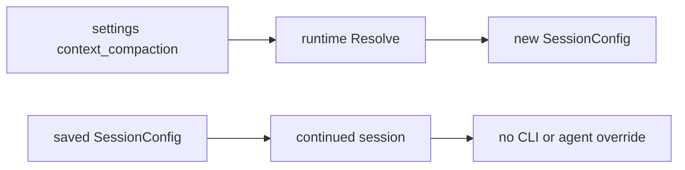
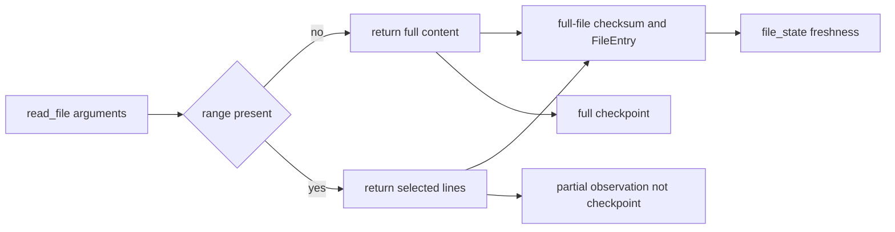
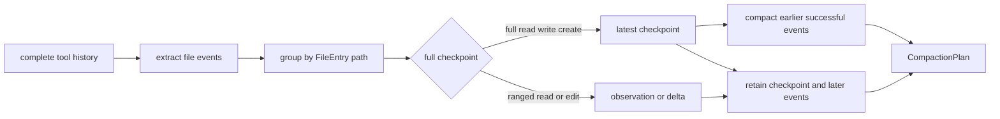
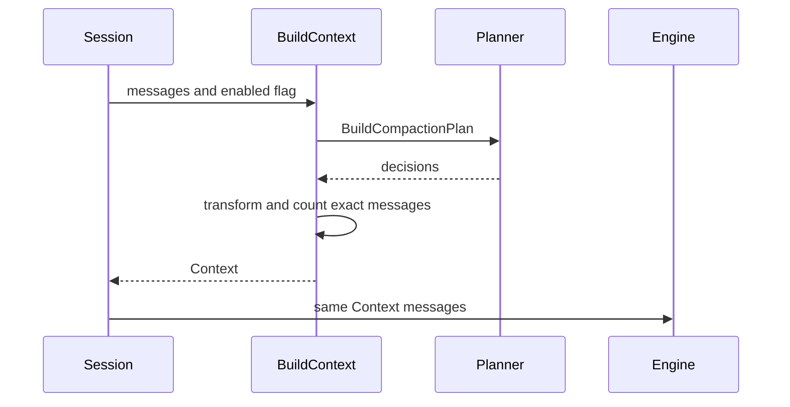
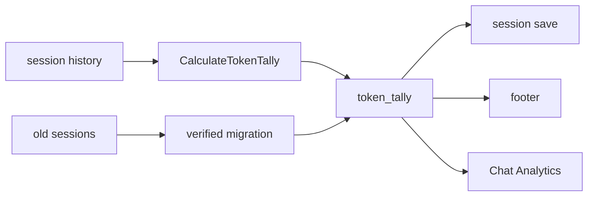
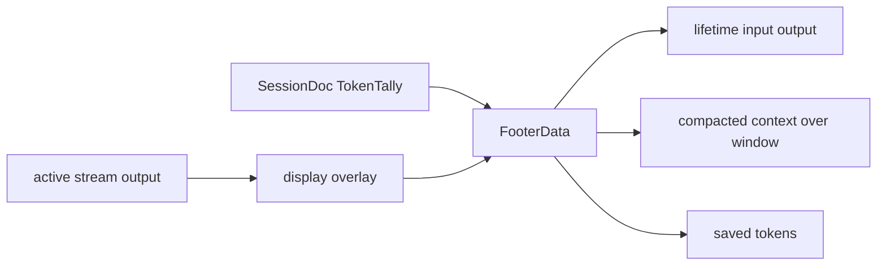
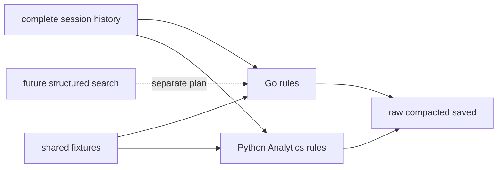

# Dynamic File Context Compaction

## Core Problem

Squid-OS sends superseded file-tool arguments and results back to the LLM, and its footer reports lifetime tokens rather than the exact next-request context. Full-file reads are also inefficient for focused inspection, encouraging unstructured sed usage.

## Goal

Add settings-controlled ranged reads and deterministic file compaction, build and measure the exact next LLM request, show its compacted size in the footer, and keep Chat Analytics aligned with the same rules.

---

## 1. Session Compaction Setting

- **Pattern:** Settings snapshot into session configuration

**Objective:** Resolve one global context_compaction switch into new sessions and preserve it in saved sessions without CLI or agent overrides.

**Success Criteria:** Settings and session JSON expose the switch, runtime resolution follows the documented precedence, and tests cover new and continued sessions.



### 1.1. Resolve compaction from settings into session state

**Type:** feature

**What:** Add the context compaction boolean to Settings and SessionConfig, resolve it from settings for new sessions, and preserve the saved value for existing sessions.

**Why:** Makes compaction a single settings-controlled behavior while keeping each session deterministic after creation.

**Files:**

- ~ defaultconfig/settings.json
- ~ internal/config/settings.go
- ~ internal/config/session.go
- ~ internal/runtime/runtime.go
- ~ internal/runtime/runtime_test.go
- ~ .squid-os/plans/session-config-resolution.md

**Snippet:**

```
type Settings struct {
    ContextCompaction bool `json:"context_compaction"`
}

type SessionConfig struct {
    ContextCompaction bool `json:"context_compaction"`
}
```

```
// New session: Settings -> SessionConfig
// Existing session: persisted SessionConfig
// No CLI or agent override.
```

**Acceptance Criteria:**

- [ ] The default settings file defines context_compaction.
- [ ] New sessions copy the settings value into initial and config.
- [ ] Existing interactive and autonomous sessions preserve their persisted value.
- [ ] No CLI option, runtime Overrides field, or agent field controls compaction.
- [ ] session-config-resolution.md documents settings-only resolution and immediate application.

**Verify:**

```bash
go test ./internal/config ./internal/runtime
```

---

## 2. Ranged File Reads

- **Pattern:** Structured partial observation with full-file freshness

**Objective:** Let read_file return focused line ranges while retaining canonical file paths and full-file checksums for stale-file protection.

**Success Criteria:** Full and ranged reads share the existing FileEntry/file_state flow, range reads return bounded content, and later compaction can distinguish partial reads from instruction arguments.



### 2.1. Support checksum-safe ranged read_file calls

**Type:** feature

**What:** Add optional start_line and end_line arguments to read_file, returning only the selected lines while computing and storing the normal full-file checksum.

**Why:** Provides the focused inspection efficiency currently obtained through sed without introducing a range registry or weakening stale-file detection.

**Files:**

- ~ internal/tools/core.go
- ~ internal/tools/core_test.go
- ~ internal/chat/tool_exec.go
- ~ internal/chat/tool_exec_test.go

**Snippet:**

```
// read_file input contract
{
  "path": "string",
  "start_line": "optional positive integer",
  "end_line": "optional positive integer"
}

// Persisted distinction:
// range present in ToolCallEntry.Instruction.Arguments => partial read
// no range fields => full read
// FileEntry.Path remains canonical and FileEntry.Checksum remains full-file.
```

**Acceptance Criteria:**

- [ ] Omitting both range arguments returns the complete file with unchanged behavior.
- [ ] A valid inclusive range returns only the requested lines with stable line-bound semantics.
- [ ] Invalid, reversed, zero, and out-of-bounds ranges return clear errors without updating file state.
- [ ] A successful ranged read computes FileEntry.Checksum from the complete file bytes and merges it through the existing file_state path.
- [ ] Multiple ranged reads of the same tracked file version succeed and do not invalidate one another.
- [ ] If a ranged read detects that a previously tracked file changed externally, it is rejected without replacing the tracked checksum and asks for a full read.
- [ ] A full read after an external change refreshes the tracked checksum through existing read behavior.
- [ ] No range registry, coverage model, or FileStateEntry schema expansion is introduced.

**Verify:**

```bash
go test ./internal/tools ./internal/chat -run 'ReadFile|FileState|FileChange'
```

---

## 3. File Compaction Rules

- **Pattern:** Pure deterministic planner

**Objective:** Derive one immutable compaction plan from persisted file-tool history using full-checkpoint rules and partial-read observations.

**Success Criteria:** The planner distinguishes full reads from ranged reads using persisted arguments, compacts only events superseded by a later full checkpoint, and reports combined instruction/result savings without mutating history.



### 3.1. Plan deterministic full-checkpoint compaction

**Type:** feature

**What:** Add a pure planner that classifies persisted file events, identifies full checkpoints, and produces per-tool-call compaction decisions with token summaries.

**Why:** Centralizes safe file rules for request construction, footer accounting, Analytics parity, and later tool-specific extensions.

**Files:**

- + internal/chat/compaction.go
- + internal/chat/compaction_test.go
- + internal/chat/compaction_benchmark_test.go

**Snippet:**

```
type CompactionDecision struct {
    ToolCallID string
    Path string
    Trace string
    CompactArguments bool
    CompactResult bool
    SupersededBy string
}

type CompactionTokens struct {
    RawInstruction int
    RawExecution int
    Raw int
    RetainedInstruction int
    RetainedExecution int
    Retained int
    SavedInstruction int
    SavedExecution int
    Saved int
}

type CompactionPlan struct {
    Decisions map[string]CompactionDecision
    Tokens CompactionTokens
}

func BuildCompactionPlan(messages []config.Message) CompactionPlan
```

```
// Checkpoint classification contract:
// read_file without start_line/end_line => full checkpoint
// read_file with either range argument => partial observation
// write_file trace write/create => full checkpoint
// edit_file => delta, including no-op read traces
```

**Acceptance Criteria:**

- [ ] The planner uses canonical FileEntry.path to group events and persisted read_file arguments to distinguish full from partial reads.
- [ ] Successful full reads and write/create events are full checkpoints.
- [ ] Ranged reads never supersede earlier reads, ranges, or edits.
- [ ] A later full read, write, or create compacts all earlier successful events for that path, including ranged reads.
- [ ] The latest checkpoint and all later partial reads and edits remain retained.
- [ ] No-op edit_file calls that emit read are not checkpoints.
- [ ] Failed and incomplete operations remain retained.
- [ ] Raw, retained, and saved instruction/execution totals match persisted metrics.
- [ ] Planning is deterministic and does not mutate messages.
- [ ] The planner scans persisted history once, groups events by canonical path with maps, and performs direct decision lookup by tool-call ID.
- [ ] The implementation avoids repeated whole-history scans per event and scales linearly with messages, tool calls, and file events.
- [ ] Benchmarks report planner ns/op, B/op, and allocs/op for a large synthetic session.

**Verify:**

```bash
go test ./internal/chat -run Compaction
```

```bash
go test -bench 'BuildCompactionPlan' -benchmem ./internal/chat
```

---

## 4. Compacted Request Context

- **Pattern:** Single request snapshot

**Objective:** Build, transform, and measure one exact provider-message snapshot for the next LLM request.

**Success Criteria:** Enabled sessions send compacted file history with valid tool pairing; disabled sessions remain unchanged; reported compacted tokens describe the exact request.



### 4.1. Build and send the exact compacted request

**Type:** feature

**What:** Add BuildContext to apply compaction decisions, count the resulting next-request provider messages, and make the stream path send that exact snapshot.

**Why:** Prevents request construction and token reporting from drifting while preserving complete persisted history.

**Files:**

- + internal/chat/context.go
- + internal/chat/context_test.go
- ~ internal/chat/engine.go
- ~ internal/chat/session.go
- ~ internal/chat/loop.go
- + internal/chat/context_benchmark_test.go

**Snippet:**

```
type ContextTokens struct {
    Raw int
    Compacted int
    Saved int
}

type Context struct {
    Messages []provider.Message
    Compaction CompactionPlan
    Tokens ContextTokens
}

func BuildContext(messages []config.Message, enabled bool) Context
func (s *Session) BuildContext() Context
```

**Acceptance Criteria:**

- [ ] Disabled compaction produces the existing provider messages and zero savings.
- [ ] Enabled compaction preserves tool-call IDs, names, chronology, valid JSON arguments, and matching results.
- [ ] Superseded read results are replaced while path and optional range arguments remain valid.
- [ ] Superseded edit old_string/new_string and result content are replaced with fixed internal text.
- [ ] Superseded write/create content and result content are replaced with fixed internal text.
- [ ] Persisted messages are unchanged after BuildContext.
- [ ] Compacted token count includes replacement overhead and describes Context.Messages exactly.
- [ ] StartStreamWithContext sends Context.Messages without an independent rebuild.
- [ ] Context transformation uses direct plan lookup, reuses unchanged strings where practical, and does not deep-copy the complete session history.
- [ ] Benchmarks report request-building ns/op, B/op, and allocs/op for a large synthetic session.

**Verify:**

```bash
go test ./internal/chat -run Context
```

```bash
go test -bench 'BuildContext' -benchmem ./internal/chat
```

---

## 5. Structured Session Token Tally

- **Pattern:** Persisted projection from canonical session history

**Objective:** Replace the scalar total_tokens field with one structured lifetime and current next-request token tally calculated by Squid-OS.

**Success Criteria:** Saved sessions contain complete lifetime and context totals, existing sessions are migrated safely, and Chat Analytics consumes the shared payload instead of duplicating tally and compaction calculations.



### 5.1. Persist a structured session token tally

**Type:** feature

**What:** Add one Go token tally contract that combines lifetime breakdowns with raw, compacted, and saved next-request context totals, and persist it instead of scalar total_tokens.

**Why:** Provides one reusable token overview for session files, saving, footer rendering, Analytics, and a future Squid server API.

**Files:**

- ~ internal/config/session.go
- + internal/chat/token_tally.go
- + internal/chat/token_tally_test.go
- ~ internal/chat/session.go
- ~ internal/app/session_persistence.go
- ~ internal/app/render.go

**Snippet:**

```
type TokenTally struct {
    Lifetime LifetimeTokenTally `json:"lifetime"`
    Context ContextTokenTally `json:"context"`
}

type LifetimeTokenTally struct {
    Input InputTokenTally `json:"input"`
    Output OutputTokenTally `json:"output"`
    Total int `json:"total"`
}

type ContextTokenTally struct {
    Raw int `json:"raw"`
    Compacted int `json:"compacted"`
    Saved int `json:"saved"`
    SavedInstruction int `json:"saved_instruction"`
    SavedExecution int `json:"saved_execution"`
}

func (s *Session) CalculateTokenTally() config.TokenTally
```

**Acceptance Criteria:**

- [ ] SessionDoc persists token_tally and no longer writes scalar total_tokens.
- [ ] Lifetime input and output totals retain the existing user, tool execution, system prompt, tool definitions, synthetic, assistant, thinking, and tool instruction breakdowns.
- [ ] Context raw, compacted, saved, saved instruction, and saved execution values come from the same Context used for request construction.
- [ ] TokenTally totals are internally consistent and covered by unit tests.
- [ ] Session save refreshes TokenTally immediately before serialization.
- [ ] Footer data is populated from the in-memory TokenTally rather than independent total calculations.

**Verify:**

```bash
go test ./internal/config ./internal/chat ./internal/app
```

### 5.2. Keep TokenTally live across session mutations

**Type:** feature

**What:** Refresh SessionDoc.TokenTally at request-relevant mutation boundaries and use it as the footer token projection throughout the active session.

**Why:** A save-only tally would be stale; keeping it live makes footer and persisted values accurate without adding a separate context cache.

**Files:**

- ~ internal/chat/session.go
- ~ internal/chat/tool_exec.go
- ~ internal/chat/turn.go
- ~ internal/chat/loop.go
- ~ internal/app/render.go
- ~ internal/app/stream.go
- ~ internal/app/session_persistence.go
- + internal/chat/token_tally_lifecycle_test.go

**Snippet:**

```
func (s *Session) RefreshTokenTally()

// Lifecycle contract:
// new/load session -> refresh
// persisted request-content mutation -> refresh
// BuildContext -> update Context tally from exact outgoing messages
// footer -> read Doc.TokenTally
// save -> final refresh safeguard then serialize
```

**Acceptance Criteria:**

- [ ] New and loaded sessions calculate TokenTally before the footer first reads it.
- [ ] Appending or removing persisted user, assistant, synthetic, system, and internal messages refreshes the lifetime and next-request tally.
- [ ] Completing tool execution and applying turn transitions refreshes TokenTally before the next LLM step.
- [ ] BuildContext updates TokenTally.Context from the exact provider messages it returns and sends.
- [ ] The footer reads SessionDoc.TokenTally and performs no history scan or compaction calculation during rendering.
- [ ] During streaming, live output metrics are overlaid for display only; persisted TokenTally refreshes when the assistant message is saved.
- [ ] Session save serializes the current TokenTally and performs a final refresh only as a correctness safeguard.
- [ ] No separate context cache, contextDirty flag, or context revision is introduced.
- [ ] Lifecycle tests prove tally values update after each mutation boundary and never remain stale.

**Verify:**

```bash
go test ./internal/chat ./internal/app -run TokenTally
```

### 5.3. Migrate saved sessions to token_tally

**Type:** chore

**What:** Use the workspace session-config-migrator to transform every saved session from total_tokens to a fully calculated token_tally payload.

**Why:** Ensures existing sessions receive the same overview without silently losing history or requiring runtime fallback logic.

**Files:**

- + <temp-dir>/session_token_tally_migration.py

**Snippet:**

```
MIGRATION_API_VERSION = 1
MIGRATION_ID = "session-token-tally"
ALLOWED_CHANGED_PATHS = {"total_tokens", "token_tally"}

def migrate(document: dict) -> dict: ...
def validate(before: dict, after: dict) -> list[str]: ...
```

**Acceptance Criteria:**

- [ ] Migration analysis and field mapping receive explicit approval before execution.
- [ ] The callback calculates lifetime and current file-compaction context totals deterministically from each complete session.
- [ ] The callback removes total_tokens only after token_tally is complete and validated.
- [ ] The runner creates timestamped source-identical .bck and migrated .new trees without modifying live sessions.
- [ ] Every discovered session is accounted for, source remains unchanged, and validation reports zero failures before adoption.
- [ ] The migration report states exact source, backup, migrated paths, counts, changed paths, and adoption safety.

**Verify:**

```bash
python3 <working-dir>/.squid-os/skills/session-config-migrator/scripts/migrate_sessions.py --source <sessions-dir> --migration <temp-dir>/session_token_tally_migration.py
```

### 5.4. Consume token_tally in Chat Analytics

**Type:** refactor

**What:** Update Chat Analytics tally, dashboard, and file compaction projections to consume the persisted token_tally payload for migrated sessions.

**Why:** Removes duplicated session-wide token aggregation and makes Squid-OS the source of truth for token totals.

**Files:**

- ~ <skill-folder>/scripts/server.py
- ~ <skill-folder>/scripts/test_file_compaction.py
- ~ <skill-folder>/assets/index.html

**Snippet:**

```
# API projection contract
{
  "lifetime": session["token_tally"]["lifetime"],
  "context": session["token_tally"]["context"]
}
```

**Acceptance Criteria:**

- [ ] The tally endpoint and dashboard summaries read lifetime totals from token_tally.
- [ ] The files/compaction UI reads current raw, compacted, and saved context totals from token_tally.
- [ ] Per-file rows continue to derive file-level details from tool history because token_tally is session-wide.
- [ ] Migrated sessions require no duplicate session-wide tally or compaction calculation in Python.
- [ ] Endpoint and UI tests verify the persisted payload is presented unchanged.

**Verify:**

```bash
python3 -m unittest discover -s <skill-folder>/scripts -p 'test_*.py' -v
```

---

## 6. Live Context Visibility

- **Pattern:** Live projection rendering

**Objective:** Render the live SessionDoc.TokenTally in the footer while keeping lifetime traffic and next-request context visually distinct.

**Success Criteria:** The footer reads the maintained token tally without building context or scanning history, uses compacted next-request tokens for context pressure, and overlays active stream output only for display.



### 6.1. Render live TokenTally in the footer

**Type:** feature

**What:** Update footer data and rendering to consume the live SessionDoc.TokenTally, displaying lifetime traffic separately from compacted next-request context and savings.

**Why:** Makes context-window pressure accurate while keeping View rendering free of history scans, compaction work, and duplicate cache state.

**Files:**

- ~ internal/app/render.go
- ~ internal/ui/footer.go
- ~ internal/ui/footer_test.go

**Snippet:**

```
type FooterData struct {
    LifetimeInputTokens int
    LifetimeOutputTokens int
    RawContextTokens int
    CompactedContextTokens int
    SavedContextTokens int
    ContextWindow int
}
```

**Acceptance Criteria:**

- [ ] buildFooterData reads SessionDoc.TokenTally and does not call BuildContext or scan persisted messages.
- [ ] The context fraction and usage bar use CompactedContextTokens divided by ContextWindow.
- [ ] The footer displays SavedContextTokens when compaction is enabled and savings are nonzero.
- [ ] Lifetime input/output counters remain separate and never drive context-window usage.
- [ ] During streaming, live output metrics are overlaid for display without mutating persisted TokenTally.
- [ ] No context cache, contextDirty flag, context revision, or footer-specific token cache is introduced.
- [ ] Footer tests cover enabled, disabled, zero-window, over-window, narrow, wide, and active-stream layouts.

**Verify:**

```bash
go test ./internal/app ./internal/ui -run Footer
```

---

## 7. Compaction Observability

- **Pattern:** Cross-implementation contract fixtures

**Objective:** Keep Chat Analytics and Squid-OS aligned on the current next-request file compaction calculation.

**Success Criteria:** Analytics displays the same raw, compacted, and saved values as Go for full and ranged read sequences, with no persisted per-turn metrics or actual/forecast modes.



### 7.1. Align Analytics with full and ranged read rules

**Type:** test

**What:** Document and test one current next-request calculation across Go and Chat Analytics, including ranged-read classification and combined instruction/result totals.

**Why:** Prevents dashboard drift without persisting compaction decisions, request metrics, or historical turn records.

**Files:**

- + internal/chat/testdata/file_compaction_cases.json
- ~ internal/chat/compaction_test.go
- ~ .squid-os/plans/context-compression/README.md
- ~ <skill-folder>/scripts/server.py
- ~ <skill-folder>/scripts/test_file_compaction.py
- ~ <skill-folder>/assets/index.html

**Snippet:**

```
{
  "name": "partial partial full",
  "events": ["read range", "read range", "read full"],
  "expected": {
    "compacted_events": 2,
    "retained_events": 1
  }
}
```

**Acceptance Criteria:**

- [ ] The one-page README states settings-only control, dynamic non-destructive compaction, and fixed internal replacement text.
- [ ] The README defines ranged reads as observations and full reads/write/create as checkpoints.
- [ ] Go and Python fixtures cover repeated full reads, multiple ranges, range-edit-range, ranges followed by full read, write/read checkpoints, no-op edits, failures, and interleaved paths.
- [ ] Analytics always presents the current next-request calculation regardless of whether the session switch is enabled.
- [ ] Analytics combines instruction and execution tokens and includes replacement overhead once runtime transformation lands.
- [ ] No context metrics are persisted on assistant messages and no historical per-turn records are added.
- [ ] Bash, sed parsing, and structured search remain explicitly out of scope for this plan.

**Verify:**

```bash
go test ./internal/chat && python3 -m unittest discover -s <skill-folder>/scripts -p 'test_*.py' -v
```
