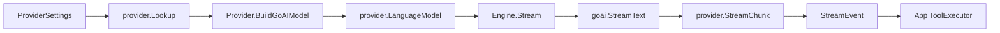
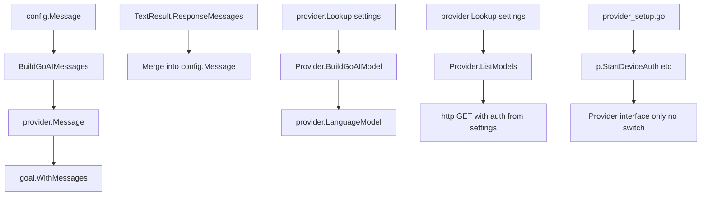
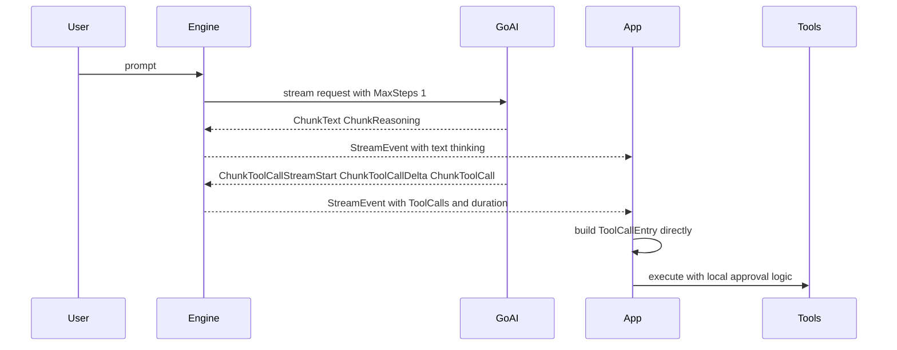
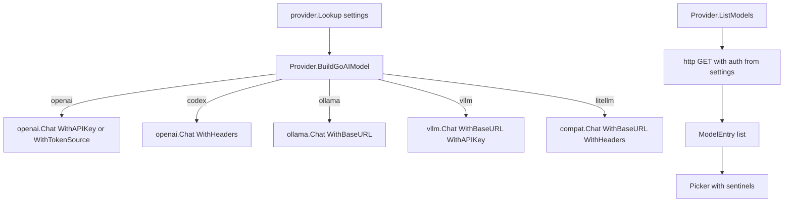

# GoAI Streaming Migration

## Core Problem

The current custom adapter and SSE assembly stack is too fragile, especially for Codex multi-tool turns. We need a cleaner streaming architecture that keeps our app and tool execution logic while replacing provider transport and parsing with GoAI.

## Goal

Engine streams through GoAI, adapter layer is removed, provider factory dispatches to per-provider BuildGoAIModel and ListModels, BuildGoAIMessages replaces API-shaped message building, tool events arrive cleanly for direct entry construction, and provider_setup.go uses only the generic Provider interface. Our rich config.Message history and metadata (token counts, TTFT, execution details) are preserved.

---

## 1. GoAI Engine Spine

- **Pattern:** Factory
- **Pattern:** Port and Adapter

**Objective:** Replace the adapter-driven engine transport with GoAI streaming while preserving our StreamEvent contract, our message model, and our custom tool execution loop.

**Success Criteria:** Engine no longer depends on internal/chat/adapter, streams through goai.StreamText with MaxSteps(1), and emits text, thinking, tool, error, and done events into the existing app layer. Engine gets its LanguageModel from provider.Lookup(settings).BuildGoAIModel().



### 1.1. Add GoAI dependency and BuildGoAIModel to Provider interface

**Type:** refactor

**What:** Add goai to go.mod and add BuildGoAIModel and ListModels methods to the existing Provider interface in provider.go.

**Why:** GoAI's core pattern is constructing a provider.LanguageModel per provider. Our existing registry already dispatches to the right provider struct — we just add two methods to the interface. No new registry or factory file needed.

**Files:**

- ~ internal/chat/provider/provider.go

**Snippet:**

```
type Provider interface {
    // Existing metadata methods
    Name() string
    SupportedAuth() []config.AuthMethod
    StaticModels() []string
    DefaultBaseURL() string
    RequiresBaseURL() bool

    // Auth flow — generic, called by provider_setup.go
    StartDeviceAuth() (string, string, error)
    PollDeviceAuth() error
    StartOAuth(redirectURI string) (string, error)
    FinishOAuth(code, redirectURI string) error
    GetCredentials() *config.ProviderCreds

    // GoAI integration — new
    BuildGoAIModel() (provider.LanguageModel, bool, error)
    ListModels(ctx context.Context) ([]string, error)
}
```

```
// NewEngine uses the existing registry:
func NewEngine(settings *config.ProviderSettings, model string, thinking bool) *Engine {
    p := provider.Lookup(settings.Name, settings)
    langModel, parseThinking, err := p.BuildGoAIModel()
    return &Engine{
        settings:              settings,
        Model:                 model,
        Thinking:              thinking,
        model:                 langModel,
        parseThinkingFromText: parseThinking,
    }
}

// Docs:
// https://goai.sh/getting-started/quick-start
// https://goai.sh/api/types.html
```

**Acceptance Criteria:**

- [ ] goai dependency is added to go.mod.
- [ ] BuildGoAIModel() (provider.LanguageModel, bool, error) is on the Provider interface.
- [ ] ListModels(ctx) ([]string, error) is on the Provider interface.
- [ ] Auth flow methods (StartDeviceAuth, PollDeviceAuth, StartOAuth, FinishOAuth, GetCredentials) are on the Provider interface — provider_setup.go uses only the interface.
- [ ] No separate registry or factory file — uses existing provider.Lookup(name, settings).
- [ ] The bool return from BuildGoAIModel indicates whether the provider needs text-level think tag parsing.
- [ ] Old transport methods (PrepareRequest, GetChatURL, IsExpired, Refresh) are removed from the interface.

**Verify:**

```bash
cd ~/src/squid-os && go build ./...
```

### 1.2. Replace Engine adapter transport with GoAI stream bridge

**Type:** refactor

**What:** Rewrite engine streaming to call goai.StreamText with MaxSteps(1) and translate provider.StreamChunk into our StreamEvent model.

**Why:** Removes custom SSE parsing, request-body shaping, and tool-call delta reconstruction from engine.go. Our app stays in control of the tool execution loop.

**Files:**

- ~ internal/chat/engine.go

**Snippet:**

```
import (
    "github.com/zendev-sh/goai"
    "github.com/zendev-sh/goai/provider"
)

type Engine struct {
    settings   *config.ProviderSettings
    Model      string
    Thinking   bool
    model      provider.LanguageModel
    parseThinkingFromText bool
}

func (e *Engine) Stream(ctx context.Context, messages []provider.Message, toolDefs []tools.Tool) <-chan StreamEvent {
    // Convert our tools to goai.Tool (no Execute — we handle execution)
    // Call goai.StreamText(ctx, e.model, goai.WithMessages(messages...), goai.WithTools(goaiTools...), goai.WithMaxSteps(1))
    // Range stream.Stream() and map chunks to StreamEvent:
    //   ChunkText -> StreamEvent.Text
    //   ChunkReasoning -> StreamEvent.Thinking
    //   ChunkToolCall / ChunkToolCallDelta -> accumulate into StreamEvent.ToolCalls
    //   ChunkStepFinish -> flush accumulated tool calls, emit done
    //   ChunkError -> StreamEvent.Error
    // Track tool call start time for duration measurement
}

// Docs:
// https://goai.sh/api/core-functions.html
// https://goai.sh/concepts/streaming.html
```

```
type StreamEvent struct {
    Text          string     // visible delta text
    Thinking      string     // thinking delta text
    Done          bool       // stream finished
    StopReason    string
    Error         error
    ToolCalls     []provider.ToolCall
    ToolCallDelta string     // incremental arg fragment for UI timing
    ToolDuration  time.Duration // duration from first tool chunk to completion
}
```

**Acceptance Criteria:**

- [ ] Engine no longer imports or uses internal/chat/adapter.
- [ ] Engine emits StreamEvent values from GoAI stream output.
- [ ] Engine uses MaxSteps(1) so our app remains the sole tool executor.
- [ ] Tool call deltas (ChunkToolCallStreamStart, ChunkToolCallDelta, ChunkToolCall) are accumulated correctly.
- [ ] StreamEvent includes tool duration (time from first tool chunk to step finish).
- [ ] Engine still returns stream errors and done states through StreamEvent.
- [ ] Context cancellation is properly handled.

**Verify:**

```bash
cd ~/src/squid-os && go build ./...
```

### 1.3. Preserve thinking behavior with provider-aware parsing fallback

**Type:** bug

**What:** Keep our current thinking parser for providers whose reasoning arrives inline in text content (like Qwen), while trusting GoAI ChunkReasoning for providers that expose it natively.

**Why:** Qwen and similar providers emit thinking tags within text content. GoAI's compat provider may return this as ChunkText. Our existing ThinkParser handles the extraction.

**Files:**

- ~ internal/chat/engine.go

**Snippet:**

```
// Each provider's BuildGoAIModel returns (LanguageModel, parseThinkingFromText, error).
// OpenAI/codex reasoning models return true for parseThinkingFromText.
// Ollama/vllm/litellm return false.

// In engine stream loop, when receiving ChunkText:
if e.parseThinkingFromText && evt.Text != "" {
    result := parser.Process(evt.Text)
    // Emit result.Text and result.Thinking via StreamEvent
} else {
    // Trust GoAI chunk types directly (ChunkReasoning for thinking)
}

// Docs:
// https://goai.sh/concepts/streaming.html
// https://goai.sh/api/types.html
```

**Acceptance Criteria:**

- [ ] Thinking continues to work for providers that expose reasoning as separate chunks (OpenAI o-series, Claude).
- [ ] Providers flagged for text parsing still use the local ThinkParser for inline think tags.
- [ ] The engine keeps a single StreamEvent contract for the app.
- [ ] No thinking information is lost for any provider.

**Verify:**

```bash
cd ~/src/squid-os && go build ./...
```

---

## 2. Provider and Message Refactor

- **Pattern:** Anti Corruption Layer

**Objective:** Each provider implements BuildGoAIModel and ListModels, message building targets GoAI types, adapter package is removed, and provider_setup.go uses only the generic Provider interface.

**Success Criteria:** All 5 active providers implement BuildGoAIModel and ListModels, BuildGoAIMessages replaces BuildAPIMessages, adapter package is gone, and provider_setup.go calls only interface methods.



### 2.1. Replace API message builder with GoAI message builder

**Type:** refactor

**What:** Rebuild the message converter so it produces provider.Message values for GoAI, and merge ResponseMessages back into our config.Message history on completion.

**Why:** Our config.Message carries rich metadata (token counts, TTFT, execution files). We keep it. We just need to convert to/from GoAI's provider.Message for the API call.

**Files:**

- ~ internal/chat/engine.go

**Snippet:**

```
import "github.com/zendev-sh/goai/provider"

func BuildGoAIMessages(paths config.Paths, settings config.Settings, messages []config.Message) []provider.Message {
    // Convert system messages -> goai.SystemMessage
    // Convert user messages -> goai.UserMessage (with image parts if needed)
    // Convert assistant messages with tool calls -> provider.Message with ToolCall parts
    // Convert tool result messages -> goai.ToolMessage
    // Convert synthetic messages -> goai.AssistantMessage
}

// Docs:
// https://goai.sh/api/types.html
// https://goai.sh/api/core-functions.html
```

```
func mergeResponseMessages(result *goai.TextResult, messages []config.Message) []config.Message {
    // After stream completes, take result.ResponseMessages and merge them
    // into our config.Message history, preserving our metadata fields
    // (token counts, TTFT, execution details already tracked separately)
}
```

**Acceptance Criteria:**

- [ ] BuildGoAIMessages produces provider.Message values from config.Message.
- [ ] System, user, assistant, tool, and synthetic roles all map correctly.
- [ ] Tool call parts (provider.Part with PartToolCall) and tool result parts are constructed properly.
- [ ] ResponseMessages from TextResult are merged back into config.Message on completion.
- [ ] Our config.Message metadata (token counts, TTFT, execution details) is preserved — not lost to GoAI conversion.

**Verify:**

```bash
cd ~/src/squid-os && go build ./...
```

### 2.2. Implement BuildGoAIModel and ListModels on each provider, remove transport methods

**Type:** refactor

**What:** Each provider file implements BuildGoAIModel (returns GoAI LanguageModel with correct auth/options) and ListModels (HTTP GET to /v1/models with auth from settings). Remove PrepareRequest, GetChatURL, IsExpired, Refresh. Keep auth flow methods and metadata on the interface.

**Why:** BuildGoAIModel replaces the adapter's transport role. ListModels consolidates GetModelsURL + PrepareRequest + FetchModels into one method. Auth flow methods stay for provider_setup.go to use generically.

**Files:**

- ~ internal/chat/provider/provider.go
- ~ internal/chat/provider/openai.go
- ~ internal/chat/provider/openai-codex.go
- ~ internal/chat/provider/vllm.go
- ~ internal/chat/provider/ollama.go
- ~ internal/chat/provider/litellm.go

**Snippet:**

```
// openai.go
func (o *OpenAIProvider) BuildGoAIModel() (provider.LanguageModel, bool, error) {
    model := o.settings.Model
    var opts []openai.Option
    switch o.settings.Credentials.ActiveAuthMethod {
    case config.AuthAPIKey:
        opts = append(opts, openai.WithAPIKey(o.settings.Credentials.APIKey))
    case config.AuthOAuth:
        // Wrap OAuth refresh in provider.CachedTokenSource
        ts := provider.CachedTokenSource(func(ctx context.Context) (*provider.Token, error) {
            // Read token from o.settings.Credentials.OAuth
            // Refresh via existing logic if expired
        })
        opts = append(opts, openai.WithTokenSource(ts))
    }
    if o.settings.BaseURL != "" {
        opts = append(opts, openai.WithBaseURL(o.settings.BaseURL))
    }
    return openai.Chat(model, opts...), false, nil
}

func (o *OpenAIProvider) ListModels(ctx context.Context) ([]string, error) {
    url := o.settings.BaseURL
    if url == "" { url = "https://api.openai.com" }
    req, err := http.NewRequestWithContext(ctx, "GET", url+"/v1/models", nil)
    // Add auth from credentials (API key or OAuth token)
    // http.Do, parse JSON, return []string
}

// Docs:
// https://goai.sh/providers/openai.html
// https://goai.sh/providers/ollama.html
// https://goai.sh/providers/vllm.html
// https://goai.sh/providers/compat.html
```

```
// openai-codex.go — BuildGoAIModel adds WithHeaders for Originator/User-Agent/Account-Id
// ollama.go — BuildGoAIModel uses ollama.Chat(model, ollama.WithBaseURL(base+"/v1"))
// vllm.go — BuildGoAIModel uses vllm.Chat with base URL and optional API key
// litellm.go — BuildGoAIModel uses compat.Chat with base URL and x-litellm-api-key header
// Each also implements ListModels with its own URL and auth logic
```

**Acceptance Criteria:**

- [ ] All 5 providers implement BuildGoAIModel() returning the correct GoAI LanguageModel.
- [ ] All 5 providers implement ListModels(ctx) that does an authenticated HTTP GET to /v1/models.
- [ ] PrepareRequest, GetChatURL, IsExpired, Refresh are removed from the Provider interface.
- [ ] Auth flow methods (StartDeviceAuth, PollDeviceAuth, StartOAuth, FinishOAuth, GetCredentials) remain on the Provider interface.
- [ ] Metadata methods (Name, SupportedAuth, StaticModels, DefaultBaseURL, RequiresBaseURL) remain.
- [ ] openai uses openai.Chat with API key or CachedTokenSource for OAuth.
- [ ] codex uses openai.Chat with extra headers (Originator, User-Agent, Account-Id).
- [ ] ollama uses ollama.Chat with base URL, no auth.
- [ ] vllm uses vllm.Chat with base URL and optional API key.
- [ ] litellm uses compat.Chat with base URL and x-litellm-api-key header.
- [ ] Reasoning models (codex o-series) return true for parseThinkingFromText.
- [ ] No dead compile-path remains for removed transport methods.

**Verify:**

```bash
cd ~/src/squid-os && go build ./...
```

### 2.3. Clean provider_setup.go to use only Provider interface

**Type:** refactor

**What:** Remove any provider-specific type assertions, switch statements, or direct references to concrete provider types in provider_setup.go. It should only call generic Provider interface methods.

**Why:** provider_setup.go should work generically for any provider — the registry dispatches to the right implementation. No more special-casing Codex vs OpenAI vs others.

**Files:**

- ~ internal/app/provider_setup.go
- ~ internal/chat/provider/provider.go

**Snippet:**

```
// provider_setup.go — now generic
func handleAuthFlow() {
    p := provider.Lookup(settings.Name, settings)
    url, code, err := p.StartDeviceAuth()
    // ... show URL to user ...
    err = p.PollDeviceAuth()
    creds := p.GetCredentials()
    // ... save credentials ...
}
```

```
// No switch on provider name, no type assertions to *CodexProvider, *OpenAIProvider, etc.
// All auth flow goes through the Provider interface.
```

**Acceptance Criteria:**

- [ ] provider_setup.go contains no switch/if on provider name for auth flow.
- [ ] provider_setup.go contains no type assertions to concrete provider types.
- [ ] All auth flow calls (StartDeviceAuth, PollDeviceAuth, StartOAuth, FinishOAuth, GetCredentials) go through the Provider interface.
- [ ] Works for all 5 active providers without provider-specific branching.

**Verify:**

```bash
cd ~/src/squid-os && go build ./...
```

### 2.4. Delete adapter package and obsolete request-shaping code

**Type:** refactor

**What:** Remove the adapter package and all request-body/SSE helper code that only served the old HTTP transport.

**Why:** We explicitly do not want legacy compatibility layers or dead code after the migration.

**Files:**

- rm internal/chat/adapter/adapter.go
- rm internal/chat/adapter/chatcompletions.go
- rm internal/chat/adapter/codex.go
- ~ internal/chat/engine.go

**Snippet:**

```
// Remove adapter package entirely
// Remove old request-body builders, SSE parsers, tool-call delta accumulators
// Keep only GoAI bridge logic and provider-message conversion in engine.go
```

**Acceptance Criteria:**

- [ ] internal/chat/adapter is fully removed.
- [ ] No code path still references adapter types or adapter imports.
- [ ] Request shaping for removed adapter transport is deleted, not just unused.

**Verify:**

```bash
cd ~/src/squid-os && go build ./...
```

---

## 3. App Stream and Tool Entry Simplification

- **Pattern:** State Simplification
- **Pattern:** Single Source of Truth

**Objective:** Simplify app stream state so tools are built from clean GoAI chunk events instead of delta-assembled partial tool state, with duration tracking.

**Success Criteria:** Streamed tool events create ToolCallEntry values directly with duration metadata, tool execution still uses our custom logic, and both pending stream state and partial delta-only assembly paths are removed.



### 3.1. Build pending tool entries directly from StreamEvent with duration

**Type:** refactor

**What:** Change app stream handling so complete tool events create ToolCallEntry values directly from StreamEvent.ToolCalls, including a duration field measured from first tool chunk to step finish.

**Why:** GoAI gives us clean ChunkToolCall values. No more fragile delta assembly. We just accumulate deltas during the stream and flush on ChunkStepFinish, capturing the time delta.

**Files:**

- ~ internal/app/stream.go
- ~ internal/ui/message.go

**Snippet:**

```
// StreamEvent now carries finalized ToolCalls and duration
func (m *Model) handleStreamEvent(event chat.StreamEvent) {
    // Append text and thinking to current message
    if event.ToolCalls != nil {
        // Build ToolCallEntry directly from event.ToolCalls
        // Store event.ToolDuration in the entry metadata
    }
    // Do not build pending partial instruction state
}
```

**Acceptance Criteria:**

- [ ] App no longer depends on streamed argument deltas to construct tool entries.
- [ ] Streamed tool events create ToolCallEntry values directly from complete provider.ToolCall.
- [ ] ToolCallEntry includes duration from first tool chunk to step finish.
- [ ] Pending stream state and pending partial instruction assembly are removed from the tool-entry path.
- [ ] Rendering continues to show pending, success, and error tool states.

**Verify:**

```bash
cd ~/src/squid-os && go build ./...
```

### 3.2. Keep local tool execution loop and timing metrics on clean entries

**Type:** refactor

**What:** Retain our custom execution loop but make it consume finalized tool entries with duration metadata rather than transient streamed partial state.

**Why:** We must keep our approval, validation, and working-dir logic while removing execution dependence on stream-built state.

**Files:**

- ~ internal/app/stream.go

**Snippet:**

```
func (m *Model) resumeToolExecution(entries []config.ToolCallEntry, startIndex int) (tea.Model, tea.Cmd) {
    // Execute from finalized entries
    // Keep approval preview validation and working-dir logic
    // Entries already carry duration from the stream phase
    // Track additional execution timing (start/end timestamps)
}
```

**Acceptance Criteria:**

- [ ] Tool execution still uses local authorization, preview, and validation logic.
- [ ] Execution reads finalized tool entry arguments.
- [ ] Duration metrics capture both stream-phase duration (model to tool flush) and execution-phase timing.

**Verify:**

```bash
cd ~/src/squid-os && go build ./...
```

### 3.3. Remove obsolete partial tool assembly state

**Type:** refactor

**What:** Delete partial tool assembly fields, delta-only helpers, and toolCallIDToIdx mapping that only existed to reconstruct streamed tool calls from low-level deltas.

**Why:** GoAI handles the delta accumulation internally and gives us clean ToolCall values. Those states are dead complexity.

**Files:**

- ~ internal/app/stream.go
- ~ internal/ui/message.go
- ~ internal/chat/engine.go

**Snippet:**

```
// Remove from engine.go:
// - toolBuffers map
// - toolCallIDToIdx map
// - nextSyntheticToolIdx
// - flushToolCalls function

// Remove from stream.go:
// - partialTools slices
// - delta-only assembly helpers

// Remove from message.go:
// - UI fallback paths for malformed tool assembly state
```

**Acceptance Criteria:**

- [ ] toolBuffers, toolCallIDToIdx, and delta assembly helpers are removed from engine.go.
- [ ] partialTools and delta-only assembly helpers are removed from stream.go.
- [ ] No UI path relies on malformed fallback tool assembly state.
- [ ] Tool rendering uses the new direct entry path.

**Verify:**

```bash
cd ~/src/squid-os && go build ./...
```

---

## 4. Model Discovery and Provider Coverage

- **Pattern:** Factory
- **Pattern:** Progressive Delivery

**Objective:** Wire BuildGoAIModel and ListModels through engine and model scanning for the 5 active providers, then document remaining GoAI providers for future migration.

**Success Criteria:** All 5 active providers work end-to-end through GoAI (streaming + model listing), provider_setup.go uses only the interface, sentinels still work, and remaining 20+ providers are documented for a follow-up plan.



### 4.1. Wire model scanning to use Provider.ListModels

**Type:** feature

**What:** Update ScanModels to call p.ListModels(ctx) on the provider instance from Lookup, falling back to static models and sentinels on error.

**Why:** GoAI has no model listing API. ListModels is our own HTTP GET with per-provider auth — consolidated into one method per provider.

**Files:**

- ~ internal/chat/models.go

**Snippet:**

```
func ScanModels(ctx context.Context, settings *config.ProviderSettings) []ModelEntry {
    p := provider.Lookup(settings.Name, settings)
    if p == nil {
        return []ModelEntry{sentinelUnknownProvider}
    }
    models, err := p.ListModels(ctx)
    if err != nil {
        // Return sentinel: auth failed, unreachable, etc.
        return []ModelEntry{sentinelForError(err)}
    }
    // Merge with p.StaticModels() fallback if empty
    // Convert to ModelEntry with sentinel entries
}

// Docs:
// https://goai.sh/concepts/providers-and-models.html
```

**Acceptance Criteria:**

- [ ] ScanModels calls provider.Lookup then p.ListModels(ctx).
- [ ] Auth is applied correctly per provider (API key header, OAuth token, or no auth).
- [ ] Sentinels for not-configured, auth-failed, and unreachable still work.
- [ ] Static model fallback from p.StaticModels() is available when ListModels returns nothing.
- [ ] No provider-specific branching in ScanModels — uses the interface.

**Verify:**

```bash
cd ~/src/squid-os && go build ./...
```

### 4.2. Wire BuildGoAIModel and provider_setup.go end-to-end for all 5 active providers

**Type:** feature

**What:** Verify engine construction uses provider.Lookup(settings).BuildGoAIModel(), ScanModels uses p.ListModels(), and provider_setup.go uses only generic Provider interface methods — no provider-specific code.

**Why:** This is the integration verification: all call paths go through the Provider interface and registry, no concrete type references leak into app code.

**Files:**

- ~ internal/chat/engine.go
- ~ internal/chat/models.go
- ~ internal/app/provider_setup.go

**Snippet:**

```
// engine.go
func NewEngine(settings *config.ProviderSettings, model string, thinking bool) *Engine {
    p := provider.Lookup(settings.Name, settings)
    langModel, parseThinking, err := p.BuildGoAIModel()
    // ...
}

// provider_setup.go
func handleAuthFlow() {
    p := provider.Lookup(settings.Name, settings)
    url, code, err := p.StartDeviceAuth()
    // ... all through interface
}

// Docs:
// https://goai.sh/getting-started/quick-start.html
// https://goai.sh/concepts/tools.html
```

**Acceptance Criteria:**

- [ ] Engine construction uses provider.Lookup(settings).BuildGoAIModel() — no adapter, no switch.
- [ ] Model scanning uses p.ListModels(ctx) — no provider-specific URL building.
- [ ] provider_setup.go calls only Provider interface methods — no type assertions, no switch on provider name.
- [ ] All 5 active providers (openai, codex, vllm, ollama, litellm) work end-to-end.
- [ ] OAuth providers use CachedTokenSource for dynamic token refresh during streaming.
- [ ] Reasoning models (codex o-series) correctly flag parseThinkingFromText.
- [ ] No old handwritten transport path remains in any call path.

**Verify:**

```bash
cd ~/src/squid-os && go build ./...
```

### 4.3. Document remaining GoAI providers for future migration

**Type:** doc

**What:** Document the remaining GoAI-supported providers (Anthropic, Google, Bedrock, Azure, Vertex, Cohere, Mistral, xAI, Groq, DeepSeek, MiniMax, Fireworks, Together, DeepInfra, OpenRouter, Requesty, Perplexity, Cerebras, NVIDIA NIM, RunPod, Cloudflare, FPT Cloud) and their BuildGoAIModel/ ListModels mapping for a follow-up plan.

**Why:** These 20+ providers follow the same pattern as the first 5. After the initial migration is stable and tested, they can be added via a separate plan using the same interface methods.

**Files:**

- + internal/chat/provider/anthropic.go
- + internal/chat/provider/google.go
- + internal/chat/provider/bedrock.go
- + internal/chat/provider/azure.go
- + internal/chat/provider/vertex.go
- ~ internal/chat/provider/provider.go

**Snippet:**

```
// Each remaining provider follows the same pattern:
//
// func init() {
//     Register(config.ProviderAnthropic, func(s *config.ProviderSettings) Provider {
//         return &AnthropicProvider{settings: s}
//     })
// }
//
// func (a *AnthropicProvider) BuildGoAIModel() (provider.LanguageModel, bool, error) {
//     model := a.settings.Model
//     return anthropic.Chat(model, anthropic.WithAPIKey(a.settings.Credentials.APIKey)), false, nil
// }
//
// func (a *AnthropicProvider) ListModels(ctx context.Context) ([]string, error) {
//     // anthropic does not have /v1/models — return StaticModels() or empty
// }

// Docs:
// https://goai.sh/providers/
// https://goai.sh/providers/anthropic.html
// https://goai.sh/providers/google.html
// https://goai.sh/providers/bedrock.html
// https://goai.sh/providers/azure.html
```

```
// Deferred to a separate plan after initial migration is tested.
// 20+ providers to implement following the same interface.
```

**Acceptance Criteria:**

- [ ] Document lists all 20+ remaining GoAI-supported providers.
- [ ] Each provider maps to the correct GoAI package (anthropic.Chat, google.Chat, bedrock.Chat, etc.).
- [ ] Auth mapping is documented per provider (API key, AWS creds, OAuth, etc.).
- [ ] ListModels approach is noted (some providers like Anthropic have no model listing endpoint — fall back to StaticModels).
- [ ] The work is deferred to a separate plan after this migration is stable.

**Verify:**

```bash
cd ~/src/squid-os && go build ./...
```
