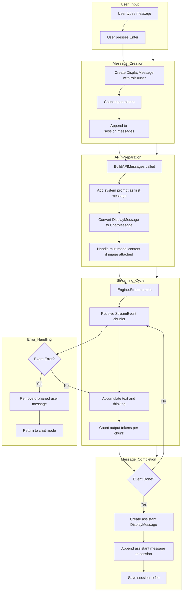
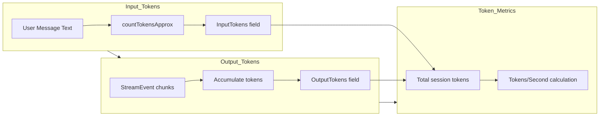
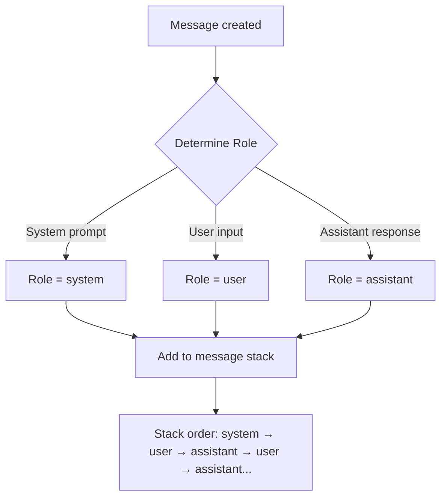
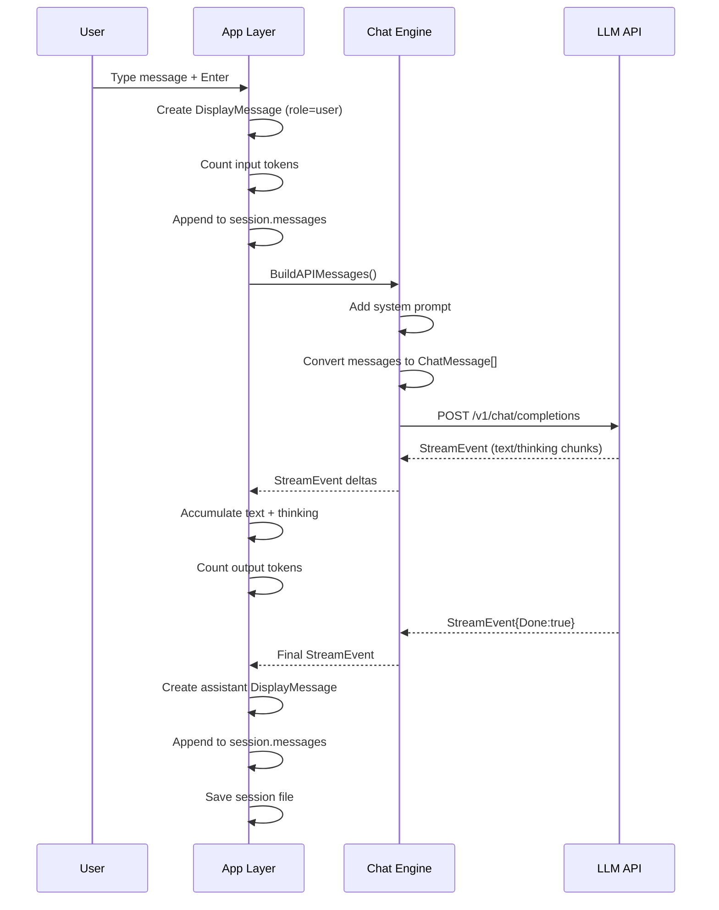

# Message Building & Stacking Diagram

## Overview

This document provides a conceptual visualization of how messages are built and stacked at each chat cycle, including tokens, roles, and the message flow.

## Message Building Flow Diagram



## Message Stack Visualization (Cycle by Cycle)

```mermaid
quadrantChart
    title: Message Stack Growth Over Cycles
    x-axis: "Earlier in conversation" --> "Latest message"
    y-axis: "Lower stack position" --> "Top of stack"
    quadrant 1: "Recent messages"
    quadrant 2: "Oldest messages"
    quadrant 3: "Oldest messages"
    quadrant 4: "Recent messages"
    "Cycle 1 - System Prompt": [0.1, 0.2]
    "Cycle 1 - User Message": [0.3, 0.4]
    "Cycle 1 - Assistant Response": [0.5, 0.6]
    "Cycle 2 - User Message": [0.7, 0.5]
    "Cycle 2 - Assistant Response": [0.9, 0.7]
    "Cycle 3 - User Message": [0.85, 0.8]
```

## Message Structure Breakdown

```mermaid
classDiagram
    class DisplayMessage {
        +string ID
        +string Role
        +time.Time CreatedAt
        +string Text
        +string ThinkingText
        +string ImagePath
        +int InputTokens
        +int OutputTokens
        +float64 TokensPerSecond
        +int64 ResponseTimeMs
        +string StopReason
        +bool ThinkingExpanded
    }

    class ChatMessage {
        +string Role
        +interface{} Content
    }

    class StreamEvent {
        +string Text
        +string Thinking
        +bool InThinking
        +bool Done
        +string StopReason
        +error Error
    }

    DisplayMessage o-- ChatMessage : converts to
    ChatMessage o-- StreamEvent : receives from
```

## Token Flow Diagram



## Role Assignment Flow



## Complete Cycle Visualization



## Key Concepts

### Message Stack Order
1. **System Prompt** (always first, role=system)
2. **User Messages** (role=user, with InputTokens)
3. **Assistant Responses** (role=assistant, with OutputTokens)

### Token Tracking
- **InputTokens**: Counted when user message is created
- **OutputTokens**: Accumulated during streaming from StreamEvent chunks
- **TokensPerSecond**: Calculated as OutputTokens / (firstTokenTime - startTime)

### Thinking Content
- Separately tracked in `ThinkingText` field
- Parsed from `<think>` tags during streaming
- Can be expanded/collapsed in UI

### Error Handling
- On error: User message is removed (no orphaned messages)
- On cancel: Assistant message is not saved
- On success: Both user and assistant messages persist

## File Locations

- [`internal/chat/engine.go`](internal/chat/engine.go:276): `BuildAPIMessages()` function
- [`internal/app/stream.go`](internal/app/stream.go:59): `sendMessage()` and `handleStreamEvent()`
- [`internal/config/types.go`](internal/config/types.go:54): `Message` and `DisplayMessage` structs
- [`internal/app/chat_session.go`](internal/app/chat_session.go:36): `appendMsg()` for stacking
