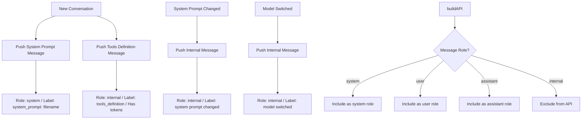

# System Prompt & Internal Messages - Implementation Plan

## Date
2025-01-XX

## Objective
Add two new message roles (`system`, `internal`) with distinct behavior for rendering and API building, plus display system prompt at the top of the message view.

---

## Summary of Requirements

### New Roles
1. **`system`** — Represents system prompts and tool definitions loaded at conversation start
2. **`internal`** — Represents metadata messages visible to the user but excluded from API builds

### Key Behaviors

| Role | Rendered? | Included in buildAPI? | Has token metrics? |
|------|-----------|----------------------|-------------------|
| `system` | Yes (expandable) | Yes (role: "system") | Yes |
| `internal` | Yes (expandable) | No | Generally no (exception: tools definition) |

---

## Part 1: Data Structure Changes

### File: `internal/config/types.go`

#### Add to `Message` struct:
- Role field should support `"system"` and `"internal"` in addition to existing `"user"`, `"assistant"`

#### Add to `DisplayMessage` struct:
- `Role` field to distinguish rendering style

---

## Part 2: New Conversation Initialization

When a new conversation starts, push these messages to the chat session:

### 2.1 — System Prompt Message
- **Role**: `system`
- **Label**: `system_prompt + filename` (e.g. "system_prompt: default.md")
- **Content**: The raw file content of the system prompt
- **InputTokens**: Token count of the system prompt content (using `countTokensApproxInt`)

### 2.2 — Tools Definition Message
- **Role**: `internal`
- **Label**: `tools_definition`
- **Content**: Flat string format: `name, path, tool{name,descr}` — e.g. `search, tools/search, tool{search, Search the web}`
- **InputTokens**: Token count of the **raw JSON** that the engine passes to the request body (not the formatted display string)
  - **Use `getTools` wrapper in tool definition to get raw JSON for counting** — this is an exceptional case where an internal message *does* have input tokens
  - Add a code comment: `// EXCEPTIONAL: tools definition is internal but sent in API request body, so we count tokens here`

### 2.3 — No Longer Load System Prompt Inline in buildAPI
- Remove the inline system prompt loading from settings file during `buildAPI`
- Instead, read the system prompt from the chat session messages (role = `system`)

---

## Part 3: Build API Changes

### File: `internal/chat/engine.go` (or relevant build file)

#### Changes:
1. **Remove**: Inline system prompt loading from settings file
2. **Add**: Iterate over session messages; only include messages with role `user`, `assistant`, and `system` in the API request
3. **Exclude**: Any message with role `internal`
4. For `system` role messages, map to the API's `"system"` role format
5. **Tools**: When building the request body, tools come from the engine's current tool definitions — NOT from the saved `tools_definition` internal message. Add a very clear comment explaining this known mismatch:
   ```go
   // TODO: Tools are loaded from current engine config, not from session messages.
   // This means if tools change between sessions, the saved tools_definition internal
   // message will not match the actual tools sent in the API request. Fix later.
   ```

---

## Part 4: Rendering

### File: `internal/ui/message.go`

#### New Render Function: `RenderSystemPrompt()`
- Called at the beginning of the message view, before other `RenderMessage` calls
- Renders like other messages but with system-specific styling

#### Common Rendering Rules for `system` and `internal`:
- **Expandable**: Like thinking/tool messages
- **Token display**: Show input tokens inline visually (same pattern as tool/canvas messages)
- **Content color**: `textMuted` (same as thinking blocks)
- **Label color for `system`**: Color index **141** (a green shade)
- **Label color for `internal`**: TBD — pick a nice muted color (suggestion: color **245** — light gray, or **39** — teal)

### File: `internal/ui/styles.go`

#### Add new styles:
```go
// System prompt label style
var SystemLabelStyle = lipgloss.NewStyle().
    ForegroundColor(lipgloss.Color("141")).
    Bold(true)

// Internal message label style
var InternalLabelStyle = lipgloss.NewStyle().
    ForegroundColor(lipgloss.Color("39")).  // TBD — pick a nice color
    Bold(true)
```

---

## Part 5: Synthetic Display Fix

### File: `internal/ui/message.go`

- When rendering synthetic messages, display **output tokens inline** (currently missing)
- Same visual pattern as other message types

---

## Part 6: New Internal Message Triggers

### 6.1 — System Prompt Changed
When the user switches system prompt files:

- **Role**: `internal`
- **Label**: `System Prompt Changed`
- **Content**: `Switched system prompt from {old_filename} to {new_filename}`
- **InputTokens**: 0 (not sent in API)

### 6.2 — Model Switched
When the user switches model:

- **Role**: `internal`
- **Label**: `Model Switched`
- **Content**: `Switched model from {old_model} to {new_model}`
- **InputTokens**: 0 (not sent in API)

---

## Pre-Requisite: Rename UserToken → InputToken

Before starting implementation, rename `UserToken` to `InputToken` across the codebase for clarity. This makes it consistent with the terminology used throughout the plan (input/output tokens).

- **Who**: User will do this manually in IDE
- **Scope**: Search and replace `UserToken` → `InputToken` in:
  - `internal/config/types.go` (struct field)
  - `internal/ui/message.go` (rendering references)
  - Any other references in stream, engine, session code
- **Note**: This is a mechanical rename, no logic change

---

## Part 7: Files to Modify

| File | Changes |
|------|---------|
| `internal/config/types.go` | Add `system` and `internal` role constants; update `Message` struct if needed |
| `internal/chat/engine.go` | Update `buildAPI` to read system prompt from session; exclude `internal` messages |
| `internal/ui/message.go` | Add `RenderSystemPrompt()`, update `RenderMessage()` to handle new roles, add synthetic output tokens |
| `internal/ui/styles.go` | Add `SystemLabelStyle`, `InternalLabelStyle` |
| `internal/app/app.go` | Push system + tools messages on new conversation; push internal messages on prompt/model switch |
| `internal/app/session.go` | Ensure system/internal messages save/load correctly |

---

## Part 8: Implementation Order

### Pre-Requisite (User does in IDE)
- [ ] Rename `UserToken` → `InputToken` everywhere in the codebase

### Phase 1: Data & Build API
- [ ] Define role constants (`system`, `internal`)
- [ ] Update `buildAPI` to read system prompt from session messages instead of settings file
- [ ] Exclude `internal` messages from API build
- [ ] Map `system` role to API format

### Phase 2: New Conversation Setup
- [ ] On new conversation, push system prompt message (role=`system`)
- [ ] On new conversation, push tools definition message (role=`internal`, with token count)
- [ ] Add code comment explaining token counting exception for tools

### Phase 3: Rendering
- [ ] Create `RenderSystemPrompt()` — renders at top of message view
- [ ] Update `RenderMessage()` to handle `system` and `internal` roles
- [ ] Apply expandable behavior
- [ ] Apply muted text content style
- [ ] Display input tokens inline
- [ ] Set system label color to 141
- [ ] Pick and set internal label color

### Phase 4: Synthetic Fix
- [ ] Display output tokens inline for synthetic messages

### Phase 5: New Internal Triggers
- [ ] Push internal message on system prompt change
- [ ] Push internal message on model switch

---

## Resolved Notes

1. **Tools definition content format**: Flat string: `name, path, tool{name,descr}` — e.g. `search, tools/search, tool{search, Search the web}`
2. **Tools JSON token count**: Count tokens on the **raw JSON** that the engine passes to the request body (not the formatted display string)
3. **System prompt message ID**: Deterministic ID — e.g. `sys0` (so we can find and update it later)
4. **Internal label color**: Color **39 (teal)** for now
5. **Session reload**: When loading a saved session, read the system prompt from the message (filter by role=system). Don't worry about tools mismatch between saved message and current engine tools — add a **very clear comment** in the build code noting this known issue for later fix.

---

## Mermaid Diagram: Message Flow



---

## Testing Checklist

- [ ] System prompt renders at top of message view before other messages
- [ ] System prompt is expandable/collapsible
- [ ] System prompt shows input tokens inline
- [ ] System label uses color 141
- [ ] Internal messages render with muted text
- [ ] Internal messages are expandable
- [ ] Internal messages show input tokens inline (when applicable)
- [ ] Tools definition shows correct token count (exceptional case)
- [ ] buildAPI includes system messages, excludes internal messages
- [ ] buildAPI no longer reads system prompt from settings file inline
- [ ] System prompt change pushes internal message with correct label/content
- [ ] Model switch pushes internal message with correct label/content
- [ ] Synthetic messages display output tokens inline
- [ ] Internal messages with no tokens do not show token count (or show 0)
