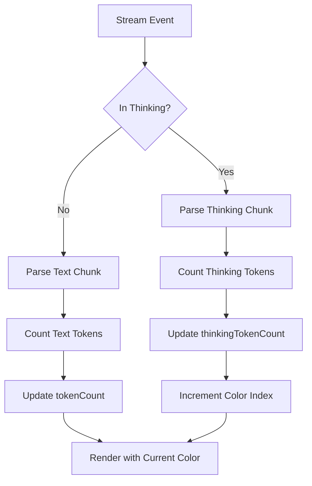

# Thinking Feature Improvements - Implementation Plan

## Summary of Requirements

Based on the user's requests, here's what needs to be implemented:

1. **Rotating Color Effect**: Change thinking block color on each new thinking chunk (black → dark blue → blue → gray → white cycle)
2. **Global Thinking Toggle**: Ctrl+E should expand/collapse thinking for ALL messages, not just the last one
3. **Token Count Display**: Show thinking token count instead of line count
4. **Separate Token Tracking**: Track `textTokenCount` and `thinkingTokenCount` separately
5. **Global Thinking State**: Thinking visibility should be a global setting, not saved per-session

---

## Implementation Plan

### Phase 1: Data Structure Changes

#### File: `internal/config/types.go`

**Changes to `Message` struct (line 55):**
```go
type Message struct {
    ID              string    `json:"id"`
    Role            string    `json:"role"`
    CreatedAt       time.Time `json:"created_at"`
    Text            string    `json:"text"`
    ThinkingText    string    `json:"thinking_text,omitempty"`
    ThinkingTokens  int       `json:"thinking_tokens,omitempty"`  // NEW
    ImagePath       string    `json:"image_path,omitempty"`
    InputTokens     int       `json:"input_tokens"`
    OutputTokens    int       `json:"output_tokens"`
    TokensPerSecond float64   `json:"tokens_per_second,omitempty"`
    ResponseTimeMs  int64     `json:"response_time_ms,omitempty"`
    StopReason      string    `json:"stop_reason,omitempty"`
}
```

**Changes to `DisplayMessage` struct (line 70):**
- Remove `ThinkingExpanded bool` field (make it global)

---

### Phase 2: Stream State Updates

#### File: `internal/app/stream.go`

**Changes to `streamState` struct (line 16):**
```go
type streamState struct {
    text              string
    thinking          string
    inThinking        bool
    active            bool
    markdown          string
    markdownEnd       int
    tokenCount        int
    thinkingTokenCount int    // NEW: Track thinking tokens separately
    thinkingColorIndex int   // NEW: Track color rotation
    start             time.Time
    firstTokenTime    time.Time
    cancelFn          context.CancelFunc
    ch                <-chan chat.StreamEvent
    userCancelled     bool
}
```

**Update `reset()` function (line 32):**
```go
func (ss *streamState) reset() {
    ss.text = ""
    ss.thinking = ""
    ss.inThinking = false
    ss.active = false
    ss.markdown = ""
    ss.markdownEnd = -1
    ss.tokenCount = 0
    ss.thinkingTokenCount = 0      // Reset thinking tokens
    ss.thinkingColorIndex = 0       // Reset color index
    ss.start = time.Time{}
    ss.firstTokenTime = time.Time{}
    ss.cancelFn = nil
    ss.ch = nil
    ss.userCancelled = false
}
```

**Update `handleStreamEvent()` function (line 112):**
- When `event.Thinking != ""`, increment `ss.thinkingTokenCount`
- When in thinking mode and new chunk arrives, increment `ss.thinkingColorIndex` (cycle through 5 colors)

---

### Phase 3: Model State Updates

#### File: `internal/app/app.go`

**Add to `Model` struct (line 17):**
```go
type Model struct {
    // ... existing fields ...
    thinkingExpanded bool  // NEW: Global thinking visibility state
    // ... rest of fields ...
}
```

---

### Phase 4: ThinkParser Enhancement

#### File: `internal/chat/thinking.go`

**Update `ThinkParser` struct (line 7):**
```go
type ThinkParser struct {
    InThink bool
    carry   string
    tokens  int  // NEW: Track thinking tokens
}
```

**Update `ProcessResult` struct (line 13):**
```go
type ProcessResult struct {
    Text         string  // visible text to display
    Thinking     string  // thinking text (hidden or shown depending on mode)
    ThinkingTokens int   // NEW: Token count for thinking
}
```

**Update `Process()` function (line 20):**
- Count tokens in thinking blocks
- Return token count in `ProcessResult`

---

### Phase 5: Color Rotation Effect

#### File: `internal/ui/styles.go`

**Add color cycle definition:**
```go
var thinkingColors = []string{
    "233", // black (near-black)
    "24",   // dark blue
    "33",   // blue
    "243",  // gray
    "255",  // white
}
```

**Update `ThinkingStyle` to support dynamic colors:**
- Create a function `getThinkingStyle(colorIndex int)` that returns a style with the appropriate foreground color

---

### Phase 6: Rendering Updates

#### File: `internal/ui/message.go`

**Update `RenderMessage()` function (line 14):**
- Change signature: `func RenderMessage(msg config.DisplayMessage, width int, thinkingExpanded bool)`
- Use global `thinkingExpanded` parameter instead of `msg.ThinkingExpanded`
- Replace line count with token count in collapsed thinking label:
  ```go
  label := fmt.Sprintf("  thinking (%d tokens, ctrl+e to expand)", msg.ThinkingTokens)
  ```
- Apply rotating color based on `thinkingColorIndex`

**Update `RenderStreamingMessage()` function (line 123):**
- Add `thinkingTokenCount` parameter
- Show token count instead of line count in thinking label

---

### Phase 7: Input Handling

#### File: `internal/app/input.go`

**Update `handleChatKey()` function (line 46):**
```go
case key.Matches(msg, keys.ExpandThinking):
    m.thinkingExpanded = !m.thinkingExpanded  // Toggle global state
    m.updateViewportContent()
    return m, nil
```

**Update `handleStreamingKey()` function (line 132):**
- Same toggle logic for Ctrl+E during streaming

---

### Phase 8: Session Persistence

#### File: `internal/app/session.go`

**Ensure `thinkingExpanded` is NOT saved:**
- The global `thinkingExpanded` state should NOT be persisted to session files
- Only `ThinkingTokens` should be saved in the `Message` struct

---

## Files to Modify

| File | Changes |
|------|---------|
| [`internal/config/types.go`](internal/config/types.go:1) | Add `ThinkingTokens` field to `Message` |
| [`internal/app/stream.go`](internal/app/stream.go:1) | Add `thinkingTokenCount` and `thinkingColorIndex` to `streamState` |
| [`internal/app/app.go`](internal/app/app.go:1) | Add global `thinkingExpanded` field to `Model` |
| [`internal/chat/thinking.go`](internal/chat/thinking.go:1) | Add token counting to `ThinkParser` |
| [`internal/ui/message.go`](internal/ui/message.go:1) | Update rendering with global state and color rotation |
| [`internal/ui/styles.go`](internal/ui/styles.go:1) | Add color cycle and dynamic thinking style |
| [`internal/app/input.go`](internal/app/input.go:1) | Update Ctrl+E handler to toggle global state |
| [`internal/app/render.go`](internal/app/render.go:1) | Update viewport rendering to use global `thinkingExpanded` |

---

## Mermaid Diagram: Thinking Flow



---

## Key Changes Summary

| Component | Change |
|-----------|--------|
| `Message` struct | Add `ThinkingTokens int` field |
| `streamState` | Add `thinkingTokenCount` and `thinkingColorIndex` |
| `Model` | Add global `thinkingExpanded bool` |
| `ThinkParser` | Count tokens in thinking blocks |
| `RenderMessage` | Use global `thinkingExpanded`, show token count, apply rotating colors |
| Ctrl+E handler | Toggle global `thinkingExpanded` for all messages |

---

## Color Rotation Details

The color cycle for thinking blocks:
1. **233** - Black (near-black background)
2. **24** - Dark blue
3. **33** - Blue
4. **243** - Gray
5. **255** - White

The color changes on each new thinking chunk received during streaming.

---

## Testing Checklist

- [ ] Thinking tokens are counted correctly
- [ ] Color rotates through the 5-color cycle
- [ ] Ctrl+E toggles thinking visibility for ALL messages
- [ ] Token count is displayed instead of line count
- [ ] Thinking visibility is NOT saved to session files
- [ ] Thinking tokens ARE saved to session files
- [ ] Color rotation works during streaming
- [ ] Global thinking state persists only in memory (not in session files)

---

## Notes

- The `thinkingExpanded` state is global and NOT persisted to session files
- The `ThinkingTokens` field IS persisted to session files
- Color rotation only happens when new thinking chunks arrive (not on a timer)
- The collapsed thinking label shows token count, not line count
