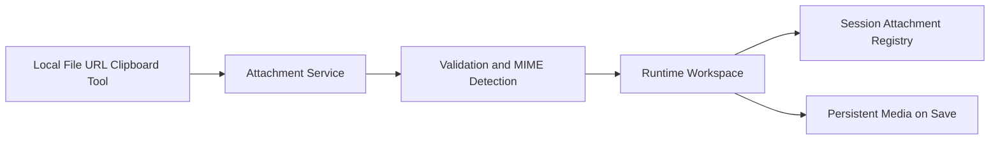
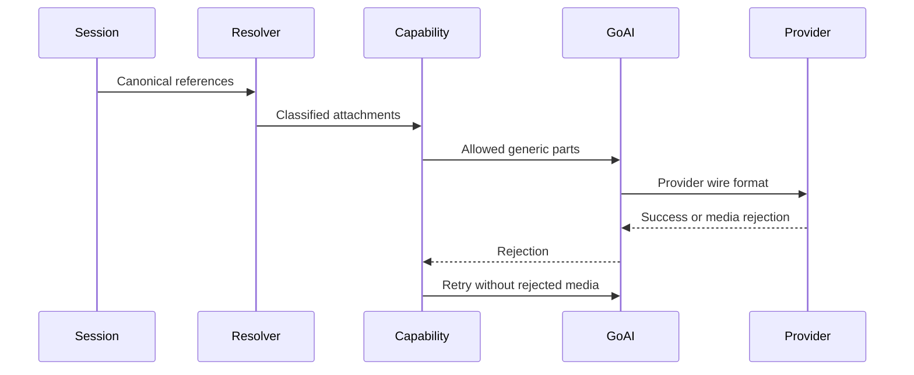
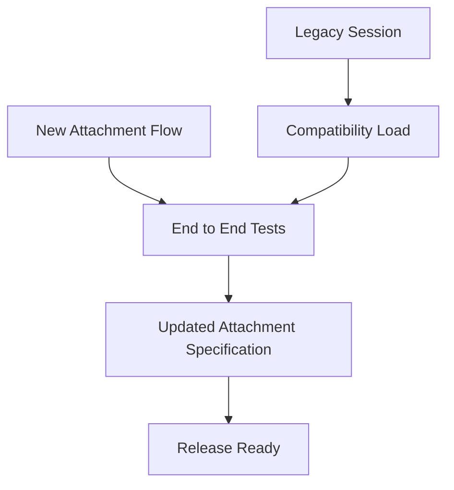

# Portable Multimodal Attachments

## Core Problem

Squid only supports one extension-detected image path, writes against prospective session storage, and lacks reusable ingestion, model filtering, rich references, and media inspection.

## Goal

Provide session-local, portable attachments from files, URLs, clipboard, and tools through one reusable media contract, with safe temporary persistence, model-aware delivery, visible chips, accurate accounting, and graceful fallback.

---

## 1. Attachment Workspace

- **Pattern:** Port and Adapter; Repository; Transactional Workspace

**Objective:** Create the reusable attachment model and runtime workspace used by composer input, tools, persistence, and provider delivery.

**Success Criteria:** Attachments are session-local, content-validated, safely stored in temporary or persistent workspaces, and survive first-save and fork operations.



### 1.1. Define attachment registry and workspace contract

**Type:** feature

**What:** Replace the single image-path concept with persisted attachment metadata and a runtime workspace abstraction shared by all ingestion sources.

**Why:** A stable contract prevents duplicated composer/tool logic and keeps canonical references portable across session moves.

**Files:**

- + internal/media/attachment.go
- + internal/media/workspace.go
- ~ internal/config/session.go
- ~ internal/chat/session.go

**Snippet:**

```
type Attachment struct {
    ID string
    RelativePath string
    DisplayName string
    MIME string
    Kind Kind
    Size int64
    SHA256 string
    Source Source
    DerivedFrom string
}

type Workspace interface {
    MediaDir() string
    Resolve(ref string) (Attachment, string, error)
    Ingest(ctx context.Context, source Source) (Attachment, error)
}
```

**Acceptance Criteria:**

- [ ] Session documents persist a top-level attachments collection and messages can retain multiple @file references.
- [ ] All stored paths are session-relative and traversal-safe.
- [ ] Legacy ImagePath messages remain loadable through migration or compatibility projection.
- [ ] Unsaved and incognito sessions resolve attachments without writing under persistent session storage.

**Verify:**

```bash
go test ./internal/media ./internal/config ./internal/chat
```

### 1.2. Implement safe reusable ingestion

**Type:** feature

**What:** Implement local-file, URL, byte-stream, and clipboard ingestion behind the attachment service with content MIME detection, hashing, deduplication, and limits.

**Why:** Every caller needs identical safety, naming, validation, and storage behavior.

**Files:**

- + internal/media/ingest.go
- + internal/media/mime.go
- + internal/media/url.go
- + internal/media/limits.go

**Snippet:**

```
type Limits struct {
    MaxFiles int
    MaxBytes int64
    MaxDownloadBytes int64
    DownloadTimeout time.Duration
    MaxRedirects int
}

type Source struct {
    Kind SourceKind
    Path string
    URL string
    Name string
    Reader io.Reader
}
```

**Acceptance Criteria:**

- [ ] MIME is detected from content with extension used only as a hint.
- [ ] URL ingestion enforces scheme, timeout, redirect, size, and private-network SSRF policy.
- [ ] Duplicate content reuses one session attachment while preserving a usable display reference.
- [ ] Partial or rejected ingestion leaves no orphaned final media file.

**Verify:**

```bash
go test ./internal/media
```

### 1.3. Migrate and fork complete attachment workspaces

**Type:** feature

**What:** Move temporary media on first explicit save and copy complete media trees during session forks while preserving attachment references.

**Why:** Autosave-off must not leak data into persistent sessions, and forked sessions must remain self-contained.

**Files:**

- ~ internal/app/session_persistence.go
- ~ internal/config/session.go
- ~ internal/chat/session.go
- + internal/media/migrate.go

**Snippet:**

```
type MigrationResult struct {
    Workspace Workspace
    Moved []string
}

func PersistWorkspace(ctx context.Context, src Workspace, destination string) (MigrationResult, error)
func CopyWorkspace(ctx context.Context, srcDir, destinationDir string) error
```

**Acceptance Criteria:**

- [ ] Autosave-off attachment ingestion writes only to a runtime temp directory until explicit save.
- [ ] First save publishes chat metadata and media as one recoverable operation and updates runtime resolution.
- [ ] Fork copies attachments and media unchanged while retaining session-local identity.
- [ ] A failed move or copy does not leave a session document referencing missing media.

**Verify:**

```bash
go test ./internal/media ./internal/config ./internal/app ./internal/chat
```

### 1.4. Manage incognito attachment lifecycle

**Type:** feature

**What:** Allocate isolated incognito workspaces, remove them on normal exit, and perform bounded stale-workspace cleanup at startup.

**Why:** Incognito attachments must stay ephemeral without allowing abandoned temporary files to accumulate indefinitely.

**Files:**

- ~ internal/app/app.go
- ~ internal/app/tui_session.go
- + internal/media/cleanup.go
- ~ internal/run/run.go

**Snippet:**

```
type CleanupPolicy struct {
    Root string
    OlderThan time.Duration
    MaxEntries int
}

func CleanupStale(policy CleanupPolicy) error
```

**Acceptance Criteria:**

- [ ] Incognito and normal unsaved runtime media use separate runtime directories.
- [ ] Normal incognito shutdown removes its workspace.
- [ ] Startup cleanup is bounded and removes only stale Squid-owned incognito directories.
- [ ] Crash leftovers never become visible as saved sessions.

**Verify:**

```bash
go test ./internal/media ./internal/app ./internal/run
```

---

## 2. Attachment Composer

- **Pattern:** Reference Token; Progressive Disclosure; Bounded Search

**Objective:** Let users discover, ingest, edit, and clearly recognize canonical capability and file references in the composer and history.

**Success Criteria:** Users can attach from bounded search, paths, URLs, and clipboard; large pastes become text attachments; all references render as distinct chips.


### 2.1. Add bounded file completion and direct source entry

**Type:** feature

**What:** Extend @ completion with files from configurable search roots, existing session media, direct paths, and media URLs; initially configure only the working directory.

**Why:** Bounded roots stay useful and efficient without intrusive home-directory scans.

**Files:**

- ~ internal/app/capability_completion.go
- + internal/app/file_completion.go
- ~ internal/app/app.go
- ~ internal/config/settings.go

**Snippet:**

```
type FileSearchConfig struct {
    Roots []string
    MaxDepth int
    MaxResults int
    Ignore []string
}

type ReferenceCandidate struct {
    Kind string
    Name string
    Source string
}
```

**Acceptance Criteria:**

- [ ] Default file search root is only the current working directory.
- [ ] Search roots accept a configurable string array for future Pictures or Documents opt-in.
- [ ] Search ignores configured heavy or hidden directories and obeys depth and result bounds.
- [ ] Selecting an external file or URL ingests it before inserting a canonical @file reference.

**Verify:**

```bash
go test ./internal/app ./internal/config
```

### 2.2. Handle clipboard files and bounded text paste

**Type:** feature

**What:** Handle Ctrl+V and Shift+Insert through one paste flow: ingest clipboard files/images, insert normal text, and convert text above a configurable threshold into a text attachment.

**Why:** Paste should feel native while preventing very large text from overwhelming the composer or request.

**Files:**

- ~ internal/app/keymap.go
- ~ internal/app/input.go
- + internal/app/paste.go
- ~ internal/config/settings.go
- ~ internal/ui/help.go

**Snippet:**

```
type PasteConfig struct {
    LargeTextBytes int
}

type ClipboardPayload struct {
    Text string
    Files []string
    Image []byte
    MIME string
}
```

**Acceptance Criteria:**

- [ ] Ctrl+V and Shift+Insert invoke the same attachment-aware paste behavior.
- [ ] Text below the threshold is inserted directly without changing ordinary terminal paste behavior.
- [ ] Text above the default 32 KiB configurable threshold is stored as a text attachment and inserts @file reference text.
- [ ] Notifications identify clipboard, local-file, or URL origin and the resulting workspace media path.

**Verify:**

```bash
go test ./internal/app ./internal/ui ./internal/config
```

### 2.3. Render canonical references as visible chips

**Type:** feature

**What:** Render file, skill, agent, and tool references as emoji chips in composer text and historical user messages without altering stored canonical text.

**Why:** Distinct, high-contrast chips let users spot active references without carefully reading every message.

**Files:**

- + internal/ui/reference.go
- ~ internal/ui/message.go
- ~ internal/style/styles.go
- ~ internal/app/render.go

**Snippet:**

```
type ReferenceKind string

const (
    ReferenceFile ReferenceKind = "file"
    ReferenceSkill ReferenceKind = "skill"
    ReferenceAgent ReferenceKind = "agent"
    ReferenceTool ReferenceKind = "tool"
)

func RenderReferences(text string, background string) string
```

**Acceptance Criteria:**

- [ ] All four qualified reference kinds render with emoji, name, padding, and a shared contrasting soft-gray background.
- [ ] Chip colors remain distinguishable on the user-message background and narrow terminals.
- [ ] History rendering derives chips from canonical text after reload.
- [ ] Malformed or unknown references remain readable plain text.

**Verify:**

```bash
go test ./internal/ui ./internal/app ./internal/style
```

---

## 3. Model-Aware Delivery

- **Pattern:** Anti-Corruption Layer; Capability Gate; Graceful Degradation

**Objective:** Resolve canonical references into generic GoAI parts, filter known restrictions, attempt unknown models, and recover cleanly from media rejection.

**Success Criteria:** Supported media reaches each provider through GoAI, unsupported media never crashes model switching, and accounting includes attachment costs.



### 3.1. Build generic GoAI attachment parts

**Type:** feature

**What:** Resolve every referenced attachment at context-build time into generic GoAI image, file, or bounded inline-text parts while retaining canonical message text.

**Why:** Squid should own attachment semantics while GoAI owns provider-specific wire conversion.

**Files:**

- ~ internal/chat/context.go
- ~ internal/chat/engine.go
- ~ internal/chat/image.go
- + internal/chat/attachment.go
- ~ internal/config/session.go

**Snippet:**

```
type ResolvedAttachment struct {
    Attachment media.Attachment
    Part goai_provider.Part
    EstimatedTokens int
}

func ResolveMessageAttachments(msg config.Message, workspace media.Workspace) ([]ResolvedAttachment, []error)
```

**Acceptance Criteria:**

- [ ] Messages support multiple referenced attachments and reference removal prevents delivery.
- [ ] Images use PartImage and supported documents use PartFile with MIME and filename metadata.
- [ ] Text attachments are injected as bounded text with explicit source and truncation markers.
- [ ] Missing or corrupt files produce an omission marker rather than aborting context construction.

**Verify:**

```bash
go test ./internal/chat ./internal/config
```

### 3.2. Apply model restrictions with unknown-model fallback

**Type:** feature

**What:** Expose GoAI model capabilities to request preparation, omit known-unsupported modalities, attempt unknown modalities, and retry once without media after a classified provider rejection.

**Why:** Fast-changing model catalogs should work optimistically without allowing unsupported media to crash a session after model switching.

**Files:**

- ~ internal/chat/provider/provider.go
- ~ internal/chat/engine.go
- + internal/chat/media_policy.go
- ~ internal/chat/stream.go
- ~ internal/app/stream.go

**Snippet:**

```
type MediaDecision string

const (
    MediaAllow MediaDecision = "allow"
    MediaOmit MediaDecision = "omit"
    MediaAttempt MediaDecision = "attempt"
)

type MediaPolicy interface {
    Decide(caps *goai_provider.ModelCapabilities, kind media.Kind) MediaDecision
    IsMediaRejection(error) bool
}
```

**Acceptance Criteria:**

- [ ] Known supported attachments are sent and known unsupported attachments are omitted with visible reason text.
- [ ] Missing or unknown capability metadata attempts delivery.
- [ ] A classified media rejection retries exactly once without rejected attachments and notifies the user.
- [ ] Authentication, network, safety, and unrelated provider errors are never misclassified for retry.

**Verify:**

```bash
go test ./internal/chat ./internal/chat/provider ./internal/app
```

### 3.3. Verify GoAI provider media compatibility

**Type:** test

**What:** Add adapter contract tests covering image and document conversion for every configured GoAI provider dialect and explicitly record unsupported combinations.

**Why:** GoAI capability flags and generic parts do not guarantee each wire adapter serializes every media kind.

**Files:**

- + internal/chat/provider/media_contract_test.go
- ~ internal/chat/context_test.go
- ~ internal/chat/provider/models.go

**Snippet:**

```
type MediaContractCase struct {
    Provider string
    Dialect string
    Kind media.Kind
    Expected Support
}
```

**Acceptance Criteria:**

- [ ] Tests cover OpenAI Responses, OpenAI-compatible Chat Completions, Anthropic, Gemini, Bedrock, and configured local dialects.
- [ ] OpenAI-compatible file-part omission is represented as unsupported rather than silently accepted.
- [ ] Images and PDFs are promised only for adapter-model combinations with verified serialization.
- [ ] Audio and video remain storable but are not advertised as direct GoAI input until generic parts exist.

**Verify:**

```bash
go test ./internal/chat/provider ./internal/chat
```

### 3.4. Account for attachment input costs

**Type:** feature

**What:** Extend message and tool-result token accounting with media-aware estimates and bounded extracted-text costs.

**Why:** Context limits and analytics must include attachment input rather than counting base64 bytes as ordinary text or ignoring media.

**Files:**

- ~ internal/chat/context.go
- ~ internal/chat/token_tally.go
- ~ internal/chat/tool_exec.go
- ~ internal/config/session.go

**Snippet:**

```
type AttachmentUsage struct {
    ID string
    Kind media.Kind
    Bytes int64
    EstimatedTokens int
}

func EstimateAttachmentTokens(a media.Attachment, model string) int
```

**Acceptance Criteria:**

- [ ] User attachment estimates contribute to context input totals without tokenizing base64 payloads.
- [ ] Text extracted or returned through inspect_media contributes to user or tool-execution accounting as appropriate.
- [ ] Unknown media costs use documented conservative estimates and remain distinguishable from exact text counts.
- [ ] Compaction and reload preserve consistent next-request totals.

**Verify:**

```bash
go test ./internal/chat ./internal/config
```

---

## 4. Autonomous Media Inspection

- **Pattern:** Application Service; Shared Kernel; Text Result Adapter

**Objective:** Allow assistants to inspect session media, external paths, and URLs autonomously without duplicating ingestion or requiring multimodal tool-result payloads.

**Success Criteria:** inspect_media uses the shared workspace and a media-capable inference path, returning bounded text with proper authorization and accounting.


### 4.1. Add reusable media inspection service

**Type:** feature

**What:** Create an inspection application service that resolves or ingests media through the shared attachment workspace and queries a configured media-capable model.

**Why:** The tool and future media workflows need one inference contract independent of composer and provider details.

**Files:**

- + internal/media/inspect.go
- ~ internal/chat/engine.go
- ~ internal/config/settings.go
- ~ internal/runtime/runtime.go

**Snippet:**

```
type Inspector interface {
    Inspect(ctx context.Context, request InspectRequest) (InspectResult, error)
}

type InspectRequest struct {
    Source string
    Query string
    SessionDir string
}

type InspectResult struct {
    Text string
    AttachmentID string
    InputTokens int
}
```

**Acceptance Criteria:**

- [ ] Inspection accepts canonical session references, local paths, and HTTP or HTTPS URLs.
- [ ] All non-session sources pass through normal ingestion limits and security policy.
- [ ] Inspection selects a configured media-capable model or returns a clear unsupported error.
- [ ] Inspection output is bounded text suitable for current GoAI tool-result representation.

**Verify:**

```bash
go test ./internal/media ./internal/chat ./internal/runtime ./internal/config
```

### 4.2. Expose inspect_media tool

**Type:** feature

**What:** Register inspect_media with path_or_url and query arguments, session runtime context, authorization behavior, and text-only results.

**Why:** Assistants need an autonomous, auditable path to understand media during tool loops.

**Files:**

- + internal/tools/media.go
- ~ internal/tools/tools.go
- ~ internal/chat/session.go
- ~ internal/chat/tool_exec.go
- ~ internal/runtime/runtime.go

**Snippet:**

```
var InspectMediaTool = Tool{
    Name: "inspect_media",
    // path_or_url, query
}

type RuntimeContext struct {
    // existing fields
    MediaInspector media.Inspector
}
```

**Acceptance Criteria:**

- [ ] The tool schema requires path_or_url and query strings.
- [ ] Local and remote sources follow existing tool authorization semantics before reading or downloading.
- [ ] Successful execution returns inspection text and records attachment and token usage.
- [ ] Tool execution never embeds binary or image content in ToolOutput.

**Verify:**

```bash
go test ./internal/tools ./internal/chat ./internal/runtime
```

---

## 5. Compatibility and Release Confidence

- **Pattern:** Characterization Test; Schema Evolution; Executable Specification

**Objective:** Protect legacy sessions and verify complete attachment workflows across save modes, model switches, and tool use.

**Success Criteria:** Legacy and new sessions load safely, agreed behavior is documented, and end-to-end tests cover critical workflows and failures.



### 5.1. Cover end-to-end attachment lifecycles

**Type:** test

**What:** Add integration tests for composer ingestion, unsaved save migration, incognito cleanup, fork, model switching, retry, reload, and inspect_media.

**Why:** Attachment behavior crosses storage, UI, context construction, providers, and tools where isolated tests cannot catch contract gaps.

**Files:**

- + internal/app/attachment_integration_test.go
- + internal/chat/attachment_integration_test.go
- ~ internal/config/session_test.go
- ~ internal/run/session_bootstrap_test.go

**Snippet:**

```
type AttachmentLifecycleCase struct {
    Source string
    SaveMode string
    ModelCapability string
    ExpectedDelivery string
}
```

**Acceptance Criteria:**

- [ ] Tests prove autosave-off does not write persistent media before explicit save.
- [ ] Saved, forked, reloaded, and historical references resolve to valid media.
- [ ] Known unsupported and provider-rejected media produce omission and retry behavior without losing message history.
- [ ] Incognito cleanup and stale startup cleanup are bounded and safe.
- [ ] Legacy ImagePath sessions remain usable.

**Verify:**

```bash
go test ./internal/app ./internal/chat ./internal/config ./internal/run ./internal/tools ./internal/media
```

### 5.2. Update attachment specification and operator guidance

**Type:** doc

**What:** Rewrite the attachment design document with the final contracts, supported tiers, limits, capability policy, temporary storage lifecycle, search roots, paste behavior, and inspection flow.

**Why:** The plan and implementation need one concise source of truth for future provider and media expansion.

**Files:**

- ~ .squid-os/plans/attachment.md
- ~ docs/README.md

**Snippet:**

```
## Supported tiers
## Shared attachment contract
## Search and paste behavior
## Capability and retry policy
## Temporary, saved, forked, and incognito lifecycle
## inspect_media contract
```

**Acceptance Criteria:**

- [ ] Specification states images and verified PDFs as the initial direct-provider baseline.
- [ ] Specification records unknown capability attempt, known unsupported omission, and one classified retry.
- [ ] Specification records configurable search roots with working directory as the only default.
- [ ] Specification records Ctrl+V, Shift+Insert, and configurable 32 KiB large-text ingestion.
- [ ] Documentation matches implemented storage and fork behavior.

**Verify:**

```bash
git diff --check
```
