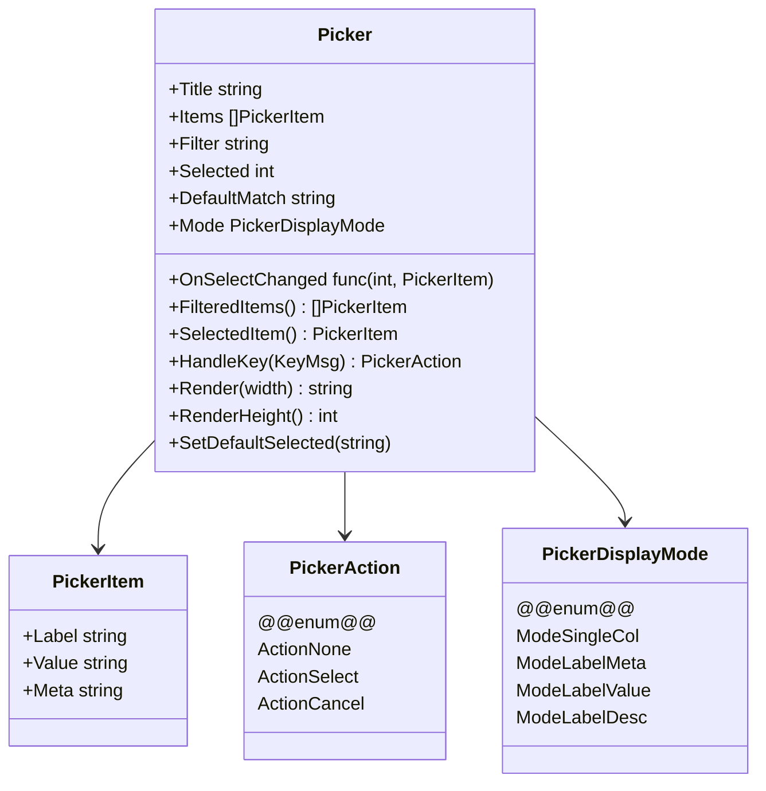
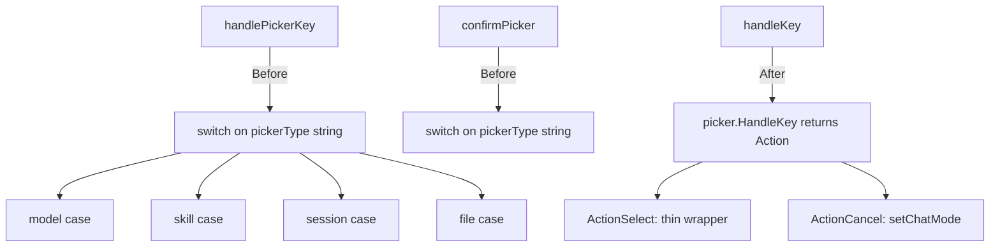

# Refactor Picker into Reusable Component

## Core Problem

Picker logic is duplicated across 4+ sites (model, skill, session, file) with parallel raw data arrays, giant switch statements in handlePickerKey/confirmPicker, and pre-formatted display strings. This makes adding new pickers painful and evolution risky.

## Goal

Single Picker component with typed items, self-contained key handling, configurable column layouts, and clean caller integration. Reduces picker-related code by ~60%.

---

## 1. Picker Component

- **Pattern:** Component Extraction

**Objective:** Build a generic Picker component in the ui package with typed items, self-contained key handling, configurable display modes, and selection callbacks

**Success Criteria:** Picker type in ui/command.go replaces PickerList with full key handling, typed items, multi-column rendering, and selection-change callbacks. All existing unit tests or behavioral expectations remain intact.



### 1.1. Picker types and core logic

**Type:** feature

**What:** Add Picker, PickerItem, PickerAction, PickerDisplayMode types and core methods (FilteredItems, SelectedItem, HandleKey, RenderHeight) to ui/command.go

**Why:** Establishes the reusable component interface that replaces PickerList across all picker sites.

**Files:**

- ~ internal/ui/command.go

**Snippet:**

```
type PickerAction int
const (
	ActionNone   PickerAction = iota
	ActionSelect               // user pressed Enter
	ActionCancel               // user pressed Esc
)

type PickerDisplayMode int
const (
	ModeSingleCol   PickerDisplayMode = iota // just Label
	ModeLabelMeta                           // Label + Meta (e.g. name + date)
	ModeLabelDesc                           // Label + Description (e.g. skill + desc)
	ModeLabelValue                          // Label + Value (e.g. provider + model ID)
)

type PickerItem struct {
	Label       string // left column
	Meta        string // right column short (date, context length, etc.)
	Description string // extended description (truncated in display)
	Value       string // internal value used for matching/default selection
}

type Picker struct {
	Title          string
	Items          []PickerItem
	Filter         string
	Selected       int
	DefaultMatch   string
	DisplayMode    PickerDisplayMode
	OnSelectionChange func(int, PickerItem)
}

func (p *Picker) FilteredItems() []PickerItem { ... }
func (p *Picker) SelectedItem() PickerItem { ... }
func (p *Picker) HandleKey(msg tea.KeyMsg) PickerAction { ... }
func (p *Picker) RenderHeight() int { ... }
func (p *Picker) SetDefaultSelected(match string) { ... }
```

**Acceptance Criteria:**

- [ ] PickerAction enum has 3 values: None, Select, Cancel
- [ ] PickerDisplayMode enum has 4 values for column layouts
- [ ] FilteredItems returns items matching filter on Label and Meta fields (case-insensitive)
- [ ] HandleKey returns ActionSelect on Enter, ActionCancel on Esc, handles Up/Down/Tab navigation, and filters on single-char input with backspace support
- [ ] HandleKey calls OnSelectionChange callback when selection changes
- [ ] SetDefaultSelected scans items and sets Selected index when Value or Label matches
- [ ] SelectedItem returns PickerItem (not just string) with all fields intact

**Verify:**

```bash
cd ~/src/squid-os && go build ./...
```

### 1.2. Picker rendering with column modes

**Type:** feature

**What:** Implement Picker.Render(width) with support for all 4 display modes, selection highlighting, windowing, and filter display

**Why:** Replaces per-site fmt.Sprintf two-column formatting with a unified renderer that handles column widths dynamically.

**Files:**

- ~ internal/ui/command.go

**Snippet:**

```
func (p *Picker) Render(width int) string {
    items := p.FilteredItems()
    // Calculate column width based on mode
    // ModeSingleCol: full width
    // ModeLabelMeta: find max Label len, Meta gets remainder
    // ModeLabelDesc: find max Label len, Description gets remainder (truncated)
    // ModeLabelValue: find max Label len, Value gets remainder
    // Apply styles from style package
    // Show window around Selected (max 15 visible)
}
```

**Acceptance Criteria:**

- [ ] ModeSingleCol renders just the Label across full width (file picker use case)
- [ ] ModeLabelMeta renders Label left-padded + Meta right (session picker: name + date)
- [ ] ModeLabelDesc renders Label left-padded + Description truncated (skill picker: name + description)
- [ ] Selected row uses BgSelected background and accent text
- [ ] Non-selected rows use BgFooter background and muted text
- [ ] Shows filter hint line when filter is non-empty
- [ ] Shows 'No matches' line when filtered list is empty
- [ ] Windowing shows max 15 items centered around selection, matching RenderHeight()
- [ ] Total render height matches RenderHeight() return value for layout calculations

**Verify:**

```bash
cd ~/src/squid-os && go build ./...
```

---

## 2. Migration

- **Pattern:** Strangler Fig

**Objective:** Replace all 4 PickerList usages with the new Picker component, eliminating the giant switch statements and parallel data arrays

**Success Criteria:** All pickers use the new Picker component. handlePickerKey and confirmPicker are gone or drastically reduced. PickerList type is removed or deprecated.



### 2.1. Replace PickerList in Model with single Picker field

**Type:** refactor

**What:** Replace the 4 PickerList fields and sessionPickerRaw in app.go with a single activePicker ui.Picker and pickerContext string. Update New() constructor and all picker creation sites.

**Why:** Eliminates parallel state (modelPicker, skillPicker, sessionPicker, filePicker, sessionPickerRaw, filePickerFor) and collapses it into one component that callers configure.

**Files:**

- ~ internal/app/app.go

**Snippet:**

```
type Model struct {
    // Pickers - single reusable component
    activePicker   ui.Picker
    pickerContext  string // identifies which picker: "model", "skill", "session", "image", "system"
    pickerPayload  interface{} // additional context (e.g. modelEntries for model picker)
}
```

**Acceptance Criteria:**

- [ ] Model struct no longer has modelPicker, skillPicker, sessionPicker, filePicker, sessionPickerRaw, filePickerFor fields
- [ ] activePicker and pickerContext fields added to Model
- [ ] All picker creation sites updated to use activePicker with appropriate DisplayMode and PickerItem slices
- [ ] go build passes with no errors

**Verify:**

```bash
cd ~/src/squid-os && go build ./...
```

### 2.2. Refactor key handling and confirm logic

**Type:** refactor

**What:** Replace handlePickerKey and confirmPicker in pickers.go with a single handleActivePicker method that calls activePicker.HandleKey() and dispatches Select/Cancel. Update handleKey in input.go and recalcLayout in update.go.

**Why:** Eliminates 120+ line switch-on-string dispatchers and collapses them into a ~30-line handler that uses the component's built-in key handling.

**Files:**

- ~ internal/app/pickers.go
- ~ internal/app/input.go
- ~ internal/app/update.go
- ~ internal/app/render.go

**Snippet:**

```
// In input.go - all picker modes route through one handler
case ModeModelPicker, ModeSkillPicker, ModeSessionPicker, ModeFilePicker:
    return m.handleActivePicker(msg)

// In pickers.go
func (m Model) handleActivePicker(msg tea.KeyMsg) (tea.Model, tea.Cmd) {
    action := m.activePicker.HandleKey(msg)
    switch action {
    case ui.ActionCancel:
        // Restore session snapshot if needed
        return m, m.setChatMode()
    case ui.ActionSelect:
        return m.confirmActivePicker()
    }
    // Handle viewport scroll keys (Up/Down still handled by picker,
    // but Scroll/Page keys go to viewport)
    m.recalcLayout()
    return m, nil
}

func (m Model) confirmActivePicker() (tea.Model, tea.Cmd) {
    // Thin switch on pickerContext to apply domain-specific logic
    // This switch stays because the *consequence* of selection is domain-specific
}
```

**Acceptance Criteria:**

- [ ] handlePickerKey function removed or reduced to handleActivePicker
- [ ] input.go routes all picker modes through handleActivePicker instead of individual calls
- [ ] confirmActivePicker has a switch on pickerContext for domain-specific apply logic (model switch, skill set, session load, file attach)
- [ ] recalcLayout uses m.activePicker.RenderHeight() instead of individual picker references
- [ ] render.go uses m.activePicker.Render(m.width) for all picker modes
- [ ] go build passes with no errors

**Verify:**

```bash
cd ~/src/squid-os && go build ./...
```

### 2.3. Migrate all picker creation sites

**Type:** refactor

**What:** Update openSkillPicker, startLoad, scanModelsCmd handler, and image/system picker creation to build PickerItem slices and use the new Picker API with appropriate DisplayMode.

**Why:** Completes the migration — each call site constructs typed PickerItems instead of pre-formatted strings, eliminating parallel raw arrays and string parsing in confirm logic.

**Files:**

- ~ internal/app/skill.go
- ~ internal/app/session.go
- ~ internal/app/update.go
- ~ internal/app/pickers.go

**Snippet:**

```
// skill.go - ModeLabelDesc
items := make([]ui.PickerItem, 0, len(entries))
for _, e := range entries {
    items = append(items, ui.PickerItem{
        Label:       e.name,
        Description: e.description,
        Value:       e.name,
    })
}
m.activePicker = ui.Picker{
    Title:       "Select Skill",
    Items:       items,
    DisplayMode: ui.ModeLabelDesc,
    DefaultMatch: currentSkill,
}

// session.go - ModeLabelMeta
items := make([]ui.PickerItem, len(sessions))
for i, s := range sessions {
    items[i] = ui.PickerItem{
        Label: s.Name,
        Meta:  util.FriendlyModDate(s.ModTime),
        Value: s.Name,
    }
}
m.activePicker = ui.Picker{
    Title:       "Load Session",
    Items:       items,
    DisplayMode: ui.ModeLabelMeta,
    DefaultMatch: m.settings.LastSessionName,
    OnSelectionChange: func(idx int, item ui.PickerItem) {
        m = m.previewSession(item.Value)
    },
}

// update.go - ModeLabelValue (provider + model)
// pickers.go - ModeSingleCol for file paths
```

**Acceptance Criteria:**

- [ ] Skill picker uses ModeLabelDesc with PickerItem.Label=skill name, Description=skill description
- [ ] Session picker uses ModeLabelMeta with PickerItem.Label=session name, Meta=date string, Value=raw name
- [ ] Session picker sets OnSelectionChange callback for live preview
- [ ] Model picker uses ModeLabelValue with PickerItem.Label=model name, Meta=context length, Value=full model ID, provider in Label or separate field
- [ ] File picker uses ModeSingleCol with PickerItem.Label=path, Value=path
- [ ] confirmActivePicker extracts typed values from PickerItem instead of parsing pre-formatted strings
- [ ] sessionPickerRaw parallel array is gone — raw name comes from PickerItem.Value
- [ ] No calls to ui.NewPickerList remain in the codebase
- [ ] go build passes with no errors

**Verify:**

```bash
cd ~/src/squid-os && go build ./...
```

### 2.4. Clean up and remove old PickerList code

**Type:** chore

**What:** Remove PickerList type, NewPickerList function, and any dead code. Verify PickerList is not referenced anywhere in the codebase.

**Why:** Completes the strangler pattern — the old type is fully replaced and can be removed.

**Files:**

- ~ internal/ui/command.go

**Snippet:**

```
// Remove from command.go:
// type PickerList struct { ... }
// func NewPickerList(...) PickerList
// func (pl *PickerList) FilteredItems()
// func (pl *PickerList) MoveUp()
// func (pl *PickerList) MoveDown()
// func (pl *PickerList) SelectedItem()
// func (pl *PickerList) RenderHeight()
// func (pl *PickerList) Render()
```

**Acceptance Criteria:**

- [ ] PickerList type is removed from command.go
- [ ] grep for PickerList and NewPickerList returns no results in internal/
- [ ] maxPickerItems constant removed or renamed to PickerMaxItems
- [ ] go build passes with no errors

**Verify:**

```bash
cd ~/src/squid-os && go build ./... && grep -r 'PickerList\|NewPickerList' internal/ || echo 'CLEAN'
```
