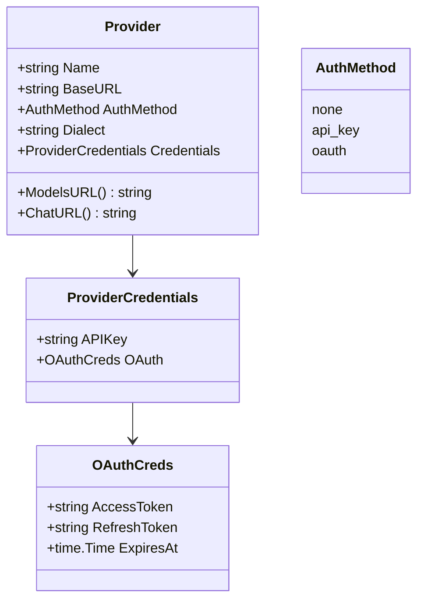
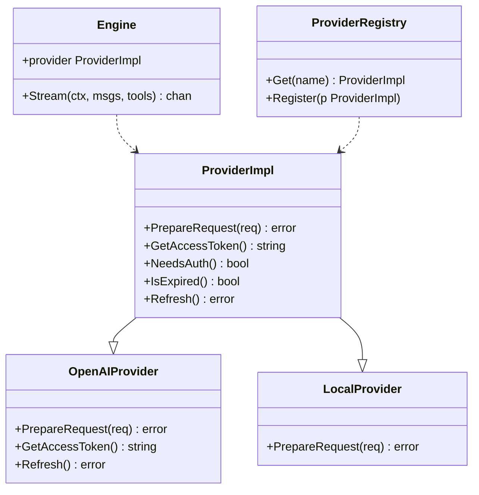
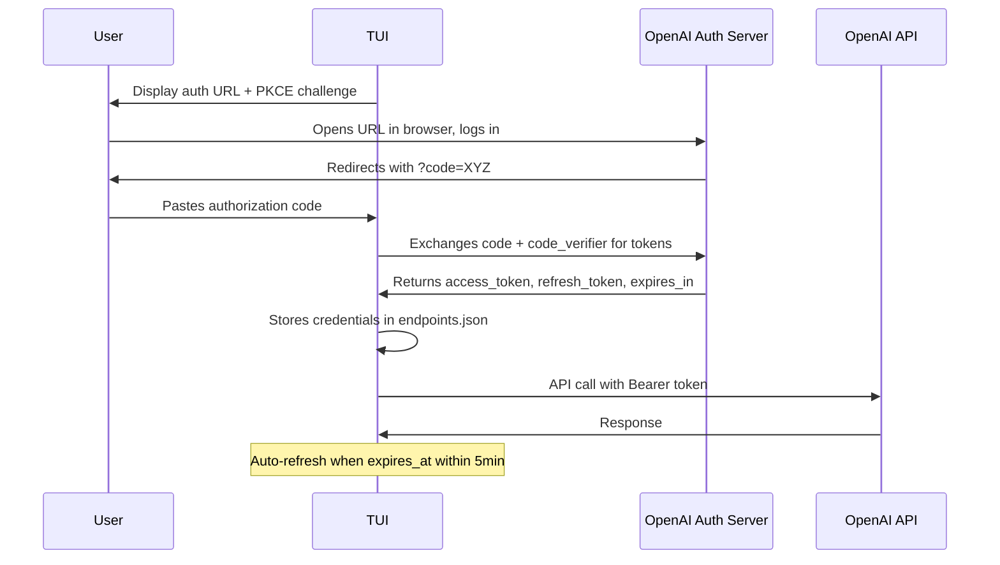
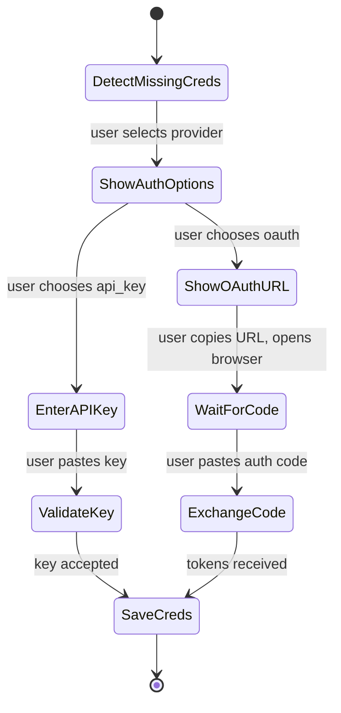
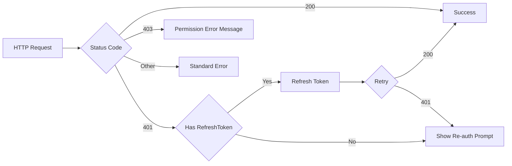

# Provider Authentication & Dialect Framework

## Core Problem

Current codebase has no credential support -- Engine fires bare HTTP requests with no auth header. Need scalable provider architecture supporting API keys and OAuth, with per-provider dialect implementations, starting with OpenAI.

## Goal

OpenAI OAuth (no-browser) and API key auth working; extensible provider interface for adding Gemini/Anthropic/Fireworks/OpenRouter; naming consistency across Provider/Endpoint/ModelEntry

---

## 1. Provider Data Model

- **Pattern:** Interface Segregation, Strategy

**Objective:** Replace ProviderConfig with a proper Provider struct that carries auth method, dialect, credentials, and callback hooks

**Success Criteria:** ProviderConfig renamed to Provider with AuthMethod, Dialect, Credentials fields; old endpoints.json format migrated



### 1.1. Provider struct with auth and dialect fields

**Type:** refactor

**What:** Replace ProviderConfig with Provider struct. AuthMethod is an array of supported methods, user picks one via ActiveAuthMethod in credentials. Known providers have hardcoded URLs, custom providers need BaseURL from user.

**Why:** Establish the data model for extensible provider authentication and API dialect support

**Files:**

- ~ internal/config/endpoints.go

**Snippet:**

```
package config

type AuthMethod string

const (
	AuthNone   AuthMethod = "none"
	AuthAPIKey AuthMethod = "api_key"
	AuthOAuth  AuthMethod = "oauth"
)

type Dialect string

const (
	DialectOpenAICompatible Dialect = "openai"
	DialectAnthropic        Dialect = "anthropic"
	DialectGemini           Dialect = "gemini"
)

type Provider struct {
	Name             string            `json:"name"`
	BaseURL          string            `json:"base_url,omitempty"`
	SupportedAuth    []AuthMethod      `json:"supported_auth"`
	Dialect          Dialect           `json:"dialect"`
	Credentials      *ProviderCreds    `json:"credentials,omitempty"`
	NeedsConfig      bool              `json:"needs_config,omitempty"`
}

type ProviderCreds struct {
	ActiveAuthMethod AuthMethod    `json:"active_auth_method"`
	APIKey           string        `json:"api_key,omitempty"`
	OAuth            *OAuthCreds   `json:"oauth,omitempty"`
}

type OAuthCreds struct {
	AccessToken  string    `json:"access_token"`
	RefreshToken string    `json:"refresh_token"`
	ExpiresAt    time.Time `json:"expires_at"`
}

// IsConfigured returns true if the provider has valid credentials to use
func (p Provider) IsConfigured() bool {
	if p.Credentials == nil {
		return false
	}
	if len(p.SupportedAuth) == 0 {
		return true // no auth needed
	}
	switch p.Credentials.ActiveAuthMethod {
	case AuthAPIKey:
		return p.Credentials.APIKey != ""
	case AuthOAuth:
		return p.Credentials.OAuth != nil && p.Credentials.OAuth.AccessToken != ""
	default:
		return false
	}
}

// NeedsURL returns true if provider requires a user-provided base URL
func (p Provider) NeedsURL() bool {
	return p.IsKnownProvider() == false
}

// IsKnownProvider returns true for built-in providers with hardcoded URLs
func (p Provider) IsKnownProvider() bool {
	known := []string{"openai", "openai-codex", "anthropic", "gemini", "fireworks", "openrouter"}
	for _, k := range known {
		if p.Name == k {
			return true
		}
	}
	return false
}

func (p Provider) ChatURL() string {
	if p.IsKnownProvider() {
		return p.getKnownChatURL()
	}
	if p.Dialect == DialectAnthropic {
		return p.BaseURL + "/v1/messages"
	}
	return p.BaseURL + "/v1/chat/completions"
}

func (p Provider) ModelsURL() string {
	if p.IsKnownProvider() {
		return p.getKnownModelsURL()
	}
	if p.Dialect == DialectOpenAICompatible {
		return p.BaseURL + "/v1/models"
	}
	return ""
}
```

**Acceptance Criteria:**

- [ ] Provider has SupportedAuth []AuthMethod (array of what the provider supports)
- [ ] ProviderCreds has ActiveAuthMethod (single chosen method) plus APIKey/OAuth
- [ ] IsConfigured checks if the active method has valid credentials
- [ ] NeedsURL returns true for custom providers, false for known ones
- [ ] IsKnownProvider identifies built-in providers with hardcoded URLs
- [ ] ChatURL/ModelsURL use hardcoded URLs for known providers, BaseURL for custom

**Verify:**

```bash
cd ~/src/squid-os && go build ./...
```

### 1.2. Migrate EndpointsConfig and update all call sites

**Type:** refactor

**What:** Update EndpointsConfig with new Provider struct. Default endpoints include vllm/ollama (need URL config) and openai (hardcoded URL, supports api_key + oauth). All call sites updated.

**Why:** Ensure the entire codebase uses the new Provider model instead of the flat ProviderConfig

**Files:**

- ~ internal/config/endpoints.go
- ~ internal/app/stream.go
- ~ internal/app/app.go
- ~ internal/app/model.go
- ~ internal/chat/models.go
- ~ internal/headless/headless.go

**Snippet:**

```
type EndpointsConfig struct {
	Providers []Provider `json:"providers"`
}

func DefaultEndpoints() EndpointsConfig {
	return EndpointsConfig{
		Providers: []Provider{
			{
				Name:          "vllm",
				BaseURL:       "",
				SupportedAuth: []AuthMethod{AuthNone},
				Dialect:       DialectOpenAICompatible,
				NeedsConfig:   true, // needs URL from user
			},
			{
				Name:          "ollama",
				BaseURL:       "",
				SupportedAuth: []AuthMethod{AuthNone},
				Dialect:       DialectOpenAICompatible,
				NeedsConfig:   true, // needs URL from user
			},
			{
				Name:          "openai",
				SupportedAuth: []AuthMethod{AuthAPIKey, AuthOAuth},
				Dialect:       DialectOpenAICompatible,
			},
		},
	}
}

func ResolveProvider(endpoints EndpointsConfig, name string) *Provider {
	for i, p := range endpoints.Providers {
		if p.Name == name {
			return &endpoints.Providers[i]
		}
	}
	return nil
}
```

**Acceptance Criteria:**

- [ ] DefaultEndpoints returns vllm and ollama with AuthNone and DialectOpenAICompatible
- [ ] ResolveProvider finds by name, returns nil if not found
- [ ] All call sites in stream.go, headless.go, models.go updated from ProviderConfig to Provider
- [ ] No compile errors across entire codebase

**Verify:**

```bash
cd ~/src/squid-os && go build ./...
```

---

## 2. Provider Interface

- **Pattern:** Strategy, Interface Segregation

**Objective:** Define a Provider interface with callback methods that each dialect implements -- avoids big switch statements, follows existing component callback pattern

**Success Criteria:** Provider interface defined with PrepareRequest, has dialect-specific implementations, engine dispatches via interface



### 2.1. Define ProviderImpl interface and registry

**Type:** feature

**What:** Create chat/provider.go with ProviderImpl interface (PrepareRequest, GetAccessToken, NeedsAuth, IsExpired) and a registry map

**Why:** Each dialect implements its own auth preparation -- no switch statement, extensible like component callbacks

**Files:**

- + internal/chat/provider.go

**Snippet:**

```
package chat

import (
	"net/http"
	"sync"
)

type ProviderImpl interface {
	// PrepareRequest modifies the outgoing request with auth headers.
	// Returns error if credentials are missing or expired and cannot be refreshed.
	PrepareRequest(req *http.Request) error
	
	// GetAccessToken returns the current access token (for logging/debugging).
	GetAccessToken() string
	
	// NeedsAuth returns true if this provider requires authentication.
	NeedsAuth() bool
	
	// IsExpired returns true if OAuth credentials have expired.
	IsExpired() bool
	
	// Refresh attempts to refresh OAuth tokens. Returns error if not applicable or failed.
	Refresh() error
}

var (
	providerRegistry = make(map[string]ProviderImpl)
	registryMu       sync.RWMutex
)

func RegisterProvider(name string, impl ProviderImpl) {
	registryMu.Lock()
	defer registryMu.Unlock()
	providerRegistry[name] = impl
}

func GetProvider(name string) ProviderImpl {
	registryMu.RLock()
	defer registryMu.RUnlock()
	return providerRegistry[name]
}

```

**Acceptance Criteria:**

- [ ] ProviderImpl interface has PrepareRequest, GetAccessToken, NeedsAuth, IsExpired, Refresh methods
- [ ] Registry uses sync.RWMutex for thread safety
- [ ] RegisterProvider and GetProvider work correctly
- [ ] No existing code breaks -- old Engine path still compiles

**Verify:**

```bash
cd ~/src/squid-os && go build ./...
```

### 2.2. Implement local/no-auth provider as default

**Type:** feature

**What:** Create a no-auth provider implementation that returns nil from PrepareRequest (passthrough for vllm/ollama), register it by default

**Why:** Existing local providers (vllm, ollama) need to continue working with no auth, serving as the base case

**Files:**

- + internal/chat/local_provider.go

**Snippet:**

```
package chat

import "net/http"

type LocalProvider struct{}

func (l *LocalProvider) PrepareRequest(req *http.Request) error { return nil }
func (l *LocalProvider) GetAccessToken() string                { return "" }
func (l *LocalProvider) NeedsAuth() bool                       { return false }
func (l *LocalProvider) IsExpired() bool                       { return false }
func (l *LocalProvider) Refresh() error                        { return nil }

func init() {
	RegisterProvider("vllm", &LocalProvider{})
	RegisterProvider("ollama", &LocalProvider{})
}

```

**Acceptance Criteria:**

- [ ] LocalProvider PrepareRequest is a no-op
- [ ] NeedsAuth returns false
- [ ] vllm and ollama registered in init
- [ ] Existing Engine usage with local providers still works unchanged

**Verify:**

```bash
cd ~/src/squid-os && go build ./...
```

### 2.3. Wire Engine to use ProviderImpl for auth

**Type:** feature

**What:** Update Engine to accept a ProviderImpl, call PrepareRequest before each HTTP call, fall back to old behavior if no provider impl found

**Why:** Bridge the gap between the new provider interface and the existing Engine streaming logic

**Files:**

- ~ internal/chat/engine.go

**Snippet:**

```
type Engine struct {
	ChatURL  string
	Model    string
	Thinking bool
	provider ProviderImpl
	client   *http.Client
}

func NewEngine(chatURL, model string, thinking bool, provider ProviderImpl) *Engine {
	return &Engine{
		ChatURL:  chatURL,
		Model:    model,
		Thinking: thinking,
		provider: provider,
		client:   &http.Client{Timeout: 0},
	}
}

// In Stream(), after creating the request:
if e.provider != nil {
	if err := e.provider.PrepareRequest(req); err != nil {
		ch <- StreamEvent{Error: fmt.Errorf("provider auth: %w", err)}
		return
	}
}

```

**Acceptance Criteria:**

- [ ] Engine accepts ProviderImpl in NewEngine
- [ ] PrepareRequest called before every outgoing HTTP request
- [ ] Auth error returns StreamEvent with Error, does not panic
- [ ] Backward compatible -- nil provider works as before (no auth header)
- [ ] All call sites of NewEngine in stream.go and headless.go updated

**Verify:**

```bash
cd ~/src/squid-os && go build ./...
```

### 2.4. Generic Sequence component for multi-step wizards

**Type:** feature

**What:** Create component/sequence.go — a tea.Model that chains multiple child components (Input, Picker, Question) with a shared context map

**Why:** Reusable wizard abstraction for provider auth and future multi-step flows (tool questions, skill install). Components remain standalone and unchanged.

**Files:**

- + internal/ui/component/sequence.go

**Snippet:**

```
package component

import (
	tea "github.com/charmbracelet/bubbletea"
)

type SequenceStep struct {
	Key       string     // name for the result in shared context
	Component tea.Model  // child component to run
}

type Sequence struct {
	Steps    []SequenceStep
	Current  int
	Context  map[string]any  // accumulated results keyed by Step.Key
	OnDone   func(map[string]any) tea.Cmd
	OnCancel func() tea.Cmd
}

func (s *Sequence) Init() tea.Cmd {
	return s.Steps[s.Current].Component.Init()
}

func (s *Sequence) Update(msg tea.Msg) (tea.Model, tea.Cmd) {
	current := &s.Steps[s.Current]
	newChild, cmd := current.Component.Update(msg)
	
	// Check if child is done (returned a different type or nil cmd with done signal)
	if isDone(newChild) {
		// Extract result and store in context under step's key
		s.Context[current.Key] = extractResult(newChild)
		
		if s.Current+1 < len(s.Steps) {
			s.Current++
			return s, s.Steps[s.Current].Component.Init()
		}
		return s, s.OnDone(s.Context)
	}
	
	current.Component = newChild
	return s, cmd
}

func (s *Sequence) View() string {
	return s.Steps[s.Current].Component.View()
}

// isDone checks if a child component signaled completion
// Each component type has its own signal (e.g., Input returns empty cmd on enter)
func isDone(m tea.Model) bool {
	// Implementation depends on how child signals completion
	// For now: if Update returns the same model type but with a Done flag
}

// extractResult pulls the output value from a completed component
func extractResult(m tea.Model) any {
	switch c := m.(type) {
	case *Input:
		return c.Value
	case *Picker:
		return c.Selected
	case *Question:
		return struct{ Index int; Text string }{c.Selected, c.Instructions}
	default:
		return nil
	}
}

```

**Acceptance Criteria:**

- [ ] Sequence implements tea.Model (Init, Update, View)
- [ ] Steps are defined as SequenceStep with Key name and child Component
- [ ] Shared context map stores results keyed by each step's Key
- [ ] On step completion: result extracted, stored in context, advances to next step
- [ ] On all steps done: calls OnDone with full context map
- [ ] OnCancel callback supported
- [ ] Child components remain unchanged — they don't know about Sequence
- [ ] Works with existing Input, Picker, Question components

**Verify:**

```bash
cd ~/src/squid-os && go build ./...
```

---

## 3. OpenAI OAuth (No-Browser)

- **Pattern:** PKCE, Strategy

**Objective:** Implement OpenAI OAuth 2.0 PKCE flow without browser automation -- user copies URL, pastes authorization code back in TUI

**Success Criteria:** User can authenticate with OpenAI subscription via paste-code flow, tokens auto-refresh, works on server and desktop



### 3.1. OpenAI OAuth PKCE implementation

**Type:** feature

**What:** Create chat/openai_provider.go with full PKCE OAuth flow: code challenge generation, token exchange, auto-refresh, and PrepareRequest that injects Bearer token

**Why:** Enable OpenAI subscription authentication -- the primary auth use case for cloud providers

**Files:**

- + internal/chat/openai_provider.go

**Snippet:**

```
package chat

import (
	"crypto/rand"
	"crypto/sha256"
	"encoding/base64"
	"fmt"
	"net/http"
	"net/url"
	"time"
)

const (
	openaiClientID      = "app_EMoamEEZ73f0CkXaXp7hrann"
	openaiAuthURL       = "https://auth.openai.com/oauth/authorize"
	openaiTokenURL      = "https://auth.openai.com/oauth/token"
	openaiBaseURL       = "https://api.openai.com"
)

type OpenAIProvider struct {
	codeVerifier string
	creds        *ProviderCreds
}

func NewOpenAIProviderWithKey(apiKey string) *OpenAIProvider {
	return &OpenAIProvider{
		creds: &ProviderCreds{APIKey: apiKey},
	}
}

// StartOAuth returns the authorization URL the user must visit.
func (o *OpenAIProvider) StartOAuth(redirectURI string) (authURL string, err error) {
	// Generate 32-byte code verifier
	o.codeVerifier = generatePKCEVerifier()
	challenge := generateCodeChallenge(o.codeVerifier)
	
	params := url.Values{
		"client_id":                {openaiClientID},
		"response_type":            {"code"},
		"code_challenge":           {challenge},
		"code_challenge_method":    {"S256"},
		"redirect_uri":             {redirectURI},
	}
	return openaiAuthURL + "?" + params.Encode(), nil
}

// FinishOAuth exchanges the authorization code for tokens.
func (o *OpenAIProvider) FinishOAuth(code string) error {
	// POST to token endpoint with code + code_verifier
	// Store returned access_token, refresh_token, expires_at
}

func (o *OpenAIProvider) PrepareRequest(req *http.Request) error {
	token := o.getCurrentToken()
	if token == "" {
		return fmt.Errorf("openai: no credentials configured")
	}
	req.Header.Set("Authorization", "Bearer "+token)
	return nil
}

func (o *OpenAIProvider) Refresh() error {
	// If API key mode, nothing to refresh
	// If OAuth mode, use refresh_token to get new tokens
}

func generatePKCEVerifier() string {
	b := make([]byte, 32)
	rand.Read(b)
	return base64.RawURLEncoding.EncodeToString(b)
}

func generateCodeChallenge(verifier string) string {
	h := sha256.Sum256([]byte(verifier))
	return base64.RawURLEncoding.EncodeToString(h[:])
}

```

**Acceptance Criteria:**

- [ ] PKCE code verifier is 32 random bytes, base64url encoded
- [ ] Code challenge is SHA256 of verifier, base64url encoded
- [ ] StartOAuth returns full authorization URL with correct OpenAI client ID
- [ ] FinishOAuth exchanges code for tokens and stores them
- [ ] PrepareRequest injects Bearer token (OAuth or API key)
- [ ] Refresh swaps expired OAuth token using refresh_token
- [ ] Returns error when no credentials configured

**Verify:**

```bash
cd ~/src/squid-os && go build ./...
```

### 3.2. OpenAI provider registration and credential persistence

**Type:** feature

**What:** Register openai and openai-codex providers, wire credential loading/saving from endpoints.json ProviderCreds into OpenAIProvider on init

**Why:** Credentials survive across sessions -- user doesn't re-auth on every restart

**Files:**

- ~ internal/chat/openai_provider.go
- ~ internal/config/endpoints.go

**Snippet:**

```
// In LoadEndpoints or a new init function:
func LoadProviderImpl(p Provider) ProviderImpl {
	switch p.Name {
	case "openai", "openai-codex":
		impl := &OpenAIProvider{}
		if p.Credentials != nil {
			impl.creds = p.Credentials
		}
		return impl
	default:
		return &LocalProvider{}
	}
}

// Save credentials back after OAuth completes:
func (o *OpenAIProvider) GetCredentials() *ProviderCreds {
	return o.creds
}

```

**Acceptance Criteria:**

- [ ] LoadProviderImpl returns OpenAIProvider for openai/openai-codex names
- [ ] Existing OAuth credentials from endpoints.json are loaded into provider
- [ ] New credentials can be marshaled back to endpoints.json
- [ ] Local providers still return LocalProvider

**Verify:**

```bash
cd ~/src/squid-os && go build ./...
```

---

## 4. TUI Auth Prompt

- **Pattern:** Component, State Machine

**Objective:** Add a TUI prompt component that guides user through provider setup on first use -- displays auth URL, collects paste-back code, or collects API key directly

**Success Criteria:** User sees guided prompt on first use of an auth-required provider, completes setup in TUI, credentials saved



### 4.1. Provider auth wizard using Sequence component

**Type:** feature

**What:** Build provider auth flow in app layer using Sequence component: URL entry → auth method picker → credential entry. No new component file needed.

**Why:** Leverage generic Sequence component for clean multi-step auth wizard. Reuses existing Input, Picker, and Question components.

**Files:**

- + internal/app/auth_setup.go

**Snippet:**

```
package app

// buildAuthWizard creates a Sequence for provider configuration:
// Step 1: If custom provider (vllm/ollama), prompt for BaseURL via Input
// Step 2: If multiple auth methods, show Picker to choose method
// Step 3: If API key, show Input for key entry
// Step 3: If OAuth, show Question with URL, then Input for code
// OnDone: save credentials, re-scan models
func (m *Model) buildAuthWizard(p *config.Provider) *component.Sequence {
	var steps []component.SequenceStep
	
	if p.NeedsURL() {
		steps = append(steps, component.SequenceStep{
			Key: "baseURL",
			Component: &component.Input{
				Label: "Enter " + p.Name + " base URL (e.g., http://localhost:8080)",
			},
		})
	}
	
	if len(p.SupportedAuth) > 1 {
		methods := []string{}
		for _, a := range p.SupportedAuth {
			methods = append(methods, string(a))
		}
		steps = append(steps, component.SequenceStep{
			Key: "authMethod",
			Component: &component.Picker{
				Title:   "Choose authentication method for " + p.Name,
				Options: methods,
			},
		})
	}
	
	// Auth step depends on chosen method or single available method
	// (built dynamically based on prior steps — see buildAuthStep)
	
	return &component.Sequence{
		Steps: steps,
		OnDone: func(ctx map[string]any) tea.Cmd {
			return m.onProviderConfigComplete(p, ctx)
		},
		OnCancel: func() tea.Cmd {
			return m.returnToModelPicker()
		},
	}
}

func (m *Model) onProviderConfigComplete(p *config.Provider, ctx map[string]any) tea.Cmd {
	// Apply context values to provider
	if baseURL, ok := ctx["baseURL"].(string); ok {
		p.BaseURL = baseURL
	}
	if method, ok := ctx["authMethod"].(string); ok {
		p.Credentials = &config.ProviderCreds{
			ActiveAuthMethod: config.AuthMethod(method),
		}
		if method == "api_key" {
			p.Credentials.APIKey = ctx["apiKey"].(string)
		} else if method == "oauth" {
			// Trigger OAuth flow with the code
			// (handled separately as OAuth needs network call)
		}
	}
	
	// Save and re-scan
	m.saveProvider(*p)
	m.refreshModels()
	return m.setChatMode()
}

```

**Acceptance Criteria:**

- [ ] Uses Sequence component to chain auth steps
- [ ] Custom providers (vllm/ollama) prompt for BaseURL via Input step
- [ ] Providers with multiple auth methods show Picker step
- [ ] Providers with single auth method skip Picker, go straight to credential
- [ ] API key mode uses Input step with masked display
- [ ] OAuth mode shows URL via Question, then Input for code paste
- [ ] OnDone saves credentials and re-scans model list
- [ ] OnCancel returns to model picker without saving
- [ ] No new component file — logic in app layer using existing components

**Verify:**

```bash
cd ~/src/squid-os && go build ./...
```

### 4.2. Wire auth prompt into provider selection flow

**Type:** feature

**What:** Before sending message, check if provider is fully configured. If not, show config wizard. Also auto-refresh expired OAuth tokens before sending.

**Why:** Integrate the auth prompt into the existing model/provider selection so user is guided through setup at the right moment

**Files:**

- ~ internal/app/model.go
- ~ internal/app/stream.go

**Snippet:**

```
// Before sending message, check if provider is configured:
func (m *Model) ensureProviderConfigured() (bool, tea.Cmd) {
	p := config.ResolveProvider(m.endpoints, m.settings.Provider)
	if p == nil {
		return false, nil
	}
	
	if !p.IsConfigured() {
		// Show config wizard
		return true, m.showProviderConfig(p)
	}
	
	// Check if OAuth creds are about to expire
	impl := chat.LoadProviderImpl(*p)
	if impl != nil && impl.IsExpired() {
		if err := impl.Refresh(); err != nil {
			// Refresh failed, show re-config wizard
			return true, m.showProviderConfig(p)
		}
		// Refresh succeeded, save updated creds
		m.saveProvider(*p)
	}
	return false, nil
}
```

**Acceptance Criteria:**

- [ ] sendMessage checks if provider IsConfigured before sending
- [ ] Unconfigured provider triggers config wizard instead of sending
- [ ] Expired OAuth tokens auto-refresh before sending
- [ ] Failed refresh triggers config wizard for re-auth
- [ ] Config cancel gracefully returns without sending

**Verify:**

```bash
cd ~/src/squid-os && go build ./...
```

### 4.3. Wire model scanning through ProviderImpl auth

**Type:** feature

**What:** ScanModels returns sentinel entries for unconfigured providers (<not configured>) and expired creds (<auth expired>). Both trigger the universal config wizard.

**Why:** Model scanner needs auth to fetch models from authenticated providers, and must surface auth-required providers as selectable placeholders in the picker

**Files:**

- ~ internal/chat/models.go
- ~ internal/chat/provider.go

**Snippet:**

```
func ScanModels(ctx context.Context, endpoints config.EndpointsConfig) []ModelEntry {
	var mu sync.Mutex
	var models []ModelEntry
	var wg sync.WaitGroup

	for _, provider := range endpoints.Providers {
		wg.Add(1)
		go func(p config.Provider) {
			defer wg.Done()
			
			// If provider needs initial config (URL or auth), return sentinel
			if !p.IsConfigured() {
				mu.Lock()
				models = append(models, ModelEntry{
					ID:          "<not configured>",
					Provider:    p.Name,
					NeedsConfig: true,
				})
				mu.Unlock()
				return
			}
			
			impl := LoadProviderImpl(p)
			entries, err := FetchModelsDetailWithAuth(ctx, p, impl)
			if err != nil {
				// If 401, creds may be expired - return sentinel
				if isAuthError(err) {
					mu.Lock()
					models = append(models, ModelEntry{
						ID:          "<auth expired>",
						Provider:    p.Name,
						NeedsConfig: true,
					})
					mu.Unlock()
				}
				return
			}
			
			mu.Lock()
			models = append(models, entries...)
			mu.Unlock()
		}(provider)
	}
	wg.Wait()
	return models
}
```

**Acceptance Criteria:**

- [ ] Unconfigured providers return <not configured> sentinel
- [ ] Providers with expired/invalid creds return <auth expired> sentinel
- [ ] Both sentinel types have NeedsConfig flag set to true
- [ ] Local providers with no auth need still show <not configured> if URL missing
- [ ] ModelEntry has NeedsConfig flag (replaces NeedsAuth) for broader coverage

**Verify:**

```bash
cd ~/src/squid-os && go build ./...
```

### 4.4. Picker shows auth-required placeholders and triggers auth prompt

**Type:** feature

**What:** Model picker shows <not configured> and <auth expired> sentinels. Selecting one opens the universal config wizard. On completion, saves provider and re-scans.

**Why:** User needs to discover and authenticate providers through the model picker since that is the primary interaction point

**Files:**

- ~ internal/app/model.go

**Snippet:**

```
// In model picker display logic:
func renderModelEntry(e ModelEntry) string {
	if e.NeedsConfig {
		label := e.ID
		if e.ID == "<auth expired>" {
			label = "re-authenticate"
		}
		return fmt.Sprintf("  %s: click to %s", e.Provider, label)
	}
	return fmt.Sprintf("  %s: %s", e.Provider, e.ID)
}

// On model selection:
func (m *Model) onModelSelected(entry ModelEntry) (Model, tea.Cmd) {
	if entry.NeedsConfig {
		// Trigger config wizard for this provider
		p := config.ResolveProvider(m.endpoints, entry.Provider)
		return m, m.showProviderConfig(p)
	}
	// Normal model selection
	m.settings.Provider = entry.Provider
	m.settings.Model = entry.ID
	return m, nil
}

// After successful config, re-scan models:
func (m *Model) onProviderConfigComplete(updated config.Provider) (Model, tea.Cmd) {
	// Save updated provider back to endpoints
	m.saveProvider(updated)
	
	ctx, cancel := context.WithTimeout(context.Background(), 15*time.Second)
	defer cancel()
	models := chat.ScanModels(ctx, m.endpoints)
	m.populateModelList(models)
	return m, nil
}
```

**Acceptance Criteria:**

- [ ] Picker displays <not configured> for providers missing URL or creds
- [ ] Picker displays <auth expired> for providers with invalid creds
- [ ] Selecting sentinel opens provider config wizard
- [ ] Wizard completion saves provider and re-scans model list
- [ ] Normal model selection unchanged for configured providers

**Verify:**

```bash
cd ~/src/squid-os && go build ./...
```

---

## 5. Error Handling & Fallback

- **Pattern:** Circuit Breaker

**Objective:** Handle auth failures gracefully -- expired tokens trigger re-prompt, 401 errors trigger credential refresh or re-auth

**Success Criteria:** Expired tokens auto-refresh before retry, 401 errors prompt for re-auth, unsupported providers return clear error



### 5.1. 401 detection and auto-refresh with re-auth prompt

**Type:** feature

**What:** In Engine Stream, detect 401 response, attempt token refresh, retry once, then return error that triggers re-auth prompt

**Why:** Expired tokens are common -- auto-refresh avoids bothering the user, re-auth prompt is the last resort

**Files:**

- ~ internal/chat/engine.go

**Snippet:**

```
// In Stream(), after getting a non-200 response:
if resp.StatusCode == http.StatusUnauthorized {
	// Try refreshing credentials
	if e.provider != nil && e.provider.IsExpired() {
		if err := e.provider.Refresh(); err == nil {
			// Retry with new token
			req2, _ := http.NewRequestWithContext(ctx, "POST", e.ChatURL, bytes.NewReader(body))
			req2.Header.Set("Content-Type", "application/json")
			e.provider.PrepareRequest(req2)
			// ... repeat the request ...
		}
	}
	// If refresh failed or not available, return error that triggers re-auth
	ch <- StreamEvent{Error: fmt.Errorf("authentication failed -- re-configure provider %s", e.providerName)}
	return
}

```

**Acceptance Criteria:**

- [ ] 401 response triggers token refresh attempt before showing error
- [ ] Successful refresh retries the request with new token
- [ ] Failed refresh returns error message that triggers re-auth prompt
- [ ] Providers without refresh capability return clear error

**Verify:**

```bash
cd ~/src/squid-os && go build ./...
```

### 5.2. Unsupported provider error and placeholder error for non-openai dialects

**Type:** feature

**What:** When user configures a provider with a dialect that has no implementation yet (anthropic, gemini), return a clear error explaining it's not yet supported

**Why:** Scope is OpenAI only for now -- other providers should fail gracefully with a helpful message, not a cryptic panic

**Files:**

- ~ internal/chat/provider.go

**Snippet:**

```
// In LoadProviderImpl:
func LoadProviderImpl(p config.Provider) ProviderImpl {
	switch p.Name {
	case "openai", "openai-codex":
		return newOpenAIFromConfig(p)
	default:
		if p.Dialect != config.DialectOpenAICompatible {
			return &UnsupportedProvider{Dialect: p.Dialect}
		}
		return &LocalProvider{}
	}
}

type UnsupportedProvider struct {
	Dialect string
}

func (u *UnsupportedProvider) PrepareRequest(req *http.Request) error {
	return fmt.Errorf("provider dialect %q not yet supported -- only openai-compatible providers are currently available", u.Dialect)
}
// ... other interface methods return appropriate stubs

```

**Acceptance Criteria:**

- [ ] Anthropic dialect returns clear unsupported error from PrepareRequest
- [ ] Gemini dialect returns clear unsupported error
- [ ] OpenAI and local providers work normally
- [ ] Error message guides user on what IS supported

**Verify:**

```bash
cd ~/src/squid-os && go build ./...
```
