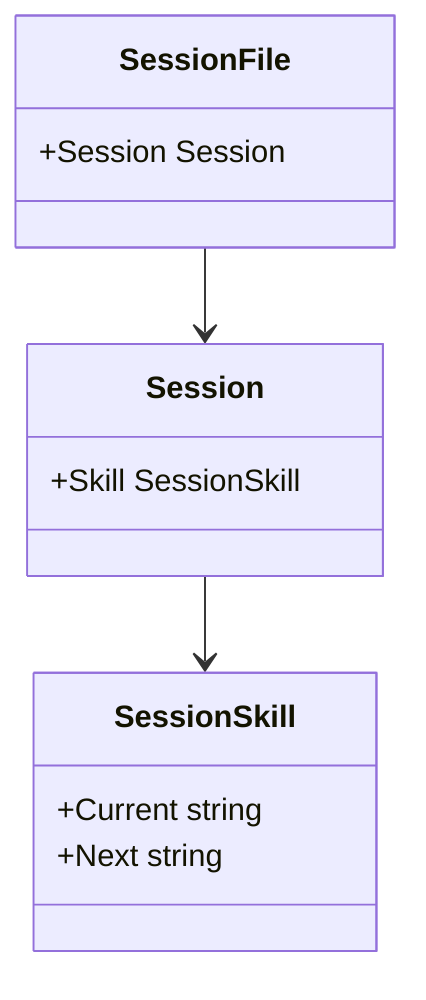
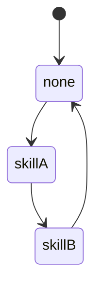
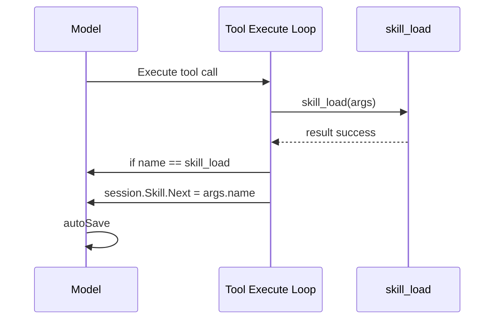
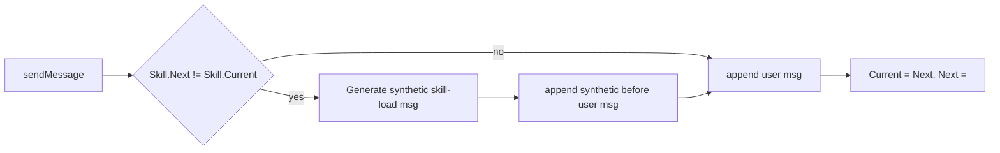
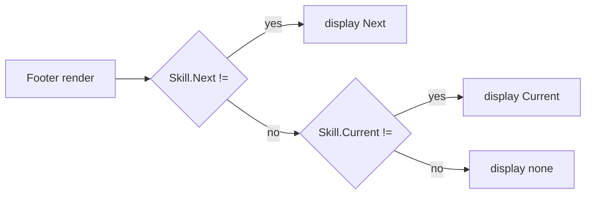

# Active Skill State

## Core Problem

Track loaded skill on the session like working_dir, allow Tab cycling, and inject a synthetic message on change when the user sends their next message. State lives entirely in SessionSkill struct — no Model-level tracking.

## Goal

User can cycle skills with Tab, skill_load sets Next, change is reflected via synthetic message on next turn, persists on save/load, cleared on new session

---

## 1. Config

- **Pattern:** Data struct (self-contained in Session)

**Objective:** Add SessionSkill struct with Current and Next to the Session config

**Success Criteria:** Session file persists both Current and Next, restored on load, footer can read it



### 1.1. Add SessionSkill to config

**Type:** feature

**What:** Add SessionSkill struct and embed it in Session in config/session.go

**Why:** Self-contained skill state on the session — Current is committed, Next is pending change

**Files:**

- ~ internal/config/session.go

**Snippet:**

```
type SessionSkill struct {
    Current string `json:"current"`
    Next    string `json:"next"`
}

type Session struct {
    // ... existing fields ...
    Skill SessionSkill `json:"skill"`
}
```

**Acceptance Criteria:**

- [ ] Both fields always persist (no omitempty)
- [ ] Default zero value is {"": ""} — no skill

**Verify:**

```bash
go build ./...
```

---

## 2. Tab Cycling

- **Pattern:** Key binding on session state

**Objective:** Tab in ModeChat cycles through [none] + registered skills, sets Next, autosaves Current

**Success Criteria:** Tab cycles skills on session.Skill, shows notification, autosaves immediately



### 2.1. Implement cycleSkill on Tab

**Type:** feature

**What:** Intercept Tab in ModeChat to cycle skills, set Next, autosave

**Why:** Let the user manually switch the loaded skill via Tab

**Files:**

- ~ internal/app/input.go
- ~ internal/app/app.go

**Snippet:**

```
case msg.Type == tea.KeyTab && !msg.Alt && m.mode == ModeChat:
    return m.cycleSkill()
```

```
func (m Model) cycleSkill() (Model, tea.Cmd) {
    options := []string{""}
    if reg := skills.GetRegistry(); reg != nil {
        for _, e := range reg.List() {
            options = append(options, e.Name)
        }
    }
    current := m.session.file.Session.Skill.Next
    if current == "" {
        current = m.session.file.Session.Skill.Current
    }
    idx := 0
    for i, s := range options {
        if s == current {
            idx = i
            break
        }
    }
    next := options[(idx+1)%len(options)]
    m.session.file.Session.Skill.Next = next
    label := next
    if next == "" {
        label = "[no skill]"
    }
    m.setNotification(ui.NotificationInfo, "skill: " + label)
    m.updateViewportContent()
    return m.autoSave()
}
```

**Acceptance Criteria:**

- [ ] Tab cycles: empty -> skill1 -> skill2 -> ... -> empty (loop)
- [ ] If Next is already set, cycling continues from Next (not Current)
- [ ] Sets Next on session.Skill
- [ ] Autosaves after each cycle
- [ ] Shows notification with skill name or [no skill]

**Verify:**

```bash
go build ./...
```

---

## 3. Tool Side-Effect

- **Pattern:** Post-execution hook (mirrors set_working_dir in stream.go)

**Objective:** skill_load tool sets Skill.Next as a side effect, autosaves

**Success Criteria:** After skill_load succeeds, session.Skill.Next is set and autosaved



### 3.1. skill_load sets Next post-execution

**Type:** feature

**What:** Add post-execution hook for skill_load in stream.go next to set_working_dir

**Why:** When the model calls skill_load, set Skill.Next and autosave so the footer reflects it

**Files:**

- ~ internal/app/stream.go

**Snippet:**

```
// After set_working_dir block in stream.go tool loop:
if p.name == "skill_load" && result.Status == tools.ResultStatusSuccess {
    if name, ok := args["name"].(string); ok {
        m.session.file.Session.Skill.Next = name
        m, _ = m.autoSave()
    }
}
```

**Acceptance Criteria:**

- [ ] After successful skill_load, session.Skill.Next is set
- [ ] Autosaves after setting Next
- [ ] Failed skill_load does not change Next

**Verify:**

```bash
go build ./...
```

---

## 4. Synthetic Message on Send

- **Pattern:** Pre-send check in sendMessage

**Objective:** On user send, if Next != Current inject synthetic skill-load message, then liquidate Next into Current

**Success Criteria:** Transition produces synthetic with label skill-load and param name; Next is cleared, Current updated; no extra save needed (autosave already ran)



### 4.1. Inject synthetic skill-load message on send

**Type:** feature

**What:** In sendMessage(), before appending user message, check if Skill.Next != Skill.Current and inject synthetic skill-load message, then liquidate

**Why:** When the skill has changed, the model needs to know via a synthetic message before the user message

**Files:**

- ~ internal/app/stream.go

**Snippet:**

```
func (m Model) sendMessage() (Model, tea.Cmd) {
    // ... existing start ...

    // Check for skill change
    if m.session.file.Session.Skill.Next != m.session.file.Session.Skill.Current {
        old := m.session.file.Session.Skill.Current
        nxt := m.session.file.Session.Skill.Next
        m.injectSkillChangeSynthetic(old, nxt)
        m.session.file.Session.Skill.Current = nxt
        m.session.file.Session.Skill.Next = ""
    }

    // ... rest of sendMessage (append user msg, start stream) ...
```

```
func (m *Model) injectSkillChangeSynthetic(old string, nxt string) {
    var text string
    if nxt == "" {
        text = fmt.Sprintf("Skill %q has been unloaded by the user. Don't use the previously loaded skill anymore.", old)
    } else if old == "" {
        text = m.getSkillText(nxt)
    } else {
        text = fmt.Sprintf("Skill changed from %q to %q. Stop using the previous skill and use the new one instead.

", old, nxt)
        text += m.getSkillText(nxt)
    }
    m.session.appendMsg(config.Message{
        ID:          fmt.Sprintf("msg_%d", len(m.session.file.Messages)+1),
        Role:        config.RoleSynthetic,
        CreatedAt:   time.Now(),
        Text:        text,
        Label:       "skill-load",
        Params:      map[string]string{"name": nxt},
        InputTokens: countTokensApprox(text),
    })
}
```

```
func (m *Model) getSkillText(name string) string {
    reg := skills.GetRegistry()
    if reg == nil {
        return fmt.Sprintf("Loaded skill: %s", name)
    }
    sk, err := reg.Load(name)
    if err != nil {
        return fmt.Sprintf("Loaded skill: %s", name)
    }
    text := fmt.Sprintf("Loaded skill: %s

", name)
    if sk.Body != "" {
        text += sk.Body
    }
    return text
}
```

**Acceptance Criteria:**

- [ ] empty -> skill: synthetic 'Loaded skill: X' + body, param name=X
- [ ] skill-A -> skill-B: synthetic 'Skill changed from A to B' + new body, param name=B
- [ ] skill-A -> empty: synthetic 'Skill A unloaded', param name=empty
- [ ] Label is skill-load
- [ ] After synthetic injection, Current = Next, Next cleared
- [ ] If Next == Current, no synthetic injected

**Verify:**

```bash
go build ./...
```

---

## 5. Clear State

- **Pattern:** Reset on session lifecycle

**Objective:** Zero out Skill on new session / incognito

**Success Criteria:** No leftover skill state when starting fresh

```mermaid
flowchart LR
    A[clearSession] --> B[Skill = SessionSkill{}]
    C[toggleIncognito] --> B
```

### 5.1. Clear Skill on new session / incognito

**Type:** feature

**What:** Reset session.file.Session.Skill to zero value in clearSession() and toggleIncognito()

**Why:** A fresh session should not carry over a previously loaded skill

**Files:**

- ~ internal/app/session.go

**Snippet:**

```
func (m Model) clearSession() (Model, tea.Cmd) {
    m.session.file.Session.Skill = config.SessionSkill{}
    // ...
```

```
func (m Model) toggleIncognito() (Model, tea.Cmd) {
    m.session.file.Session.Skill = config.SessionSkill{}
    // ...
```

**Acceptance Criteria:**

- [ ] clearSession zeros both Current and Next
- [ ] toggleIncognito zeros both Current and Next

**Verify:**

```bash
go build ./...
```

---

## 6. Footer Display

- **Pattern:** UI render using session state

**Objective:** Footer shows skill state: Next if set, otherwise Current

**Success Criteria:** Footer displays current/pending skill info from SessionSkill



### 6.1. Display skill in footer

**Type:** feature

**What:** Add SessionSkill to FooterData, display it in line2 footer (after auth mode, before working dir)

**Why:** User needs to see what skill is currently loaded or pending

**Files:**

- ~ internal/ui/footer.go
- ~ internal/app/render.go

**Snippet:**

```
type FooterData struct {
    // ... existing fields ...
    Skill config.SessionSkill
}
```

```
// In buildFooterData:
return ui.FooterData{
    // ... existing ...
    Skill: m.session.file.Session.Skill,
}
```

```
// In RenderFooter line2, after authLabel:
var skillLabel string
if data.Skill.Next != "" {
    skillLabel = style.FooterValueStyle.Render("[skill: " + data.Skill.Next + "]")
} else if data.Skill.Current != "" {
    skillLabel = style.FooterValueStyle.Render("[skill: " + data.Skill.Current + "]")
}
left2 := thinkLabel + authLabel + skillLabel + style.FooterValueStyle.Render(" ") + curDirLabel
```

**Acceptance Criteria:**

- [ ] When Next is set, footer shows [skill: Next]
- [ ] When Next is empty but Current is set, footer shows [skill: Current]
- [ ] When both empty, no skill label shown
- [ ] Skill label appears between auth mode and working dir

**Verify:**

```bash
go build ./...
```
