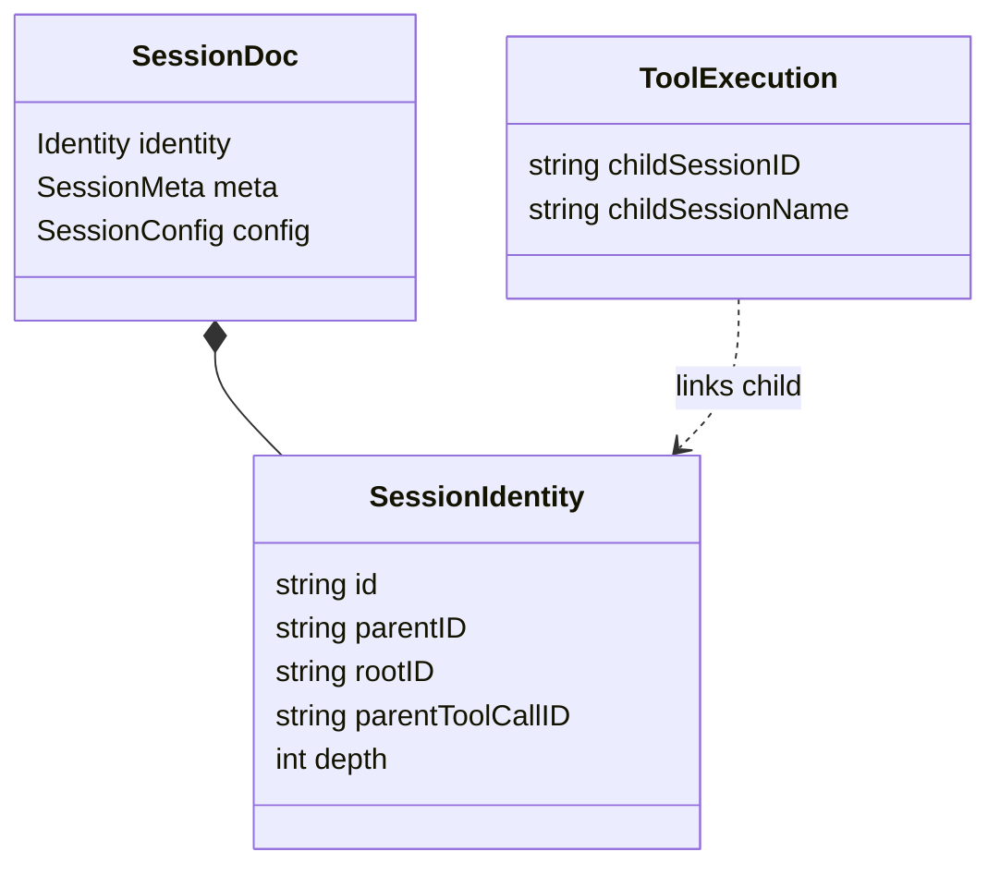
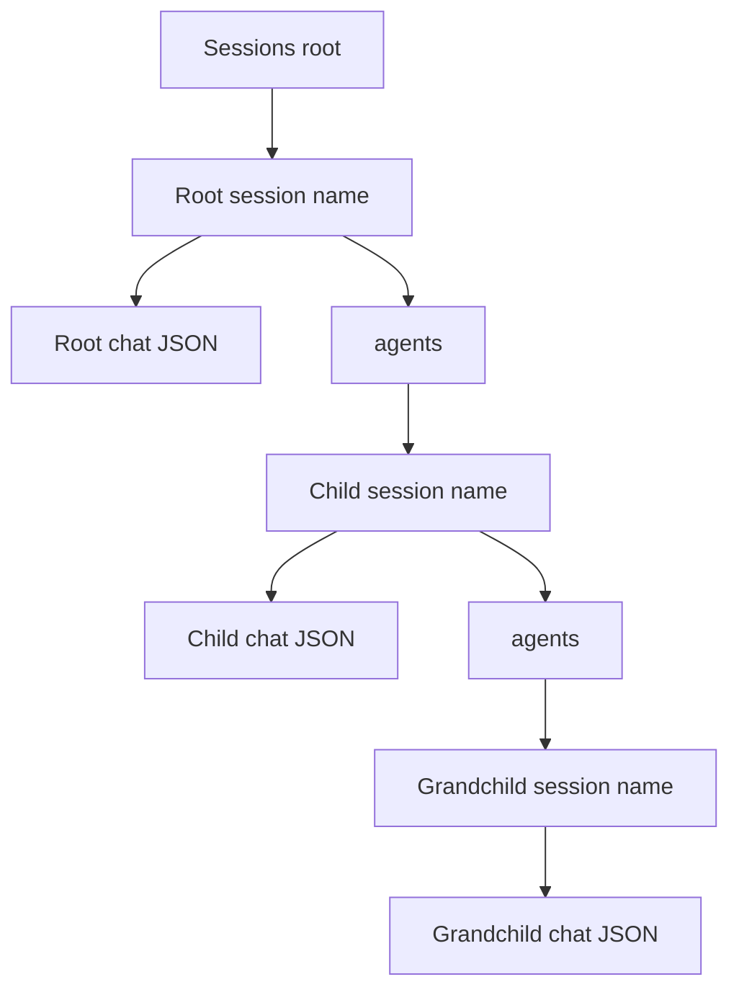
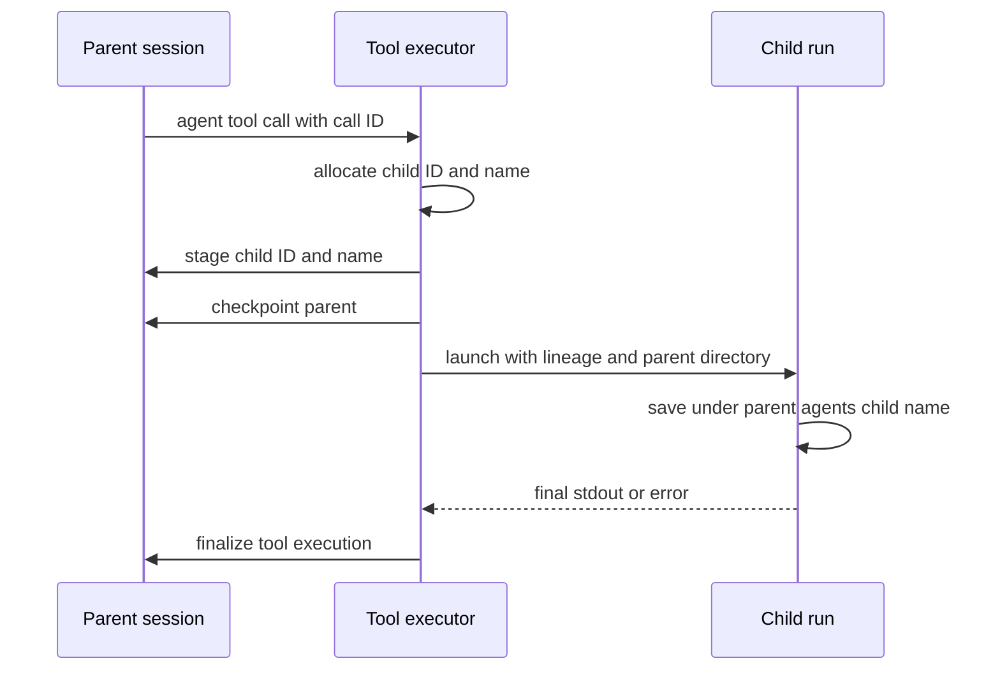
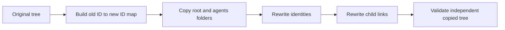

# Recursive Subagent Session Persistence

## Core Problem

Delegated agent runs have no durable lineage or parent-relative storage, so their transcripts cannot be reliably saved, traversed, or validated as children of the invoking session. Session identity also currently lives in Meta, while tool executions cannot identify the child session they created.

## Goal

Persist every delegated run as an independently identified SessionDoc beneath its immediate parent, link it from the creating tool call, support recursive save/load and whole-tree forks without stored paths, and safely migrate existing root session documents.

---

## 1. Session Lineage

- **Pattern:** Explicit Identity and Backward-Compatible Schema Evolution

**Objective:** Give root and delegated session documents durable lineage, and let parent tool executions identify the child they created.

**Success Criteria:** New documents carry explicit identity, existing documents have a deterministic migration, and ordinary tool calls remain unchanged.



### 1.1. Introduce durable session lineage and child execution links

**Type:** feature

**What:** Move immutable session identity out of `SessionMeta` into `SessionIdentity`, and add optional child ID/name fields to tool-call execution records.

**Why:** Separates lineage from timestamps and lets a parent tool call locate and validate its recursively stored child without persisting a path.

**Files:**

- ~ internal/config/session.go
- ~ internal/config/session_test.go

**Snippet:**

```
type SessionIdentity struct {
    ID               string `json:"id"`
    ParentID         string `json:"parent_id,omitempty"`
    RootID           string `json:"root_id"`
    ParentToolCallID string `json:"parent_tool_call_id,omitempty"`
    Depth            int    `json:"depth"`
}

type SessionMeta struct {
    CreatedAt string `json:"created_at"`
    UpdatedAt string `json:"updated_at"`
}

// ToolCallEntry.Execution additions:
// ChildSessionID string `json:"child_session_id,omitempty"`
// ChildSessionName string `json:"child_session_name,omitempty"`
```

**Acceptance Criteria:**

- [ ] A new root session has a non-empty ID, RootID equal to ID, empty parent fields, and depth zero.
- [ ] Child lineage can be constructed with parent ID, root ID, parent tool-call ID, and depth without changing SessionConfig.
- [ ] Tool execution JSON omits child fields for non-agent tools and round-trips them when present.
- [ ] Meta retains timestamps but no longer owns session identity.

**Verify:**

```bash
go test ./internal/config
```

### 1.2. Migrate persisted root sessions to the identity schema

**Type:** chore

**What:** Use the `session-config-migrator` workflow to transform existing session JSON from `meta.id` into the new top-level identity object.

**Why:** Preserves current session IDs and timestamps while making every legacy document a valid root in the new lineage model.

**Files:**

- ~ .squid-os/skills/session-config-migrator/scripts/migrate_sessions.py

**Snippet:**

```
# Migration callback contract
MIGRATION_API_VERSION = 1
MIGRATION_ID = "session-lineage-identity"
ALLOWED_CHANGED_PATHS = {"identity", "meta.id"}

def migrate(document: dict) -> dict: ...
def validate(before: dict, after: dict) -> list[str]: ...
```

**Acceptance Criteria:**

- [ ] The migration copies meta.id to identity.id and identity.root_id without generating a replacement ID.
- [ ] The migration sets parent_id and parent_tool_call_id empty and depth zero for existing root sessions.
- [ ] The migration removes meta.id while preserving meta.created_at, meta.updated_at, messages, configs, and token data.
- [ ] The migrator produces untouched backup and validated migrated trees and never replaces the live sessions directory.
- [ ] Unsupported or missing legacy IDs fail validation instead of inventing identity.

**Verify:**

```bash
python3 .squid-os/skills/session-config-migrator/scripts/migrate_sessions.py --help
```

---

## 2. Parent-Relative Session Storage

- **Pattern:** Filesystem Aggregate and Explicit Runtime Location

**Objective:** Make each loaded session know its runtime directory and save delegated sessions beneath the immediate parent without changing the global sessions root.

**Success Criteria:** Root behavior remains name-based, child persistence is recursive, and no absolute or relative session path is persisted in chat.json.



### 2.1. Add parent-relative session location primitives

**Type:** feature

**What:** Introduce explicit root and child session-directory resolution, plus load/save operations that target a resolved session directory rather than overloading Paths.Sessions.

**Why:** A nested session must checkpoint repeatedly under its parent while the application environment continues to expose the real global sessions root.

**Files:**

- ~ internal/config/session.go
- ~ internal/config/session_test.go

**Snippet:**

```
func RootSessionDir(paths Paths, name string) string
func ChildSessionDir(parentDir, childName string) string
func SessionDocPath(sessionDir string) string
func SaveSessionDocAt(sessionDir string, doc SessionDoc, tally *TokenTally) error
func LoadSessionDocAt(sessionDir string) (SessionDoc, error)

// Existing name-based root functions delegate to these primitives.
```

**Acceptance Criteria:**

- [ ] Root save/load/list behavior and sessions/name/chat.json layout remain backward compatible.
- [ ] A child resolves to parentDir/agents/childName/chat.json and a grandchild follows the same rule recursively.
- [ ] Nested saves do not modify Paths.Sessions or the sessions directory shown in environment context.
- [ ] Session names are validated so they cannot escape their parent agents directory.

**Verify:**

```bash
go test ./internal/config
```

### 2.2. Carry the current session directory through runtime persistence

**Type:** feature

**What:** Add a non-persisted current session directory to session requests and chat sessions, and make TUI/run checkpoint paths use that resolved directory.

**Why:** Creation, repeated autosaves, reloads, and further nested calls must share one authoritative runtime location without storing paths in SessionDoc.

**Files:**

- ~ internal/runtime/runtime.go
- ~ internal/chat/session.go
- ~ internal/run/run.go
- ~ internal/app/ui_session.go
- ~ internal/app/session_persistence.go

**Snippet:**

```
type SessionRequest struct {
    // existing fields
    SessionDir string
}

type Session struct {
    // existing fields
    SessionDir string // runtime-only
}

func NewSession(/* existing args */, sessionDir string) *Session
func LoadSession(/* existing args */, sessionDir string) *Session
```

**Acceptance Criteria:**

- [ ] Root TUI and run sessions resolve SessionDir from Paths.Sessions and the root session name.
- [ ] A child uses its supplied resolved directory for initial, tool-flush, completion, error, and timeout checkpoints.
- [ ] A reloaded session uses the directory of the selected chat document for subsequent saves and descendant creation.
- [ ] SessionDir is not serialized into SessionDoc and does not alter working directory or environment paths.

**Verify:**

```bash
go test ./internal/chat ./internal/run ./internal/app ./internal/runtime
```

---

## 3. Recursive Agent Delegation

- **Pattern:** Preallocated Child Invocation and Parent-Owned Linkage

**Objective:** Preallocate child identity at the agent tool call, launch the child with trusted internal lineage/location inputs, and persist a navigable recursive relationship.

**Success Criteria:** Installed and inline agents create unique child transcripts, parent calls contain child links, and nested agents repeat the same behavior within depth limits.



### 3.1. Preallocate and persist child linkage during agent tool execution

**Type:** feature

**What:** Extend the tool execution contract so agent tools receive the current tool-call ID/session context and stage child ID/name on the execution entry before process launch.

**Why:** The parent must own the child identity, save the relationship before delegation, and avoid parsing IDs from child stdout or using a callback protocol.

**Files:**

- ~ internal/tools/tools.go
- ~ internal/chat/session.go
- ~ internal/chat/tool_exec.go
- ~ internal/chat/tool_exec_test.go

**Snippet:**

```
type RuntimeContext struct {
    Config       config.SessionConfig
    Catalog      Catalog
    Identity     config.SessionIdentity
    SessionDir   string
    ToolCallID   string
}

type ChildSessionRef struct {
    ID   string
    Name string
}

// Agent execution preparation stages ChildSessionRef on ToolCallEntry.Execution
// and checkpoints the parent before launching the child.
```

**Acceptance Criteria:**

- [ ] Only call_agent and inline_agent allocate child sessions; ordinary tools leave child fields empty.
- [ ] The child ID is allocated by the parent before launch and matches the ID passed to the child.
- [ ] Installed child names use agent-name plus tool-call ID; inline names use inline plus tool-call ID.
- [ ] The parent execution entry contains child ID/name before the subprocess starts and is checkpointed when the parent is persistable.
- [ ] Failed launches retain a stable child reference and normal tool error semantics.

**Verify:**

```bash
go test ./internal/chat ./internal/tools
```

### 3.2. Launch delegated runs with trusted recursive session context

**Type:** feature

**What:** Add internal run options for preallocated identity and parent session directory, then make call_agent and inline_agent launch children with forced autosave beneath the immediate parent.

**Why:** Delegated runs need durable transcripts and recursive storage while public --session remains an unambiguous root-session loader.

**Files:**

- ~ internal/tools/agents.go
- ~ internal/tools/agents_test.go
- ~ internal/cli/run.go
- ~ internal/cli/cli_test.go
- ~ internal/run/run.go

**Snippet:**

```
type ChildSessionOptions struct {
    ID               string
    ParentID         string
    RootID           string
    ParentToolCallID string
    Depth            int
    ParentSessionDir string
    Name             string
}

// Internal CLI contract:
// --session-id
// --parent-session-id
// --root-session-id
// --parent-tool-call-id
// --session-depth
// --parent-session-dir
// --save-name
```

**Acceptance Criteria:**

- [ ] Agent tools pass the preallocated identity, generated save name, immediate parent directory, and decremented max-agent-depth.
- [ ] The child creates Identity with depth parent plus one and saves to parentDir/agents/saveName/chat.json.
- [ ] Child autosave is forced for initial/partial/final transcripts regardless of the parent agent definition save default.
- [ ] A child calling another agent uses its own SessionDir as the next parent directory, producing recursive storage.
- [ ] Public --session name loading and root picker/analytics discovery remain unchanged.
- [ ] Internal lineage flags reject partial, inconsistent, negative-depth, or non-child combinations.

**Verify:**

```bash
go test ./internal/tools ./internal/cli ./internal/run
```

### 3.3. Resolve and validate child sessions from parent links

**Type:** feature

**What:** Add parent-relative child resolution that loads a referenced child by local name and verifies its session, parent, root, and tool-call identity.

**Why:** Future tree browsing and current diagnostics need a safe way to revisit child logs without global ID lookup, stored paths, or making children normal root sessions.

**Files:**

- ~ internal/config/session.go
- ~ internal/config/session_test.go
- ~ internal/chat/session.go

**Snippet:**

```
func LoadChildSession(
    parentDir string,
    parent config.SessionDoc,
    toolCall config.ToolCallEntry,
) (doc config.SessionDoc, childDir string, err error)
```

**Acceptance Criteria:**

- [ ] A child is resolved only as parentDir/agents/ChildSessionName/chat.json.
- [ ] Loading fails clearly when the file is absent or child ID, ParentID, RootID, ParentToolCallID, or depth is inconsistent.
- [ ] A successfully loaded child returns its runtime directory so its descendants can be resolved recursively.
- [ ] The API does not recursively scan global sessions and does not expose children through root ListSessions.

**Verify:**

```bash
go test ./internal/config ./internal/chat
```

---

## 4. Whole-Tree Session Forking

- **Pattern:** Aggregate Copy with Identity Remapping

**Objective:** Preserve recursive agent history when save-as creates a new root session while ensuring the copied tree has independent identities.

**Success Criteria:** A full session-tree fork copies every child, rewrites all lineage and tool links consistently, and never references the source tree for navigation.



### 4.1. Fork complete session trees with remapped identities

**Type:** feature

**What:** Change save-as for an already persisted session to copy its complete recursive agents tree and rewrite all copied session identities and child links.

**Why:** A fork should preserve inspectable delegated history without duplicating immutable IDs or depending on the original directory.

**Files:**

- ~ internal/config/session.go
- ~ internal/config/session_test.go
- ~ internal/app/session_persistence.go
- ~ internal/app/tui_session.go

**Snippet:**

```
type SessionTreeForkResult struct {
    RootIdentity config.SessionIdentity
    IDMap        map[string]string
}

func ForkSessionTree(
    sourceDir string,
    destinationDir string,
) (SessionTreeForkResult, error)
```

**Acceptance Criteria:**

- [ ] Save-as to a new root name copies the root chat document and every recursive agents directory.
- [ ] Every copied session receives a new unique ID and the copied root has RootID equal to its new ID.
- [ ] Copied ParentID, RootID, and tool execution ChildSessionID values use the new ID mapping.
- [ ] ParentToolCallID, depth, child names, messages, and directory layout are preserved.
- [ ] Fork validation fails atomically on broken lineage, duplicate IDs, destination collision, or incomplete copying.
- [ ] A first save of an unsaved root remains a normal save rather than a fork.

**Verify:**

```bash
go test ./internal/config ./internal/app
```

### 4.2. Verify recursive delegation and fork behavior end to end

**Type:** test

**What:** Add integration coverage for root-to-child-to-grandchild persistence, parent-relative reload, failure checkpoints, and independent whole-tree forks.

**Why:** The feature crosses CLI subprocesses, tool execution, session persistence, and schema lineage, so unit tests alone cannot protect the complete contract.

**Files:**

- + internal/run/subagent_session_test.go
- ~ internal/tools/agents_test.go
- ~ internal/config/session_test.go

**Snippet:**

```
func TestDelegatedRunPersistsRecursiveSessionTree(t *testing.T)
func TestFailedDelegatedRunKeepsInspectableChild(t *testing.T)
func TestLoadChildValidatesParentToolLink(t *testing.T)
func TestSaveAsForkRemapsCompleteSessionTree(t *testing.T)
```

**Acceptance Criteria:**

- [ ] A direct child and grandchild are saved at the expected recursive locations with correct depths and lineage.
- [ ] Parent tool execution child references match the created documents.
- [ ] Partial child logs remain readable after child error or timeout.
- [ ] Loading through parent links succeeds while root session listing remains noise-free.
- [ ] The forked tree is navigable after the source tree is removed from the test fixture.

**Verify:**

```bash
go test ./...
```
