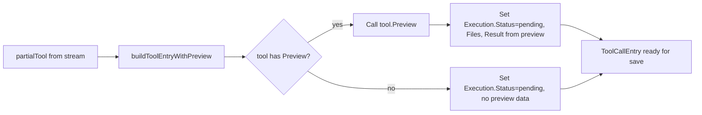
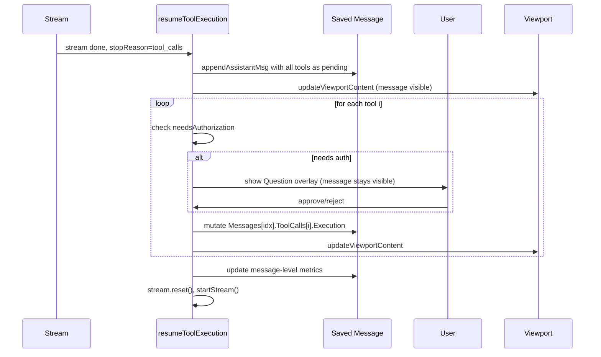
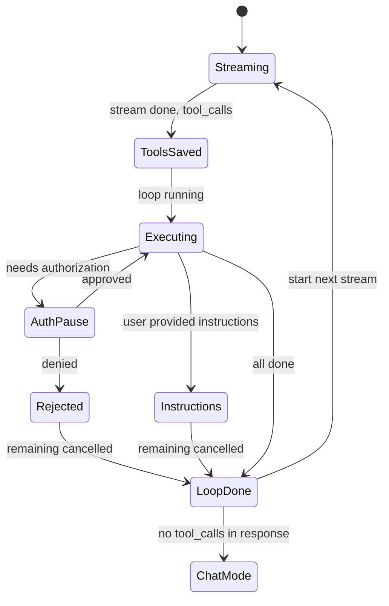

# Eager Tool Execution: Save Assistant Message Before Tool Loop

## Core Problem

When tool execution pauses for authorization, the assistant message disappears from view because it hasn't been saved yet. This makes it impossible for the user to see what the assistant is about to do. Additionally, if the app crashes mid-tool-loop, all tool progress is lost.

## Goal

1. Assistant message saved immediately after stream ends, before any tool executes. 2. Tool entries visible with preview diffs during auth pause. 3. Crash resilience - executed tools are persisted. 4. Simplified render path - no special streaming-vs-paused conditions.

---

## 1. Message Model & Preview

- **Pattern:** Value Object

**Objective:** Add a Preview method to the Tool interface for generating read-only Execution data (Files, Result) without side effects. Extend ToolCallEntry to support a 'pending' execution state with preview data.

**Success Criteria:** Tools with Preview produce FileEntry diffs and Result text before execution. ToolCallEntry renders correctly with status=pending and preview data in the UI.



### 1.1. Add Preview-aware tool entry builder

**Type:** feature

**What:** Add buildToolEntryWithPreview function that builds a ToolCallEntry from a partialTool, calling tool.Preview if available to pre-fill Execution with diffs and Result text, status=pending.

**Why:** Enables rendering preview diffs before the tool actually executes, so the user sees exactly what will happen during authorization.

**Files:**

- ~ internal/app/stream.go

**Snippet:**

```
func buildToolEntryWithPreview(p partialTool, tool *tools.Tool, args map[string]interface{}) config.ToolCallEntry {
    entry := buildInstructionEntry(p)
    if tool != nil && tool.Preview != nil {
        preview := tool.Preview(args)
        entry.Execution.Status = ResultStatusPending
        entry.Execution.Result = preview.Result
        entry.Execution.Error = preview.Error
        entry.Execution.Files = preview.Files
        for j := range preview.Files {
            preview.Files[j].ToolCallID = p.id
        }
    } else {
        entry.Execution.Status = ResultStatusPending
    }
    return entry
}
```

**Acceptance Criteria:**

- [ ] buildToolEntryWithPreview returns a ToolCallEntry with status=pending
- [ ] For tools with Preview (write_file, edit_file), Execution.Files contains FileEntry with Diff
- [ ] For tools without Preview (read_file, open, bash), Execution is pending but empty of Files/Result
- [ ] No disk writes occur during preview -- FileEntry diff is computed from in-memory reads only

**Verify:**

```bash
cd ~/src/squid-os && go build ./...
```

### 1.2. Render preview diffs for pending tools

**Type:** feature

**What:** Update renderToolCallsInline in message.go to show file diffs when Execution.Status is 'pending' and Files are non-empty (currently only shows for 'success').

**Why:** Preview data is pre-populated for destructive tools. The diff should render alongside the pending status indicator so the user sees the expected changes during auth.

**Files:**

- ~ internal/ui/message.go

**Snippet:**

```
// Diff is visible for both success and pending (with preview data)
if (tc.Execution.Status == "success" || tc.Execution.Status == "pending") && len(tc.Execution.Files) > 0 {
    if d := renderToolFilesDiff(tc.Execution.Files, boxWidth, t.Style); d != "" {
        content = append(content, d)
    }
}
```

**Acceptance Criteria:**

- [ ] Pending tool entries with preview FileEntry diffs render the side-by-side diff in the UI
- [ ] Pending tool entries without preview data (read_file, etc.) show no diff
- [ ] The [ ] pending prefix indicator still appears for pending tools
- [ ] Success status tools continue to render diffs as before

**Verify:**

```bash
cd ~/src/squid-os && go build ./...
```

---

## 2. Eager Save & In-Place Update

- **Pattern:** Command Pattern, State Machine

**Objective:** Restructure resumeToolExecution to save the assistant message before the tool loop starts, then mutate the saved message's ToolCalls in place as each tool executes.

**Success Criteria:** After stream ends with tool_calls, the assistant message is immediately visible in the viewport. During auth pauses, the full message with tool entries remains visible. Each executed tool updates its entry in the saved message.



### 2.1. Move appendAssistantMsg before tool loop, return message index

**Type:** refactor

**What:** Change appendAssistantMsg to return the index of the appended message. Call it BEFORE the tool execution loop with all tool entries built via buildToolEntryWithPreview (status=pending). Metrics start minimal (DurationTimeMs=0, TokensPerSecond=0) and are updated in place.

**Why:** The message must be saved before any tool runs so it persists across auth pauses and survives crashes. Returning the index lets the loop mutate the right message in place.

**Files:**

- ~ internal/app/stream.go

**Snippet:**

```
// In handleStreamEvent, when event.Done && stopReason==tool_calls:
func (m *Model) resumeToolExecution() (tea.Model, tea.Cmd) {
    // Build all tool entries with preview
    entries := make([]config.ToolCallEntry, len(m.stream.partialTools))
    for i, p := range m.stream.partialTools {
        tool := m.toolReg.Get(p.name)
        var args map[string]interface{}
        if p.args != "" {
            json.Unmarshal([]byte(p.args), &args)
        }
        entries[i] = buildToolEntryWithPreview(p, tool, args)
    }

    // Save message eagerly
    msgIdx := m.appendAssistantMsg(config.Message{...entries...})

    // Loop and mutate in place
    for i := 0; i < len(entries); i++ {
        m.session.file.Messages[msgIdx].ToolCalls[i] = entries[i]
        // ... auth gate, execute, update entry, updateViewportContent
    }
}
```

**Acceptance Criteria:**

- [ ] appendAssistantMsg returns the index of the appended message
- [ ] Message is saved before any tool executes, with all tool entries as pending
- [ ] Message-level metrics (DurationTimeMs, TokensPerSecond) start at 0 and are updated after loop completes
- [ ] SequenceStat is created with initial values and accumulated as tools execute
- [ ] The viewport shows the full assistant message (text, thinking, tools) immediately after stream ends

**Verify:**

```bash
cd ~/src/squid-os && go build ./...
```

### 2.2. Refactor tool loop to mutate saved message in place

**Type:** refactor

**What:** Rewrite the tool execution loop to mutate session.file.Messages[msgIdx].ToolCalls[i] directly after each tool executes. Remove the local 'entries' slice as the source of truth -- use the saved message's ToolCalls instead. Update render cache at the message index after each mutation.

**Why:** Mutating the saved message means the viewport always reflects current state. No need for pendingEntries or separate local tracking during auth pauses.

**Files:**

- ~ internal/app/stream.go

**Snippet:**

```
// Simplified loop - mutate saved message directly
for i := startIndex; i < len(m.stream.partialTools); i++ {
    tc := &m.session.file.Messages[msgIdx].ToolCalls[i]
    p := m.stream.partialTools[i]
    tool := m.toolReg.Get(p.name)
    args := parseArgs(p.args)

    // Auth gate - message stays visible with tc as pending
    if m.needsAuthorization(tool, args) {
        // ... setAuthMode, return
    }

    // Execute
    result := tool.Execute(args)
    tc.Execution.Status = result.Status
    tc.Execution.Result = result.Result
    tc.Execution.Error = result.Error
    tc.Execution.Tokens = countTokensApprox(content)
    tc.Execution.DurationMs = elapsed
    tc.Execution.Files = result.Files

    // Invalidate render cache for this message so it re-renders
    m.session.invalidateRenderAt(msgIdx)
    m.updateViewportContent()
}
```

**Acceptance Criteria:**

- [ ] Each tool execution updates the saved message's ToolCalls entry in place
- [ ] After each execution, the render cache is invalidated and viewport updated
- [ ] The pendingEntries field on streamState is no longer needed
- [ ] When auth is needed, the tool entry remains in pending state in the saved message
- [ ] After auth approval, execution fills in the same entry that was already saved

**Verify:**

```bash
cd ~/src/squid-os && go build ./...
```

### 2.3. Simplify setAuthMode and auth resume flow

**Type:** refactor

**What:** Remove m.stream.active=false from setAuthMode. Simplify OnConfirm/OnCancel callbacks to use the message index directly instead of passing pendingEntries. Remove the pendingEntries and pendingToolIndex fields from streamState since the saved message is now the source of truth.

**Why:** With the message already saved, the auth pause doesn't need to track a separate entries slice. The pending state lives in the saved message. Removing active=false keeps the streaming render path simple.

**Files:**

- ~ internal/app/stream.go

**Snippet:**

```
// setAuthMode no longer sets active=false
func (m *Model) setAuthMode() tea.Cmd {
    ctx := m.stream.authorizationCtx
    msgIdx := m.stream.authMsgIndex  // index of the saved message
    toolIdx := m.stream.authToolIndex

    q := &component.Question{
        OnConfirm: func(selection int, instructions string, ctx any) tea.Cmd {
            m := ctx.(*Model)
            m.stream.authorizationCtx.Result = AuthResult{...}
            // Resume from toolIdx, message already saved at msgIdx
            return m.resumeToolExecution(toolIdx)
        },
    }
    m.setComponent(q)
    m.updateViewportContent()
    return q.BlinkCmd()
}
```

**Acceptance Criteria:**

- [ ] setAuthMode no longer sets stream.active=false
- [ ] Auth question overlay appears while the saved assistant message with tool entries remains visible in viewport
- [ ] pendingEntries and pendingToolIndex fields removed from streamState
- [ ] Auth resume continues the loop from the correct tool index, mutating the saved message
- [ ] stream.reset() is still called after the loop completes, clearing state for the next stream

**Verify:**

```bash
cd ~/src/squid-os && go build ./...
```

### 2.4. Update message metrics in place after loop completes

**Type:** refactor

**What:** After the tool loop finishes, update the saved message's metrics in place: DurationTimeMs, TokensPerSecond, InputTokens, StopReason, ToolCallMetrics, and SequenceStat. Invalidate render cache and re-render.

**Why:** Metrics were previously computed at append time (which was after the loop). Now the message is saved before the loop, so metrics need a final update pass.

**Files:**

- ~ internal/app/stream.go

**Snippet:**

```
// After loop completes
func (m *Model) finalizeToolMessage(msgIdx int) {
    msg := &m.session.file.Messages[msgIdx]
    msg.DurationTimeMs = m.stream.metrics.Duration().Milliseconds()
    msg.TokensPerSecond = m.stream.metrics.AvgTokenPerSec()
    msg.InputTokens = config.TotalExecutionTokens(msg.ToolCalls)
    msg.StopReason = "tool_calls"
    msg.ToolCallMetrics = config.ContentMetrics{...}

    // Update SequenceStat
    if msg.SequenceStat != nil {
        msg.SequenceStat.DurationMs = msg.DurationTimeMs
        msg.SequenceStat.AvgTokensPerSec = msg.TokensPerSec
        msg.SequenceStat.InputTokens = msg.InputTokens
        msg.SequenceStat.ExecDurMs = sumExecDurations(msg.ToolCalls)
    }

    m.session.invalidateRenderAt(msgIdx)
    m.updateViewportContent()
}
```

**Acceptance Criteria:**

- [ ] DurationTimeMs reflects actual total duration from stream start through all tool executions
- [ ] TokensPerSecond is correctly computed from total output tokens / inference duration
- [ ] InputTokens reflects sum of all tool execution result tokens
- [ ] SequenceStat is updated with final execution durations and token counts
- [ ] ToolCallMetrics has correct totals
- [ ] Render cache is invalidated so the header shows final metrics

**Verify:**

```bash
cd ~/src/squid-os && go build ./...
```

### 2.5. Clean up render.go - remove streaming special cases for auth pause

**Type:** refactor

**What:** Remove the stream.active guard workaround from render.go. Since the assistant message is always saved before the tool loop, the streaming render path in updateViewportContent is only needed for active streaming (during the initial token flow), not for auth pauses. Clean up any leftover conditions related to authorizationCtx in the render path.

**Why:** With eager save, the streaming content is always in the saved message during auth pauses. The render path doesn't need special branching for auth state anymore.

**Files:**

- ~ internal/app/render.go

**Snippet:**

```
// updateViewportContent - simplified streaming block
// Only renders streaming content when actively streaming (during token flow)
// Auth pauses show the saved message directly - no special case needed
if m.stream.active {
    // ... existing streaming render logic (unchanged)
}
```

**Acceptance Criteria:**

- [ ] render.go has no authorizationCtx condition in the streaming render block
- [ ] The streaming render path only activates when stream.active is true (during token flow)
- [ ] During auth pause, the saved message renders normally from the cached messages
- [ ] No visual regression - assistant message with tools stays visible during auth

**Verify:**

```bash
cd ~/src/squid-os && go build ./...
```

---

## 3. Integration & Edge Cases

- **Pattern:** Error Handling, State Management

**Objective:** Handle error cases, user cancellation, crash recovery, and captured instructions with the new eager-save model.

**Success Criteria:** All error paths work correctly: rejected auth cancels remaining tools, captured instructions create a user message and cancel remaining tools, stream cancellation preserves already-executed tools, and crashes don't lose progress.



### 3.1. Handle auth rejection and captured instructions with eager save

**Type:** bug

**What:** Update auth rejection and captured instructions handling: when rejected, set remaining tool entries to error status in the saved message. When instructions are provided, cancel remaining tools and append a user message with the instructions.

**Why:** With eager save, rejected tools and instruction-injected user messages need to update the already-saved message and optionally append a new message.

**Files:**

- ~ internal/app/stream.go

**Snippet:**

```
// Auth rejection - mark remaining as error in saved message
if !result.Approved {
    tc := &m.session.file.Messages[msgIdx].ToolCalls[i]
    tc.Execution.Status = tools.ResultStatusError
    tc.Execution.Error = "rejected by user"
    for j := i + 1; j < len(m.session.file.Messages[msgIdx].ToolCalls); j++ {
        m.session.file.Messages[msgIdx].ToolCalls[j].Execution.Status = tools.ResultStatusError
        m.session.file.Messages[msgIdx].ToolCalls[j].Execution.Error = "cancelled: prior tool rejected"
    }
    m.session.invalidateRenderAt(msgIdx)
    break
}

// Captured instructions - cancel remaining, append user message
if capturedInstructions != "" {
    // ... cancel remaining in saved message
    m.session.appendMsg(userMsgWithInstructions)
    break
}
```

**Acceptance Criteria:**

- [ ] Rejected tool: entry shows error status, remaining tools show cancelled
- [ ] Captured instructions: remaining tools cancelled, user message appended after assistant message
- [ ] Saved message is updated and re-rendered in both cases
- [ ] After rejection or instructions, loop completes, metrics finalized, next stream starts (or chat mode if no more tool calls)

**Verify:**

```bash
cd ~/src/squid-os && go build ./...
```

### 3.2. Handle stream error and cancellation mid-tool-loop

**Type:** bug

**What:** Update stream error handling in handleStreamEvent and user cancellation (ctrl+c) during tool execution. When an error occurs mid-loop, the already-saved message stays with its partial results. Error or abort messages are appended as synthetic messages.

**Why:** With eager save, a stream error during the resumed stream (after tools) should not lose the tool results from the previous loop. The saved message with executed tools is already persisted.

**Files:**

- ~ internal/app/stream.go

**Snippet:**

```
// Stream error during resumed stream after tool loop
// The previous assistant message with tool results is already saved - no need to recover
// Just append error message and return to chat mode
if event.Error != nil {
    // If we were in the middle of a resumed stream after tools,
    // the prior message is already saved with its tool results
    errText := "Stream error: " + event.Error.Error()
    m.session.appendMsg(syntheticErrorMsg(errText))
    m.stream.reset()
    m.updateViewportContent()
    return m, m.setChatMode()
}
```

**Acceptance Criteria:**

- [ ] Stream error after tool loop: previous assistant message with executed tools remains visible
- [ ] Error is shown as a synthetic message after the tool results
- [ ] User cancellation during tool execution: partial tool results are preserved in the saved message
- [ ] User cancellation during resumed stream: both the tool message and the partial new stream are handled gracefully

**Verify:**

```bash
cd ~/src/squid-os && go build ./...
```

### 3.3. Handle multi-round tool chains and file change validation

**Type:** bug

**What:** Ensure the file change validation gate works with eager save: when a file has changed externally, mark the tool as error in the saved message and cancel remaining tools. Ensure multi-round tool chains (stream -> tools -> stream -> tools) work correctly with the new model.

**Why:** The file change gate and multi-round tool chains are existing behaviors that must be preserved with the refactored eager-save model.

**Files:**

- ~ internal/app/stream.go

**Snippet:**

```
// File change validation - mark in saved message
if err := tools.Validate(resolvedPath, sessionState); err != nil {
    tc := &m.session.file.Messages[msgIdx].ToolCalls[i]
    tc.Execution.Status = tools.ResultStatusError
    tc.Execution.Error = fmt.Sprintf("blocked: file changed externally: %s", resolvedPath)
    // Cancel remaining in saved message
    for j := i + 1; j < len(m.session.file.Messages[msgIdx].ToolCalls); j++ {
        m.session.file.Messages[msgIdx].ToolCalls[j].Execution.Status = tools.ResultStatusError
        m.session.file.Messages[msgIdx].ToolCalls[j].Execution.Error = "cancelled: prior tool failed"
    }
    m.session.invalidateRenderAt(msgIdx)
    break
}
```

**Acceptance Criteria:**

- [ ] File changed externally: tool entry shows error in saved message, remaining tools cancelled
- [ ] Multi-round tool chain: after tool loop completes, startStream() creates a new stream that eventually produces another assistant message (possibly with more tools)
- [ ] Each round's assistant message is independently saved and tracked
- [ ] File state tracking (FileState map) continues to work correctly across rounds

**Verify:**

```bash
cd ~/src/squid-os && go build ./...
```
