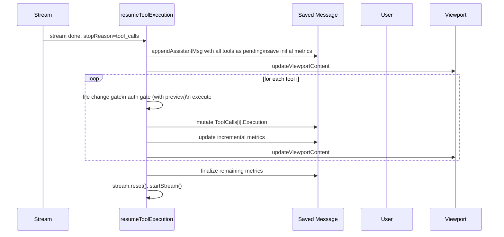
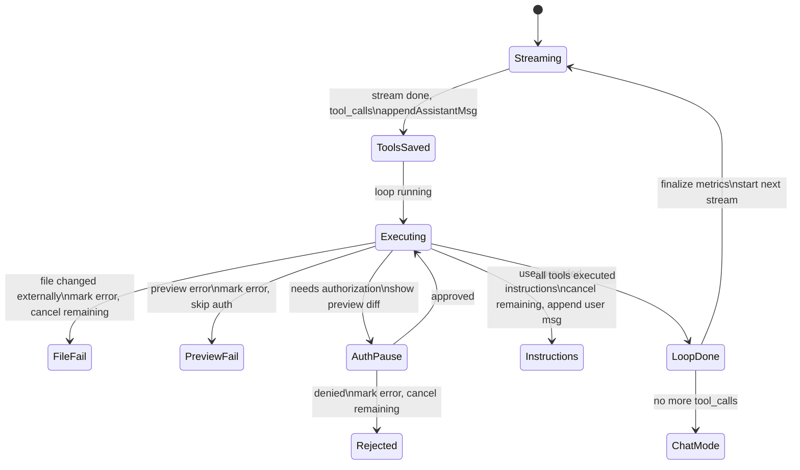

# Eager Tool Execution: Save Assistant Message Before Tool Loop

## Core Problem

When tool execution pauses for authorization, the assistant message disappears from view because it hasn't been saved yet. This makes it impossible for the user to see what the assistant is about to do. Additionally, if the app crashes mid-tool-loop, all tool progress is lost.

## Goal

1. Assistant message saved immediately after stream ends, before any tool executes. 2. Tool entries visible with preview diffs during auth pause. 3. Crash resilience - executed tools are persisted with incremental metrics. 4. Simplified render path - no special streaming-vs-paused conditions.

---

## 1. Preview at Auth Gate & Smart Rendering

- **Pattern:** Lazy Evaluation, View Model

**Objective:** Generate preview data only when a tool needs authorization. Render only tools up to the pending index so the last visible tool is the one being authorized. Show error messages even when collapsed.

**Success Criteria:** Preview runs on-demand at the auth gate. Pending tools render with diffs up to the pending index. Error tools show their error message visible.

```mermaid
flowchart LR
  A[Tool needs auth?] --> B|yes|[Call tool.Preview(args)]
  B --> C{Preview ok?}
  C -->|success| D[Fill Execution with preview, show auth question]
  C -->|error| E[Mark status=error, skip auth, continue]
  A --> F|no|[Execute directly]
```

### 1.1. Add on-demand preview at auth gate in resumeToolExecution

**Type:** feature

**What:** In the auth gate of the tool loop, call tool.Preview(args) for destructive tools. On success, pre-fill Execution with preview data (Files with diffs, Result) and status=pending, then show the auth question. On error, mark status=error with the error message, skip authorization entirely, and continue to the next tool.

**Why:** Preview only when needed keeps the eager-save step simple (just Instruction + empty Execution). If a preview fails, there's no point asking the user to authorize a tool that will error.

**Files:**

- ~ internal/app/stream.go

**Snippet:**

```
// In the tool loop, when needsAuthorization is true:
if m.needsAuthorization(tool, args) {
    // Run preview first
    if tool.Preview != nil {
        preview := tool.Preview(args)
        if preview.Status == tools.ResultStatusError {
            // Preview failed — mark as error, skip auth
            entries[i].Execution.Status = tools.ResultStatusError
            entries[i].Execution.Error = preview.Error
            continue
        }
        // Preview succeeded — populate execution with preview data
        entries[i].Execution.Status = tools.ResultStatusPending
        entries[i].Execution.Result = preview.Result
        entries[i].Execution.Files = preview.Files
        for j := range preview.Files {
            preview.Files[j].ToolCallID = p.id
        }
    } else {
        entries[i].Execution.Status = tools.ResultStatusPending
    }
    // Now set up auth context and show question
    m.stream.authorizationCtx = &AuthorizationContext{...}
    m.stream.pendingToolIndex = i
    m.setAuthMode()
    return m, nil
}
```

**Acceptance Criteria:**

- [ ] For destructive tools with Preview (write_file, edit_file), preview runs before the auth question and populates Execution.Files with diffs and Execution.Result
- [ ] If preview returns an error, the tool is marked as error status and authorization is skipped
- [ ] For destructive tools without Preview field, Execution is set to pending without preview data
- [ ] The auth question still shows after a successful preview, with the diff visible in the viewport

**Verify:**

```bash
cd ~/src/squid-os && go build ./...
```

### 1.2. Render tools up to pending index with visible error messages

**Type:** feature

**What:** Update renderToolCallsInline in message.go to: (1) only render tool entries up to and including the pending tool index (the one being authorized), skipping entries after it. (2) Show error message text even when collapsed, not just the [✗] prefix.

**Why:** During auth pause, we want the last visible tool to be the one being authorized. Tools that haven't been reached yet shouldn't clutter the view. Error messages are the whole point of an error entry — they should be visible.

**Files:**

- ~ internal/ui/message.go

**Snippet:**

```
// renderToolCallsInline: stop rendering at the pending boundary
func renderToolCallsInline(toolCalls []config.ToolCallEntry, boxWidth int, expanded bool, pendingIndex *int, reg *tools.Registry) string {
    var b strings.Builder
    for i, tc := range toolCalls {
        // Don't render tools beyond the pending index
        if pendingIndex != nil && i > *pendingIndex {
            break
        }
        // ... existing render logic

        // Error messages always visible (not just when expanded)
        if tc.Execution.Status == "error" {
            if tc.Execution.Error != "" {
                content = append(content, renderPerLine(tc.Execution.Error, t.Style.Error))
            }
        }

        // Diff visible for both success and pending (with preview data)
        if (tc.Execution.Status == "success" || tc.Execution.Status == "pending") && len(tc.Execution.Files) > 0 {
            if d := renderToolFilesDiff(tc.Execution.Files, boxWidth, t.Style); d != "" {
                content = append(content, d)
            }
        }
    }
    return b.String()
}
```

**Acceptance Criteria:**

- [ ] During auth pause, only tools up to and including the pending index are rendered
- [ ] Tools after the pending index are hidden from view
- [ ] Error tool entries show their error message text even when collapsed
- [ ] Pending tool entries with preview FileEntry diffs render the side-by-side diff
- [ ] Success status tools continue to render diffs as before
- [ ] When no auth is active (pendingIndex is nil), all tools render as before

**Verify:**

```bash
cd ~/src/squid-os && go build ./...
```

---

## 2. Eager Save & In-Place Mutation

- **Pattern:** Command Pattern, State Machine

**Objective:** Save the assistant message before the tool loop starts, then mutate the saved message's ToolCalls in place as each tool executes. Update metrics incrementally for crash resilience.

**Success Criteria:** After stream ends with tool_calls, the assistant message is immediately visible. Each tool execution updates the saved message. Metrics are updated incrementally — if the app crashes, the persisted state reflects exactly which tools have executed.



### 2.1. Save assistant message before tool loop with initial metrics

**Type:** refactor

**What:** Have appendAssistantMsg return the index of the appended message. Call it before the tool loop with all tool entries (Instruction populated, Execution status=pending empty). Save initial metrics we know: text metrics, thinking metrics, tool call instruction tokens/duration, and a partial SequenceStat.

**Why:** The message must be saved before any tool runs so it persists across auth pauses and survives crashes. Saving known metrics upfront means a crash doesn't lose progress -- the saved state reflects what we know.

**Files:**

- ~ internal/app/stream.go

**Snippet:**

```
// In handleStreamEvent, when event.Done && stopReason==tool_calls:
func (m *Model) resumeToolExecution() (tea.Model, tea.Cmd) {
    // Build all tool entries with instruction only
    entries := make([]config.ToolCallEntry, len(m.stream.partialTools))
    for i, p := range m.stream.partialTools {
        entries[i] = buildInstructionEntry(p)
        entries[i].Execution.Status = tools.ResultStatusPending
    }

    // Save eagerly with initial metrics
    msgIdx := m.appendAssistantMsg(config.Message{
        // ... text, thinking, textMetrics, thinkingMetrics from stream
        ToolCalls:       entries,
        ToolCallMetrics: {Tokens: m.stream.metrics.ToolCallTokens(), ...},
        // DurationTimeMs = 0, TokensPerSecond = 0 — finalized later
    })

    // Loop mutates m.session.file.Messages[msgIdx].ToolCalls in place
    for i := 0; i < len(entries); i++ {
        // file change gate -> auth gate (with preview) -> execute
    }
}
```

**Acceptance Criteria:**

- [ ] appendAssistantMsg returns the index of the appended message
- [ ] Message is saved before any tool executes, with all tool entries as pending
- [ ] TextMetrics and ThinkingMetrics are saved from stream state (already known)
- [ ] ToolCallMetrics instruction tokens are saved (already known from partialTools)
- [ ] DurationTimeMs and TokensPerSecond start at 0 and are updated incrementally
- [ ] SequenceStat is created with initial values and updated as tools execute
- [ ] The viewport shows the full assistant message immediately after stream ends

**Verify:**

```bash
cd ~/src/squid-os && go build ./...
```

### 2.2. Mutate saved message in place with incremental metrics

**Type:** refactor

**What:** Rewrite the tool execution loop to mutate session.file.Messages[msgIdx].ToolCalls[i].Execution directly. After each execution, update incremental metrics on the saved message: SequenceStat.ExecDurMs, ToolCallMetrics, and a running DurationTimeMs. Invalidate render cache and update viewport after each tool.

**Why:** Mutating the saved message means the viewport always reflects current state. Incremental metrics mean a crash preserves a consistent snapshot of what's been executed.

**Files:**

- ~ internal/app/stream.go

**Snippet:**

```
// Loop mutates saved message directly
for i := startIndex; i < len(m.stream.partialTools); i++ {
    tc := &m.session.file.Messages[msgIdx].ToolCalls[i]
    p := m.stream.partialTools[i]
    tool := m.toolReg.Get(p.name)
    args := parseArgs(p.args)

    // Gate: file change (before auth)
    // Gate: authorization (with on-demand preview)

    // Execute
    resultStart := time.Now()
    result := tool.Execute(args)
    tc.Execution.Status = result.Status
    tc.Execution.Result = result.Result
    tc.Execution.Error = result.Error
    tc.Execution.Tokens = countTokensApprox(content)
    tc.Execution.DurationMs = time.Since(resultStart).Milliseconds()
    tc.Execution.Files = result.Files

    // Update incremental metrics on saved message
    msg := &m.session.file.Messages[msgIdx]
    if msg.SequenceStat != nil {
        msg.SequenceStat.ExecDurMs += tc.Execution.DurationMs
    }
    msg.DurationTimeMs = time.Since(m.stream.metrics.Start).Milliseconds()

    m.session.invalidateRenderAt(msgIdx)
    m.updateViewportContent()
}
```

**Acceptance Criteria:**

- [ ] Each tool execution updates the saved message's ToolCalls entry in place
- [ ] After each execution, SequenceStat.ExecDurMs accumulates the tool's duration
- [ ] DurationTimeMs is updated with the elapsed time from stream start
- [ ] Render cache is invalidated at msgIdx and viewport updated after each tool
- [ ] pendingEntries and pendingToolIndex fields are replaced by msgIdx tracking
- [ ] If the app crashes mid-loop, the saved message has accurate metrics for all tools executed so far

**Verify:**

```bash
cd ~/src/squid-os && go build ./...
```

### 2.3. Simplify auth pause and reorder gates: file change before auth

**Type:** refactor

**What:** Remove stream.active=false from setAuthMode. Replace pendingEntries/pendingToolIndex in streamState with a single authMsgIndex field. Move file change validation gate to run before the authorization gate — if a file changed externally, fail immediately without asking for authorization.

**Why:** Keeping active=true avoids the disappearing-content bug. A single authMsgIndex is simpler than a whole entries slice. File change gate before auth avoids pointless authorization questions for files that have changed.

**Files:**

- ~ internal/app/stream.go

**Snippet:**

```
// Updated gate order in the tool loop:
for i := startIndex; i < len(m.stream.partialTools); i++ {
    tc := &m.session.file.Messages[msgIdx].ToolCalls[i]
    p := m.stream.partialTools[i]
    tool := m.toolReg.Get(p.name)
    args := parseArgs(p.args)

    // Gate 1: File change validation (BEFORE auth)
    if isFileTool && pathVal != "" {
        if err := tools.Validate(resolvedPath, sessionState); err != nil {
            tc.Execution.Status = tools.ResultStatusError
            tc.Execution.Error = "blocked: file changed externally"
            // Cancel remaining
            break
        }
    }

    // Gate 2: Authorization (with on-demand preview)
    if m.needsAuthorization(tool, args) {
        // ... preview + setAuthMode
    }

    // Execute
}

// setAuthMode no longer sets active=false
func (m *Model) setAuthMode() tea.Cmd {
    m.stream.authMsgIndex = msgIdx
    m.stream.authToolIndex = i
    // ... rest unchanged
}
```

**Acceptance Criteria:**

- [ ] setAuthMode no longer sets stream.active=false
- [ ] pendingEntries field removed from streamState, replaced by authMsgIndex and authToolIndex
- [ ] File change validation runs before authorization — tools on changed files fail immediately without auth prompt
- [ ] Auth resume uses authMsgIndex to locate the saved message and mutate the right entry
- [ ] Auth question overlay appears while the saved assistant message with tool entries remains visible

**Verify:**

```bash
cd ~/src/squid-os && go build ./...
```

### 2.4. Finalize remaining message metrics after loop completes

**Type:** refactor

**What:** After the tool loop finishes (all tools done, rejected, or cancelled), compute final metrics on the saved message: TokensPerSecond, InputTokens (TotalExecutionTokens), final DurationTimeMs, StopReason=tool_calls, and finalize SequenceStat.AvgTokensPerSec. Invalidate render cache.

**Why:** These metrics depend on the full set of executed tools and total duration. They are computed after the loop completes to have the full picture.

**Files:**

- ~ internal/app/stream.go

**Snippet:**

```
// After loop completes, finalize metrics on the saved message
msg := &m.session.file.Messages[msgIdx]
msg.DurationTimeMs = time.Since(m.stream.metrics.Start).Milliseconds()
msg.TokensPerSecond = m.stream.metrics.AvgTokenPerSec()
msg.InputTokens = config.TotalExecutionTokens(msg.ToolCalls)
msg.StopReason = "tool_calls"

if msg.SequenceStat != nil {
    msg.SequenceStat.DurationMs = msg.DurationTimeMs
    msg.SequenceStat.InputTokens = msg.InputTokens
    msg.SequenceStat.OutputTokens = m.stream.metrics.TotalOutputTokens()
    msg.SequenceStat.AvgTokensPerSec = msg.TokensPerSecond
}

m.session.invalidateRenderAt(msgIdx)

```

**Acceptance Criteria:**

- [ ] DurationTimeMs reflects total time from stream start through all tool executions
- [ ] TokensPerSecond is correctly computed from total output tokens / inference duration
- [ ] InputTokens is the sum of all tool execution result tokens
- [ ] SequenceStat is finalized with complete execution durations and token counts
- [ ] StopReason is set to tool_calls on the saved message
- [ ] Render cache is invalidated so header shows final metrics

**Verify:**

```bash
cd ~/src/squid-os && go build ./...
```

---

## 3. Cleanup & Edge Cases

- **Pattern:** Error Handling, State Management

**Objective:** Clean up render path, handle all error cases with the new eager-save model, and ensure crash resilience.

**Success Criteria:** Render path has no special auth-pause branching. Auth rejection, captured instructions, stream errors, and multi-round tool chains all correctly update the saved message.



### 3.1. Clean up render.go and remove auth-pause special cases

**Type:** refactor

**What:** Remove any authorizationCtx condition from the streaming render block in render.go. Since the assistant message is always saved before the tool loop, the streaming render path is only needed during active token streaming. The saved message handles everything else.

**Why:** With eager save, there's no more disappearing content during auth pause. The render path doesn't need branching for auth state.

**Files:**

- ~ internal/app/render.go

**Snippet:**

```
// updateViewportContent - streaming block unchanged
// No authorizationCtx condition needed
if m.stream.active {
    // ... existing streaming render logic (as-is)
}

// Remove the old workaround:
// if m.stream.active || m.stream.authorizationCtx != nil {  <-- gone

```

**Acceptance Criteria:**

- [ ] render.go has no authorizationCtx condition in the streaming render block
- [ ] The streaming render path only activates when stream.active is true
- [ ] During auth pause, the saved message renders normally from the cached messages
- [ ] No visual regression - assistant message with tools stays visible during auth

**Verify:**

```bash
cd ~/src/squid-os && go build ./...
```

### 3.2. Handle rejection, captured instructions, and stream errors with eager save

**Type:** bug

**What:** Update auth rejection, captured instructions, and stream error/cancellation handling to mutate the saved message. Rejection marks remaining tools as error. Captured instructions cancel remaining tools and append a user message. Stream errors during resumed streaming preserve the already-saved tool message.

**Why:** With eager save, all these paths need to update the already-saved message rather than a local entries slice. Crash resilience requires that rejected tools and error states are persisted.

**Files:**

- ~ internal/app/stream.go

**Snippet:**

```
// Auth rejection: mark current + remaining as error in saved message
if !result.Approved {
    msg := &m.session.file.Messages[msgIdx]
    msg.ToolCalls[i].Execution.Status = tools.ResultStatusError
    msg.ToolCalls[i].Execution.Error = "rejected by user"
    for j := i + 1; j < len(msg.ToolCalls); j++ {
        msg.ToolCalls[j].Execution.Status = tools.ResultStatusError
        msg.ToolCalls[j].Execution.Error = "cancelled: prior tool rejected"
    }
    break
}

// Captured instructions: cancel remaining, append user message
if capturedInstructions != "" {
    msg := &m.session.file.Messages[msgIdx]
    for j := i + 1; j < len(msg.ToolCalls); j++ {
        msg.ToolCalls[j].Execution.Status = tools.ResultStatusError
        msg.ToolCalls[j].Execution.Error = "cancelled: user provided instructions"
    }
    m.session.appendMsg(userMsgWithInstructions)
    break
}

// Stream error after tool loop: prior message is already saved
if event.Error != nil {
    m.session.appendMsg(syntheticErrorMsg(event.Error.Error()))
    m.stream.reset()
    return m, m.setChatMode()
}
```

**Acceptance Criteria:**

- [ ] Rejected tool: entry shows error status in saved message, remaining tools show cancelled
- [ ] Captured instructions: remaining tools cancelled in saved message, user instruction message appended after
- [ ] Stream error after tool loop: previous assistant message with tool results remains intact
- [ ] User cancellation during resumed stream: both the tool message and the partial new stream are handled
- [ ] All mutations on the saved message trigger render cache invalidation and viewport update

**Verify:**

```bash
cd ~/src/squid-os && go build ./...
```

### 3.3. Ensure multi-round tool chains work with eager save

**Type:** bug

**What:** Verify multi-round tool chains (stream → tools → stream → tools) work correctly with eager save. Each round's assistant message is independently saved with its own msgIdx. File state tracking persists across rounds. The startStream function after loop completion works unchanged since the message is already saved.

**Why:** Multi-round tool chains are existing behavior that must be preserved. Each round independently saves its message before its own tool loop.

**Files:**

- ~ internal/app/stream.go

**Snippet:**

```
// After loop completes and metrics are finalized:
m.stream.reset()
m.updateViewportContent()
return m.startStream()

// startStream builds API messages from current session state
// (which now includes the saved assistant message with tool results)
// and starts a new stream — works as before since the message is persisted

```

**Acceptance Criteria:**

- [ ] Each round's assistant message is independently saved before its tool loop
- [ ] File state tracking (FileState map) continues to work correctly across rounds
- [ ] startStream after loop completion sees the saved tool results in the message and builds API messages correctly
- [ ] Multiple rounds of tool chains don't interfere with each other's msgIdx

**Verify:**

```bash
cd ~/src/squid-os && go build ./...
```
